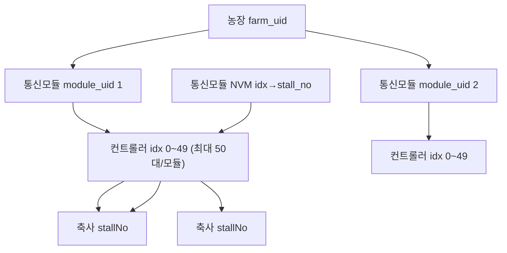

# 스마트 축사 IoT 대시보드 - 작업 맥락

> IoT 축사 환경 제어 시스템의 모니터링·제어 대시보드. decoded 센서 데이터 표시와 제어 명령 발행을 인증/권한 기반으로 제공한다.

## 1. 프로젝트 개요

- **대상 폴더**: `web/` (Next.js 앱). 루트(`dashboard/`)에는 목업 이미지(`*.png`)와 문서가 위치.
- **목적**: Supabase에 적재된 IoT 디코딩 데이터를 권한별로 조회하고, 컨트롤러에 제어 명령을 발행.
- **Supabase 프로젝트**: `ompufmezugftzoergdbn` (운영 DB, 신중히 다룰 것)

## 2. 기술 스택

- Next.js 16 (App Router, Turbopack) + TypeScript
- Tailwind CSS + shadcn/ui
- Supabase (`@supabase/ssr`, `@supabase/supabase-js`) — DB + Auth
- 인증: 이메일/비밀번호 (Supabase Auth)

## 3. 실행 방법

```bash
cd web
npm install
# web/.env.local 에 환경변수 설정 (아래 4번 참고)
npm run dev      # http://localhost:3000
npm run build    # 프로덕션 빌드 검증
```

## 4. 환경변수 (`web/.env.local`)

실제 값은 커밋하지 않는다. 이름만 `web/.env.example`에 기록.

| 이름 | 용도 |
| --- | --- |
| `NEXT_PUBLIC_SUPABASE_URL` | Supabase 프로젝트 URL (클라이언트 노출) |
| `NEXT_PUBLIC_SUPABASE_ANON_KEY` | anon key (RLS 전제, 클라이언트 노출) |
| `SUPABASE_SERVICE_ROLE_KEY` | service_role key (서버 전용, 관리자 기능에서만 사용) |

> `service_role` key는 서버 코드(`lib/supabase/admin.ts`, 관리자 액션)에서만 사용하며 `server-only`로 가드.

## 5. 데이터 구조 (`public.iot_room_state_decoded`)

한 행 = 한 모듈의 한 시점 스냅샷.

| 컬럼 | 설명 |
| --- | --- |
| `farm_uid` (smallint) | 농장 식별자 |
| `module_uid` (smallint) | 통신 모듈 식별자 |
| `mesure_dt` (text) | 측정 시각 |
| `received_at` (timestamptz) | 수신 시각 |
| `decoded_json` (jsonb) | 디코딩 결과 |

`decoded_json.controllers[]` = 모듈당 컨트롤러 50개 배열. 각 항목:

- `idx` (0~49), `eqpmnNo` ("01"~"50")
- `ES01`: 온도(℃) 배열 (문자열) — 예 `["25.0","24.2"]`
- `ES02`: 습도(%) 배열 (문자열)
- `EC01`: **송풍팬** %, `EC02`: **배기팬** %, `EC03`: **입기팬** % (각 10포인트 시계열, 문자열)
- 메타: `makrId`, `stallNo`, `stallTyCode`, `itemCode`, `mesureDt`, `lsindRegistNo`

### 현장 계층 구조 (도메인)



| 계층 | 식별자 | 설명 |
| --- | --- | --- |
| **농장** | `farm_uid` | 다농장 확장. 농장 하나에 **여러 축사**·**여러 통신모듈** |
| **통신모듈** | `module_uid` | RS-485 마스터 1대. **모듈당 컨트롤러 최대 50대** (`idx` 0~49, `eqpmnNo` 01~50) |
| **컨트롤러** | `idx` / `eqpmnNo` | 모듈 로컬 번호. 측정값(ES/EC) 보유 단위 |
| **축사(칸)** | `stallNo` | **통신모듈이 idx별 `stall_no` 설정·전송** (`ver=0x04`). **축사 1개에 컨트롤러 여러 대** 가능 |

- `idx` 50개 상한 = **축사 수가 아니라 통신모듈 1대가 수용하는 컨트롤러 수**.
- 농장 지도 카드 1장 = **`stallNo` 1개** (소속 컨트롤러 readings 를 평균·최악 상태로 집계).
- MQTT 1건 = 모듈 1대 스냅샷 (`controllers[]` 길이 ≤ 50).

**데이터 계층**: `farm_uid` → `module_uid` → `controllers[idx]` + **통신모듈 NVM `stall_no`** → `decoded_json.stallNo`

**제외 데이터**: NH3, CO2 (수집 불가로 미구현)

### 파싱 가정 (`web/src/lib/data/iot.ts`)
- **축사 식별** = `stallNo` (통신모듈 전송, `stallTyCode` 는 Registry/LUT 보조)
- **현재값** = 각 ES/EC 배열의 **마지막 원소** (`READING_AT` 상수로 변경 가능)
- **통신상태** = `received_at` 신선도: 15분 이내 `normal` / 60분 이내 `caution` / 그 외 `offline`

## 6. 인증 / 권한 (RLS)

DB에 RLS가 적용되어 있어 권한이 DB 레벨에서 강제된다.

| 테이블 | 정책 | 조건 |
| --- | --- | --- |
| `iot_room_state_decoded` | `decoded_select_scoped` (SELECT) | `user_can_read_farm(auth.uid(), farm_uid)` |
| `profiles` | `profiles_select_own` (SELECT) | 본인 또는 `is_admin()` |
| `user_access` | `user_access_select_own` (SELECT) | 본인 또는 `is_admin()` |

- `profiles.role`: `admin` / `operator` / `viewer`
- `user_access`: 스코프(`farm`/`module`/`ctrl`)별 `can_read`, `can_command`
- 앱 레벨: `lib/auth/get-current-user.ts`가 user+profile+access를 묶어 제공(React `cache`). `RoleGuard`로 UI 노출 제어, `require-admin`으로 관리자 페이지 보호.

## 7. 라우팅 / 접근 흐름

- `/` → `/login` 리다이렉트
- `proxy.ts`(Next 16 미들웨어): 미인증 시 보호 경로 → `/login`, 로그인 상태에서 `/login` → `/farm`
- `(dashboard)/layout.tsx`: 미인증 → `/login`, 권한 없음(`!hasAccess`) → `/pending`
- 관리자 메뉴(`/admin/users`)는 `role === "admin"`에만 노출

## 8. 구현 현황

| 영역 | 상태 |
| --- | --- |
| 로그인 / 로그아웃 / 세션 미들웨어 | 완료 |
| 접근 게이트 / `/pending` / RoleGuard | 완료 |
| 관리자 사용자·농장 접근 권한 관리(`/admin/users`) | 완료 (service_role 액션) |
| 축사 페이지 실데이터 (요약 + 컨트롤러 목록) | 완료 |
| 컨트롤러 페이지 실데이터 (캐스케이드 선택 + 상세/목록/팬 추이) | 완료 |
| 농장 페이지 실데이터 (요약/환경평균/최근수신/연결상태) | 완료 |
| 농장 지도 (2D 그리드 카드 맵 + 축사 메타데이터) | 완료 |
| 축사 메타데이터 설정 (`/settings?tab=barn`) | 완료 |
| 명령 발행(쓰기) / 명령 이력 | 미구현 (정적) |
| 차트(도넛/환경비교/스파크라인 일부) | 미구현 (placeholder) |
| 컨트롤러 이름 메타데이터 (설정탭 UI만 골격) | 미구현 (저장 연동) |

## 9. 주요 의사결정

- **축사번호(`stallNo`)** 는 **통신모듈에서 idx별로 설정**(NVM)·**전송** (wire `ver=0x04`). 슬레이브·서버 LUT·대시보드에서 idx→stallNo 매핑 **하지 않음**.
- `profiles.ui_config` 는 **지도 배치·표시명만** (사용자별). stallNo 목록은 수집 데이터에서 자동 유도.
- `controller_stall_map` 등 **양방향 매핑 DB migration 보류·취소**.
- 농장 지도는 **2D 그리드 카드 맵** (아이소메트릭은 후속). NH3/CO2·신호강도·지리좌표는 미표시.
- **축사(`/barns`)** 는 stallNo 기준 목록으로 전환 예정. 현재는 **컨트롤러(idx) 단위** 임시 표시.
- 제어 명령 의도는 4종: **최저환기 / 최고환기 / 설정온도 / 온도편차** (`ctrl_thermo_command`).
- 인증은 OAuth가 아니라 이메일/비밀번호 (계정이 이미 `auth.users`에 존재).

## 10. 농장 지도 UI/UX

### 저장소 (`profiles.ui_config`)

```json
{
  "barns": [
    {
      "id": "barn-1",
      "farmUid": 1,
      "moduleUid": 1,
      "stallNo": "03",
      "name": "3축사",
      "grid": { "col": 1, "row": 2 },
      "type": "barn"
    }
  ]
}
```

- **축사 식별**: `stallNo` = 펌웨어 전송 → `decoded_json`. 지도 카드 1개 = stallNo 1개.
- 설정: `/settings?tab=barn` → 전송 데이터에 나타난 stallNo 중 **지도 위치·이름만** 지정 (`saveBarnMetasAction`)
- 집계: `aggregateByBarn(readings, barnMetas)` — `(farmUid, moduleUid, stallNo)` 매칭, 평균값·최악 상태
- 지도: `FarmMapView` — 4×4 CSS Grid, 게이트웨이 placeholder(중앙 상단), 축사 카드, 범례
- 클릭: `/controllers?farm=&module=` 딥링크
- 빈 상태: 축사 미설정 시 설정 탭 CTA
- 모바일: `FarmMapList` 세로 카드 폴백

### 목업 대비 표시 항목

| 목업 | 구현 |
| --- | --- |
| 아이소메트릭 3D | 2D 그리드 카드 (후속 업그레이드 가능) |
| NH3, CO2 | 미표시 |
| RPM, 팬레벨 1~10, 모드 | 미표시 (실데이터 없음) |
| 온도, 습도, 팬% | 표시 |
| 게이트웨이 신호강도 | placeholder (`--`) |

## 11. 진행 중 / 대기 작업: 컨트롤러 제품 UI

컨트롤러 페이지를 **실제 회사 컨트롤러 제품(성일전자 AVR-2000 / AUTOFAN)**처럼 조작하는 UI로 만들기로 함.

### 확정된 방향
- **외형**: 실제 제품 사진/도면 기준 → 사용자 제공 대기 중 (**블로커**)
- **표시 데이터**: 목업의 RPM/모드 대신 **실데이터(송풍/배기/입기 % + 온도·습도)** 기준으로 재설계
- **조작(쓰기)**: 기존 명령 4종으로 매핑

### 데이터 불일치 메모 (중요)
목업(AUTOFAN)은 `현재 RPM`, `팬 레벨(1~10)`, `모드(자동/수동/정지/급기/배기/알람)`를 표시하지만, 현재 `decoded_json`에는 **RPM·모드 데이터가 없음**. 따라서 패널은 실제 보유 값(EC% / 온도 / 습도) 기준으로 재구성한다.

### 사진 수령 후 계획
1. 제품 사진 기반 패널 UI (실데이터 표시)
2. 조작부: 최저환기% / 최고환기% / 설정온도 / 온도편차 입력 → `ctrl_thermo_command` insert
   - `can_command` 권한자만 활성화, 미권한자 읽기 전용
   - 쓰기 전 `ctrl_thermo_command` 스키마/RLS 확인 및 SQL·영향 범위 설명 선행
3. 명령 히스토리: `ctrl_thermo_command` 최근 이력 조회(읽기)

## 12. Git / 브랜치

- 원격: `github.com/SIJackLee/dashboard`
- 작업 브랜치(스택): `feature/auth-access-gate` → `feature/admin-user-access`
  - `feature/admin-user-access`에 관리자 기능 + 실데이터 매칭 커밋 누적
- 규칙: main 직접 push 금지, 기능 단위 브랜치/커밋, push/merge는 승인 후.

## 13. 주요 경로

```
web/src/
  app/
    (dashboard)/{farm,barns,controllers,alarms,logs,settings}/page.tsx
    (dashboard)/admin/users/{page.tsx,actions.ts}
    login/page.tsx  pending/page.tsx  auth/{actions.ts,callback/route.ts}
  components/
    layout/{app-sidebar,top-bar,page-shell,nav-items}
    common/{stat-card,section-card,status-badge,env-chip,fan-indicator,sparkline,...}
    farm/  barns/  controllers/  admin/
  lib/
    data/{iot.ts,barn-meta.ts}  # decoded 파싱·집계, 축사 메타데이터
    farm/{farm-map-view,farm-map-card,...}
    auth/{get-current-user,require-admin}.ts
    supabase/{client,server,admin,middleware}.ts
  proxy.ts                 # Next 16 미들웨어(세션/보호)
```
