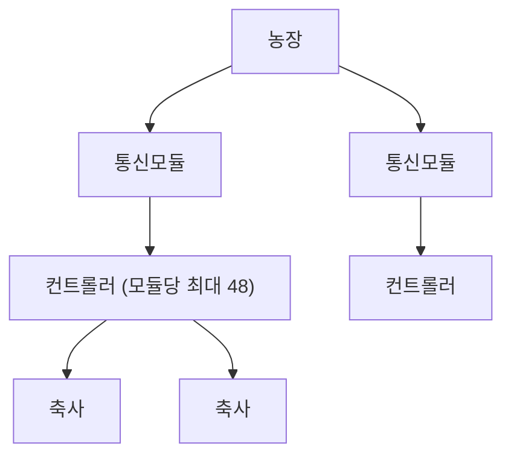

# 스마트 축사 IoT 대시보드 - 작업 맥락

> **문서 허브:** [`README.md`](./README.md)  
> **배포 기준:** [`CLOUD_DEPLOY.md`](./CLOUD_DEPLOY.md) (`commit → push → main → Vercel`)  
> IoT 축사 모니터링·제어 대시보드. 인증/권한 기반 조회·명령.

## 1. 프로젝트 개요

- **대상 폴더**: `web/` (Next.js 앱).
- **목적**: Supabase IoT 데이터 권한별 조회 · 컨트롤러 명령.
- **Supabase**: 운영 프로젝트는 `.env.local` 기준 (키·ref 문서에 하드코딩하지 말 것).

## 2. 기술 스택

- Next.js 16 (App Router, **webpack** dev/build) + TypeScript
- Tailwind CSS + shadcn/ui
- Supabase (`@supabase/ssr`, `@supabase/supabase-js`) — DB + Auth
- 인증: 이메일/비밀번호 (Supabase Auth)

## 3. 실행 방법

> **경로:** `dashboard/web/` (저장소 루트 `dashboard/` 기준).  
> 집 LIVE 시뮬: [`HOME_SIM_PILOT.md`](./HOME_SIM_PILOT.md) (`simulator/sim_pilot_farm01.py`). 회사 MQTT/RS 없이 raw INSERT + `decode-batch`.

```bash
cd web
npm install
# web/.env.local 에 환경변수 설정 (아래 4번 참고)
npm run dev      # http://localhost:3000 (webpack)
npm run build    # webpack 프로덕션 빌드 검증
```

## 4. 환경변수 (`web/.env.local`)

실제 값은 커밋하지 않는다. 이름만 `web/.env.example`에 기록.

| 이름 | 용도 |
| --- | --- |
| `NEXT_PUBLIC_SUPABASE_URL` | Supabase 프로젝트 URL (클라이언트 노출) |
| `NEXT_PUBLIC_SUPABASE_ANON_KEY` | anon key (RLS 전제, 클라이언트 노출) |
| `SUPABASE_SERVICE_ROLE_KEY` | service_role key (서버 전용, 관리자 기능에서만 사용) |

> `service_role` key는 서버 코드(`lib/supabase/admin.ts`, 관리자 액션)에서만 사용하며 `server-only`로 가드.

## 5. LIVE 데이터 경로 (현행)

RS-DB-C: EC2는 raw INSERT, **decode·LIVE UI는 이 앱**. 배포 요약: [`CLOUD_DEPLOY.md`](./CLOUD_DEPLOY.md).

| 계층 | 현행 |
| --- | --- |
| Raw / pipeline | `v_iot_raw_live` 등 (Edge·앱 decode) |
| 대시보드 list tier (기본) | `v_iot_dashboard_list` — `NEXT_PUBLIC_LIVE_READ_TIER` 미설정 시 |
| Farm-scoped full / bulk | `v_iot_decoded_latest` (channels[] 필요) |
| Overview | `v_iot_farm_overview` (list 집계 · 최근 2시간 최신 1행) |
| 레거시 롤백 | `NEXT_PUBLIC_LIVE_READ_TIER=legacy` → decoded_latest + decoded_json 중심 |

구현: `web/src/lib/data/iot-live-fetch.ts`, `live-config.ts`, `iot-raw-live.ts`.

### 도메인 계층 (현장)



| 계층 | 설명 |
| --- | --- |
| 농장 | 다농장 · UI는 표시명 |
| 통신모듈 | RS-485 마스터 · 컨트롤러 최대 48 |
| 컨트롤러 | 온·습·팬 측정 단위 |
| 축사 | 지도 카드 1장 = 축사 1 |

**제외:** NH3, CO2 (수집 불가 미구현).

### 페이로드·파싱 가정

- 디코드 결과의 컨트롤러 배열 · 시계열 → UI 현재값은 보통 **마지막 원소**
- 축사유형 바이트가 1~10 밖이면 Edge가 `iot_room_state_decoded`에 쓰지 않고 `iot_room_state_decode_failed.error_code=INVALID_STALL_TY`로 남김 (관측 쿼리: [`SPARSE_OBSERVATION.md`](./SPARSE_OBSERVATION.md))
- 통신상태 ≈ **수신 시각(`received_at`)** 신선도 (약 15분 / 60분 / 그 외)
- 추이 차트·리포트 시계열 ≈ **측정 시각(`mesure_at`)** — 재연결 시 컨트롤러 버퍼를 짧은 주기로 올려도 샘플 자체는 기존 5분 측정 간격. 패킷 unix가 서울 벽시계를 UTC처럼 넣은 경우 Edge가 9시간을 빼 수신 창에 맞춤. LIVE/REPLAY 플래그 구분 없이 `farm_trend_history*`에 포함 (`live`/`history`/`replay`)
- **추이 차트 커버리지** (차트 탭만): 수신 시각 버킷 RPC `farm_trend_uplink_coverage_json` (migration `20260828020000`, **iot-cloud 적용됨**). 희소=유효 실시간 업링크·디코드 생략 → 직전 값 유지. 통신두절=해당 컨트롤러 수신 없음 → 선 단절. 없음=잘못된 축사유형·클럭 불일치·2026-08-24 이전 83바이트 폐기 → 유지 금지. **색면·구간 라벨·범례는 그리지 않음.** 목록 카드·LIVE·PDF는 기존 null 갭.
- **헤더 도구:** TopBar 오른쪽 상시 아이콘(이상상황 · 운영 · 리포트 · 테마 · md+ 뷰포트). 플로팅 Hub FAB 레일은 사용하지 않음.
- 구 **REPLAY 전용 UI** (`/replay`, `/logs`) = 미구현·비목표 (정책상 모드 분리 없음). `v_iot_replay_*` view는 레거시
- 구 테이블 `iot_room_state_decoded` 는 RLS·이력 참고용일 수 있음. **출고 LIVE 읽기 정본은 위 view** (카드 최신값은 여전히 live 스냅샷 + `received_at`)

### 데이터 모듈

| 파일 | 용도 |
| --- | --- |
| `lib/data/iot.ts` | LIVE readings 진입 |
| `lib/data/iot-live-fetch.ts` | list/detail/overview + cache |
| `lib/data/iot-live-merge.ts` | LIVE 병합 |
| `lib/data/iot-chart.ts` | 차트 집계 |
| `lib/data/iot-firmware.ts` | 48 ctrl 상수 |
| `lib/data/barn-meta.ts` | 축사 메타 |
| `lib/data/controller-meta.ts` | 컨트롤러 표시명 |
| `lib/data/alarms.ts` | 파생 알람 |


## 6. 인증 / 권한 (RLS)

DB에 RLS가 적용되어 있어 권한이 DB 레벨에서 강제된다.

| 테이블 | 정책 | 조건 |
| --- | --- | --- |
| `iot_room_state_decoded` | `decoded_select_scoped` (SELECT) | `user_can_read_farm(auth.uid(), farm_uid)` |
| `profiles` | `profiles_select_own` (SELECT) | 본인 또는 `is_admin()` |
| `user_access` | `user_access_select_own` (SELECT) | 본인 또는 `is_admin()` |

- `profiles.role`: `admin` / `operator` / `viewer`
- `user_access`: 스코프(`farm`/`module`/`ctrl`)별 `can_read`, `can_command`
- 앱 레벨: `lib/auth/get-current-user.ts`가 user+profile+access를 묶어 제공(React `cache`). `RoleGuard`로 UI 노출 제어, `require-admin`으로 관리자 페이지 보호.

## 7. 라우팅 / 접근 흐름

- `/` → `/login` 리다이렉트
- `proxy.ts`(Next 16 미들웨어): 미인증 시 보호 경로 → `/login`, 로그인 상태에서 `/login` → `/farm`
- `(dashboard)/layout.tsx`: 미인증 → `/login`, 권한 없음(`!hasAccess`) → `/pending`
- 관리자 메뉴(`/admin/ops`)는 `role === "admin"`에만 노출
- 허브 탭: [`farm-hub-url.md`](./farm-hub-url.md) · 사용설명서: [`user-manual/`](./user-manual/)

## 8. 구현 현황

| 영역 | 상태 |
| --- | --- |
| 로그인 / 로그아웃 / 세션 미들웨어 | 완료 |
| 접근 게이트 / `/pending` / RoleGuard | 완료 |
| 관리자 `/admin/ops` (디렉터리·명령·헬스 DAG 아이콘 타일) | 완료 |
| `/farm` 허브 — 관리자 전국 지도 관제 · 단건 농장 그리드·목록·차트 · ARIA | 완료 (ARIA는 PoC) |
| 일괄적용 · 컨트롤러 설정 · 명령 insert | 완료 |
| LIVE view 경로 (`dashboard_list` / `decoded_latest`) | 완료 — §5 |
| REPLAY 전용 UI (`/replay`, `/logs`) | **비목표** — 재연결 백필은 추이(`mesure_at`)로 흡수 |
| 명령 downlink Agent (`pending` → MQTT → `sent`) | 미구현 (대시보드는 insert만) |
| 사용설명서 차트·ARIA 절 | 완료 — `user-manual/11` · `12` |

## 9. 주요 의사결정

- **축사번호(`stallNo`)** 는 **통신모듈에서 idx별로 설정**(NVM)·**전송** (wire `ver=0x04`). 슬레이브·서버 LUT·대시보드에서 idx→stallNo 매핑 **하지 않음**.
- `profiles.ui_config` 는 사용자별 **카드 좌표(`barnLayouts`)·표시명·알람·온보딩**. stallNo 목록은 수집 데이터에서 자동 유도. 옛 `barns` 배열·`displaySettings`는 폐기(2026-08-28).
- `controller_stall_map` 등 **양방향 매핑 DB migration 보류·취소**.
- 농장 지도는 **2D 그리드 카드 맵** (아이소메트릭은 후속). NH3/CO2·신호강도·지리좌표는 미표시.
- 관리자 `/farm`(농장 미선택)은 **전국 지도 + 현황 목록**. 지도는 **카카오맵** 기본(키·SDK 실패 시 Leaflet + OSM 한국). 남한 범위. 배정 농장은 좌표가 없어도 목록에 두고, 핀은 좌표가 있는 것만. 상태 칩으로 목록·핀을 거른다. 핀·목록 클릭은 단건 현장 화면. `/admin/ops`에는 지도를 두지 않음.
- **축사(`/barns`)** stallNo 기준 전환은 **펌웨어 `ver=0x04` 이후**. 현재는 **컨트롤러(idx) 단위** 임시 표시.
- **축사 페이지 차트** x축 = 컨트롤러 **1~50** (`idx+1`) 고정 슬롯. 외부 차트 라이브러리 없이 `CompactColumnChart`(CSS/SVG).
- **`iot-chart.ts` 분리**: 클라이언트 컴포넌트가 `server-only`인 `iot.ts`를 import 하지 않도록 차트 집계만 별도 모듈.
- **빠른 비교** UI는 제거. 온습도·팬 비교로 역할 분리.
- **컨트롤러 제품 UI** (AVR-2000 / AUTOFAN 사진 기반)는 **추후**.
- 제어 명령 의도는 4종: **최저환기 / 최고환기 / 설정온도 / 온도편차** (`ctrl_thermo_command`).
- 인증: **이메일/비밀번호** + **Google / 카카오 OAuth** (Supabase Auth). OAuth 콜백 `/auth/callback`. 신규·미승인 계정은 `user_access`/`admin` 없으면 `/pending` (정책 A).

## 10. 농장 지도 UI/UX

### 저장소 (`profiles.ui_config`)

```json
{
  "barnLayouts": {
    "catalogKey#stallNo": { "col": 1, "row": 2 }
  }
}
```

- **축사 식별**: `stallNo` = 펌웨어 전송 → `decoded_json`. 지도 카드 1개 = stallNo 1개. 좌표만 `barnLayouts`.
- 집계: `aggregateByBarn(readings, barnMetas)` — LIVE 스냅샷 기준, 평균값·최악 상태
- 지도: `FarmMapView` — 필드 탭 카드 그리드 (LIVE + `barnLayouts`)
- **로그인 스플래시:** 브랜드 최소 ~2.1초. 해제는 셸 마운트가 아니라 **필드 LIVE bootstrap 종료 + 1프레임 paint** (`NavContentReadyMarker ready`). 로그인 직후 농장 패널·24h 추이를 스플래시와 겹쳐 prefetch (`warmPostLoginFarmHub`). 차트 30일·모델 WebGL은 스플래시에서 기다리지 않음.
- **그래프 기간:** `?trendPeriod=24h|7d|30d` (기본 **7d**) — 그리드·목록·DELIN 탭 공유. 차트 탭 브러시는 30일 트랙에서 **임의 구간**을 고르며 `trendPeriod`는 바꾸지 않음(초기 창만 농장 기간으로 시드, 우클릭=30일 전체). 브러시 점선=양호도 75 기준. 그리드 히트맵=컨트롤러 추이에서 파생한 축사 평균, 목록/상세=TrendChart 컨트롤러 단위. 버킷 기준 **`mesure_at`**. **로드:** 필드 진입 시 백그라운드. 희소 compact. **24h 15분 → 30d 1시간(하루 RPC로 분할, 최신부터). 7일은 30일 슬라이스.** 브러시 창이 **약 48시간 이하**일 때만 그 구간 15분을 추가 요청. 히트맵은 GRAPH_BARS(24/28/30) 다운샘플, 차트 탭은 플롯 px viewBox + LTTB(약 2.5px/점). 필드 라인은 점 마커 없음(핀·카드는 유지), 구간 줌·브러시 없음. **PDF·목록 all-periods도 허브와 같은 축**(24h×96 15분 / 7d×168 1h / 30d×720 1h). 인쇄만 LTTB(최대 96점). 15분 2880 경로는 폐기. 줌 창만 `TREND_15M_PERIODS`.
- **오늘의 리포트 PDF:** 헤더 `DailyReportButton` (`data-tour-id="header-daily-report"`) — 활성 농장 기준 브라우저 생성. **표지(농장 7일)** + **축사유형 1장씩** + **마지막 권장구간 이탈**. 온도·습도·채널은 허브 차트처럼 **지표마다 풀폭 행**. 표지 상·하한은 **이 농장에 저장된 알람**(`getAlarmSettings` → 농장 스코프, 없으면 계정 전역). 축사유형·이탈 페이지는 **생육 권장**. 그 그래프의 최저·최고도 함께 표시. 문장은 숫자 FACT만. 마지막 페이지는 30일 중 **가장 긴 생육 권장 온도 이탈 연속 구간**(없으면 페이지 유지·없음). 허브 split-Y·브러시·48h 줌은 인쇄에 넣지 않음. 시계열은 허브 `TREND_PERIODS`와 동일 (`getFarmControllerTrendAllPeriods` → 축사·유형 평균). 차트 선색은 `TREND_CHART_COLORS`. 문서 뼈대는 **레터헤드**. 빨강은 이상상황·통신 두절·온도 선·권장 이탈만. 인쇄는 LTTB 최대 96점. 표지·헤더는 농장 **표시명**. **이상상황**은 모듈 에러코드 + 통신두절만(온·습 권장/가이드 이탈은 배지와 별개, 마지막 장에서 다룸). 렌더 `buildAndDownloadDailyReportPdf` (jspdf + canvas). 컨트롤러 1대/페이지 첨부는 넣지 않음.
- 클릭: `/farm?tab=ops&…` 딥링크 (레거시 `/controllers`는 redirect)
- 빈 상태: 축사 미설정 시 설정 탭 CTA
- 모바일: `FarmMapList` 세로 카드 폴백

### 목업 대비 표시 항목

| 목업 | 구현 |
| --- | --- |
| 아이소메트릭 3D | 2D 그리드 카드 (후속 업그레이드 가능) |
| NH3, CO2 | 미표시 |
| RPM, 팬레벨 1~10, 모드 | 미표시 (실데이터 없음) |
| 온도, 습도, 팬% | 표시 |
| 게이트웨이 신호강도 | placeholder (`--`) |

## 11. 축사 페이지 (`/barns`) UI

### 레이아웃 (상→하)

1. **요약 카드** — 총/정상/주의/오프라인 (`summarizeBarns`)
2. **3열 그리드** — 상태 분포 | 온습도 비교 | 팬 비교
3. **축사 목록** — 컨트롤러 단위 테이블 (`getBarnReadings`)

### 차트 컴포넌트

| 컴포넌트 | 데이터 | 설명 |
| --- | --- | --- |
| `BarnStatusDonut` | `BarnSummary` | 정상/주의/오프라인 SVG 도넛 + 범례 |
| `TempHumidityCompareChart` | `readings` | 온도·습도, x축 1~50 |
| `FanCompareChart` | `readings` | 송풍·배기·입기팬 %, x축 1~50 |

- 공통 렌더: `BarnMetricChartStack` → `buildControllerSlotSeries()` (`iot-chart.ts`)
- 막대: `CompactColumnChart` — `fillWidth`로 50슬롯 균등 분할, 마지막 행에만 x축 눈금 (1, 5, 10, …, 50)
- 동일 슬롯에 복수 모듈 데이터가 있으면 해당 슬롯 값 **평균**

## 12. 진행 중 / 대기 작업: 컨트롤러 제품 UI

컨트롤러 페이지를 **실제 회사 컨트롤러 제품(성일전자 AVR-2000 / AUTOFAN)**처럼 조작하는 UI로 만들기로 함.

### 확정된 방향
- **외형**: 실제 제품 사진/도면 기준 → 사용자 제공 대기 중 (**블로커**)
- **표시 데이터**: 목업의 RPM/모드 대신 **실데이터(송풍/배기/입기 % + 온도·습도)** 기준으로 재설계
- **조작(쓰기)**: 기존 명령 4종으로 매핑

### 데이터 불일치 메모 (중요)
목업(AUTOFAN)은 `현재 RPM`, `팬 레벨(1~10)`, `모드(자동/수동/정지/급기/배기/알람)`를 표시하지만, 현재 `decoded_json`에는 **RPM·모드 데이터가 없음**. 따라서 패널은 실제 보유 값(EC% / 온도 / 습도) 기준으로 재구성한다.

### 사진 수령 후 계획
1. 제품 사진 기반 패널 UI (실데이터 표시) — 현재 `CommandPanel`·이력 테이블은 일반 폼 UI로 **이미 구현**
2. 외형·조작부를 실제 제품( AVR-2000 / AUTOFAN ) 레이아웃에 맞게 재배치

## 13. Git / 브랜치

- 원격: `github.com/SIJackLee/dashboard`
- 작업 브랜치(스택): `feature/auth-access-gate` → `feature/admin-user-access`
  - `feature/admin-user-access`에 관리자·실데이터·명령·축사 차트 커밋 누적
- 최근 커밋 예: `3374425` 축사 차트, `386537a` 원격 명령
- 규칙: main 직접 push 금지, 기능 단위 브랜치/커밋, push/merge는 승인 후.

## 14. 주요 경로

```
web/src/
  app/
    (dashboard)/farm/page.tsx          # map | ops 허브
    (dashboard)/{controllers,alarms,settings}/page.tsx  # redirect only
    (dashboard)/admin/ops/**             # system | users | farms | commands (+ health-actions, users-actions)
    login/page.tsx  pending/page.tsx  auth/{actions.ts,callback/route.ts}
  components/
    layout/{top-bar, header-tools-menu, ...}
    common/{stat-card,section-card,status-badge,...}
    farm/  controllers/  ops/  admin/
  lib/
    data/{iot.ts,iot-live-fetch.ts,barn-meta.ts,commands.ts}
    farm/{farm-map-view,farm-map-canvas,...}
    auth/{get-current-user,require-admin}.ts
    supabase/{client,server,admin,middleware}.ts
  proxy.ts                 # Next 16 미들웨어(세션/보호)
```
