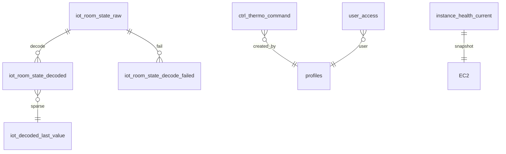

# DB — Supabase · iot-cloud

> **상위:** [`SYSTEM.md`](./SYSTEM.md) §2.2 · **Migration:** `web/supabase/migrations/` (**적용은 사용자 승인 후**)  
> **작성 원칙:** 설계 이유 → 경로 → 운영.

---

## 1. 설계 이유

| 결정 | 설계 이유 | 하지 않은 것 | 근거 |
|------|-----------|--------------|------|
| **iot-cloud 단일 Postgres** | Auth·RLS·JOIN view·Edge cron·명령 ACK **한 스키마** | 농장별 DB · read replica만 분리 · **multi-DB COLD(E)** | [`IOT_RETENTION_OPTIONS.md`](./IOT_RETENTION_OPTIONS.md) |
| **raw/decoded 논리 분리·물리 단일** | 월 파티션·retention·sparse·hot view로 계층 분리. Free tier 현실 | raw 전용 클러스터 · decoded만 S3 | [`DECODED_CAPACITY.md`](./DECODED_CAPACITY.md) |
| **decode-batch on Edge** | raw 옆 **pg_cron ~10s** · cursor·`last_value`·config **DB co-location** | RS decode · Next API batch · per-farm worker | [`decode-batch`](../supabase/functions/decode-batch/) |
| **ctrl_thermo_command in DB** | 감사·RLS·pending queue · uplink ACK diff · C.py 단일 소비 | MQTT cmd 직접 · Redis 큐 | [`CTRL_THERMO_COMMAND_PHASE_A.md`](./CTRL_THERMO_COMMAND_PHASE_A.md) |
| **LIVE view 2h hot** | `received_at` 신선도 · list/latest tier · decode 부하와 read 분리 | 앱 raw scan · 무제한 latest | [`LIVE_HOT_VIEW_RULES.md`](./LIVE_HOT_VIEW_RULES.md) |
| **물리 테이블→View 치환 금지** | 디스크 절약 **위장** 불가 — retention은 detach/archive | HOT/WARM view-only 아카이브 | [`IOT_RETENTION_OPTIONS.md`](./IOT_RETENTION_OPTIONS.md) |

### 1.1 DB 물리 분리를 하지 않은 이유

[`IOT_RETENTION_OPTIONS.md`](./IOT_RETENTION_OPTIONS.md) 옵션 **E (multi-DB COLD)** 기각:

| multi-DB 시 문제 | 단일 DB 대응 |
|------------------|--------------|
| Auth·RLS 이중 | `user_can_read_farm` 한 곳 |
| trend JOIN 불가 | decoded + RPC 한 connection |
| Edge cron 분산 | `decode-batch` + pg_cron 한 프로젝트 |
| Free tier N× 비용 | 파티션 detach + archive |

**HOT=30일, WARM 없음** — 차트·LIVE·보관 상한 동일 ([`DECODED_ROWCOUNT_PLAN.md`](./DECODED_ROWCOUNT_PLAN.md)).

### 1.2 해석(decode)을 DB Edge로 처리한 이유

| RS/Next에서 decode 시 | Edge + Postgres |
|----------------------|-----------------|
| sparse `last_value` 원격 조회 | 같은 트랜잭션 |
| 월 파티션 upsert | `ensure_iot_decoded_month_partitions` |
| batch cursor | `iot_decode_cursor` |
| clock_kst −9h | `iot_decode_config` |
| Vercel timeout·cold start | cron 상시 |

**RS는 raw INSERT만** — [`SYSTEM_INSTANCE.md`](./SYSTEM_INSTANCE.md).

### 1.3 명령·uplink가 동일 DB를 거치는 이유

1. **감사:** 누가·언제·어떤 payload insert 했는지
2. **RLS:** farm scope로 명령 insert 제한
3. **단일 downlink:** C.py만 queue 소비
4. **ACK:** uplink decoded thermo ↔ `ctrl_thermo_command.payload` 비교 → `applied`

대시보드→MQTT 직접은 브라우저 보안·감사·ACK 비교 **불가**.

---

## 2. 경로·객체

### 2.1 프로젝트

| 항목 | 값 |
|------|-----|
| Supabase project | `iot-cloud` |
| Region | `ap-northeast-2` |
| Migration 정본 | `web/supabase/migrations/` |
| Edge Functions | `web/supabase/functions/` |

### 2.2 데이터 계층 (ER 요약)

| 계층 | 객체 | 키·용도 |
|------|------|---------|
| Raw | `iot_room_state_raw` | `received_at` · `topic` · `payload_bytea` |
| Decode | `iot_room_state_decoded` | **월 파티션** `RANGE (mesure_at)` |
| Last | `iot_decoded_last_value` | sparse 기준 (앱 직접 SELECT 불가) |
| 실패 | `iot_room_state_decode_failed` | INVALID_STALL_TY 등 |
| Cursor | `iot_decode_cursor` | Edge batch `last_raw_id` |
| 설정 | `iot_decode_config` | sparse · clock · batch_limit · cron_secret |
| 명령 | `ctrl_thermo_command` | pending→sent→applied |
| Auth | `profiles` · `user_access` | role · farm scope |
| 헬스 | `instance_health_current` | EC2 snapshot |
| Archive | `archive.*_archived` | detach soak 60d DROP |

트리거: `iot_raw_fill_from_topic()` — raw INSERT 시 topic 파생.

### 2.3 LIVE Views

| View | 용도 | hot 조건 |
|------|------|----------|
| `v_iot_dashboard_list` | 카드·목록·soft refresh | `received_at > now()-2h` · **평면 스칼라** |
| `v_iot_decoded_latest` | 패널 bootstrap · `channels[]` · bulk | 동일 2h · LATERAL 최신 1행 |
| `v_iot_farm_overview` | admin hub 집계 | list 위 집계 |
| `v_iot_raw_live` | 레거시 TS decode 경로 | RS-DB-C 전환 잔재 |

**list vs latest tier:** list=경량 · latest=channels 필요 시 ([`live-read-select.ts`](../src/lib/data/live-read-select.ts)).

PR 체크: `LIVE_LIST_FORBIDDEN_TOKENS` · `npm run measure:live` p95<300ms ([`LIVE_HOT_VIEW_RULES.md`](./LIVE_HOT_VIEW_RULES.md)).

### 2.4 Edge · RPC

| 이름 | 트리거 | 역할 |
|------|--------|------|
| `decode-batch` | pg_cron ~10s | raw→decoded · clock_kst · sparse |
| `push-dispatch` | 이벤트/cron | FCM 1차 |
| `farm_trend_history` | RPC | 축사 추이 · `mesure_at` 버킷 |
| `farm_trend_history_by_controller` | RPC | 컨트롤러 추이 |
| `farm_trend_uplink_coverage_json` | RPC | 차트 coverage · clock 정렬 |

**Sparse (Edge only):** ε_temp=0.2°C · ε_fan=2%p · heartbeat=1800s · RS 필터 **금지** ([`DECODED_ROWCOUNT_PLAN.md`](./DECODED_ROWCOUNT_PLAN.md)).

**clock_kst:** `FARM02`, `FARM03` → decode 시 −9h (live/replay 무관).

### 2.5 RLS

| 객체 | 정책 | 조건 |
|------|------|------|
| `iot_room_state_decoded` | `decoded_select_scoped` | `user_can_read_farm(auth.uid(), farm_uid)` |
| `profiles` | `profiles_select_own` | 본인 또는 `is_admin()` |
| `user_access` | `user_access_select_own` | 본인 또는 `is_admin()` |
| `farm_trend_*` RPC | SECURITY DEFINER | `user_can_read_farm` |
| `instance_health_current` | service_role only | 클라 RLS 불필요 |

### 2.6 pg_cron (UTC → KST 대략)

| jobname | schedule (UTC) | KST | command |
|---------|------------------|-----|---------|
| `ensure-iot-decoded-partitions-daily` | `0 18 * * *` | 03:00 | `ensure_iot_decoded_month_partitions(2)` |
| `cleanup-iot-retention-30d-daily` | `30 18 * * *` | 03:30 | `cleanup_iot_retention_30d(30, 10000)` |
| `cleanup-iot-archive-drop-daily` | `45 18 * * *` | 03:45 | `cleanup_iot_archive_drop(30, 30)` |
| `cleanup-ops-logs-7d-daily` | `50 18 * * *` | 03:50 | `cleanup_ops_logs_7d(7, 10000)` |

### 2.7 핵심 migration (참고)

| 파일 | 내용 |
|------|------|
| `20260614000000_rs_live_views.sql` | LIVE views 초기 |
| `20260805120000_iot_raw_drop_unused_passthrough_columns.sql` | raw 슬림 Phase 4 |
| `20260805150000_iot_decoded_sparse_poc.sql` | sparse PoC |
| `20260805170000_iot_retention_30d_cron.sql` | retention cron |
| `20260901003000_farm_trend_uplink_coverage_mesure_align.sql` | coverage RPC |

---

## 3. 운영

### 3.1 시간축 (DB 관점)

| 필드 | 의미 | 소비 |
|------|------|------|
| `received_at` | raw/decode **수신** | 2h hot · LIVE 신선도 |
| `mesure_at` | 장비 **측정** | 차트 · PDF · 파티션 키 |
| clock_kst | firmware KST stuff | decode −9h |

수신 최신 + 측정 정체 = **replay/장비 시계** — 앱 [`live-status.ts`](../src/lib/data/live-status.ts).

### 3.2 모니터링

| 신호 | 쿼리/객체 | 임계 |
|------|-----------|------|
| LIVE empty | `v_iot_decoded_latest` count | 2h 0건 |
| decode backlog | `iot_decode_cursor` lag | warn 100 · critical 500 rows |
| decode fail | `iot_room_state_decode_failed` | INVALID_STALL_TY |
| retention | raw/decoded rowcount | 30d cron |
| sent stuck | `ctrl_thermo_command` sent age | TTL 300s+ |
| 용량 | Supabase dashboard | Phase4 raw ~21MB (indexes ~81%) |

### 3.3 retention 변경 절차

[`IOT_RETENTION_OPTIONS.md`](./IOT_RETENTION_OPTIONS.md):

1. dry-run SQL
2. trend 24h/30d 스모크
3. cron `active=false` 롤백 경로 확보
4. **사용자 승인 후** 적용

`VACUUM FULL`: 1회 작업만 — 일일 cron 아님.

### 3.4 장애 triage (DB층)

1. **raw 있음 · decoded 없음** → `decode-batch` 로그 · cursor · failed 테이블
2. **decoded 있음 · view empty** → 2h hot · `received_at` 창
3. **데이터 있음 · UI empty** → RLS · `user_access`
4. **차트 날짜 어긋남** → `clock_kst_farm_keys` · mesure 분포

검증 SQL 예: `SELECT count(*) FROM public.v_iot_dashboard_list;`

### 3.5 변경 금지 (승인 필수)

- 운영 migration 적용 · RLS 삭제
- retention 대량 DELETE · DROP COLUMN (복구 불가)
- `service_role` anon 노출

---

## 4. 참고

| 문서 | 내용 |
|------|------|
| [`DECODED_ROWCOUNT_PLAN.md`](./DECODED_ROWCOUNT_PLAN.md) | D1 파티션 · D3 sparse · D4 retention |
| [`SPARSE_OBSERVATION.md`](./SPARSE_OBSERVATION.md) | sparse 관측 |
| [`SYSTEM_INSTANCE.md`](./SYSTEM_INSTANCE.md) | RS/C · MQTT |
| [`SYSTEM_NEXTJS.md`](./SYSTEM_NEXTJS.md) | LIVE tier · read path |

---

## 변경 이력

| 날짜 | 내용 |
|------|------|
| 2026-09-01 | 초안 — 설계 이유·ER·RLS·cron (Canvas §2.2 승인 반영) |
