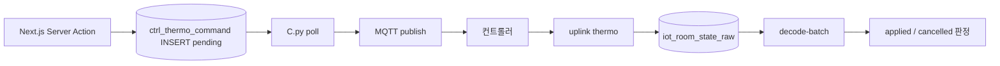

# Instance — EC2 · MQTT · RS/C

> **상위:** [`SYSTEM.md`](./SYSTEM.md) §2.1 · **배포:** [`CLOUD_DEPLOY.md`](./CLOUD_DEPLOY.md)  
> **작성 원칙:** 설계 이유 → 경로 → 운영. 비밀값·키는 문서에 기록하지 않는다.

---

## 1. 설계 이유

| 결정 | 설계 이유 | 하지 않은 것 | 근거 |
|------|-----------|--------------|------|
| **Instance·Dashboard repo 분리** | `rsd`=상시 MQTT·systemd · `dashboard`=Vercel git 배포. **수집 장애와 UI 릴리스 분리** | 대시보드 repo에 RS/C 통합 · UI를 EC2에서 호스팅 | [`CLOUD_DEPLOY.md`](./CLOUD_DEPLOY.md) |
| **RS는 raw INSERT만** | EC2 blast radius 최소. decode는 upsert·sparse·월 파티션·`last_value` 갱신 → **DB 소유** | RS wire decode(Phase3+ 폐기) · RS sparse 필터 | [`RAW_STORAGE_CHANGE.md`](./RAW_STORAGE_CHANGE.md) · [`DECODED_ROWCOUNT_PLAN.md`](./DECODED_ROWCOUNT_PLAN.md) |
| **C.py는 EC2 유지** | MQTT cmd 구독·long poll·현장 네트워크 근접. **serverless/Vercel 부적합** | Next.js MQTT publish · 농장마다 cmd 브로커 | [`CTRL_THERMO_COMMAND_PHASE_A.md`](./CTRL_THERMO_COMMAND_PHASE_A.md) · 데이터폼 정책 §4 |
| **헬스→DB 적재** | admin DAG가 **DB만** 읽어 전국 상태. EC2 SSH 없이 관측 | Prometheus만 별도 · 대시보드가 EC2 SSH | [`PROJECT_CONTEXT.md`](./PROJECT_CONTEXT.md) §6 |
| **공유 수집 Instance** | MQTT 브릿지 **1벌** · 다농장 topic multiplex. 운영 인력·키 관리 단순 | **농장별 EC2** · tenant별 MQTT 클러스터 | [`SYSTEM.md`](./SYSTEM.md) §1.7 |

### 1.1 RS-DB-C에서 Instance 위치

Instance는 **R(Receive)** 계층만 담당한다.

- **uplink:** 현장 → MQTT → `RS.py` → `iot_room_state_raw`
- **downlink:** `ctrl_thermo_command` → `C.py` → MQTT → 현장
- **decode·LIVE view·UI:** Instance 밖 (Supabase Edge + Vercel)

과거 D.py가 EC2에서 decoded INSERT 하던 경로는 **폐기**. 현행 decode 소유는 [`decode-batch`](../supabase/functions/decode-batch/) ([`CLOUD_DEPLOY.md`](./CLOUD_DEPLOY.md)).

### 1.2 농장별 Instance를 쪼개지 않은 이유

| 고려 | 공유 Instance | 농장별 Instance |
|------|---------------|-----------------|
| MQTT·TLS·키 | 1벌 운영 | N벌 중복 |
| topic | `sungil/{farm}/{item}/raw` multiplex | 브로커 분산 |
| blast radius | RS=raw-only로 이미 축소 | 농장 격리 ↑ · 비용 ↑ |
| 운영 | systemd·헬스 1 DAG | N대 SSH·패치 |

**결론:** 다농장 규모에서 **운영 단순성**이 우선. 장애 격리는 decode=DB·UI=Vercel 분리로 충분.

---

## 2. 경로·객체

### 2.1 저장소·배포

| 구분 | 경로 | 비고 |
|------|------|------|
| EC2 repo | `https://github.com/SIJackLee/rsd` | dashboard repo와 **분리** |
| Dashboard | `dashboard/web` → Vercel | Instance 코드 없음 |
| 레퍼런스 | `Operation/RSD/` | 로컬 참고용 |

### 2.2 프로세스·systemd (문서화된 이름)

| 유닛/프로세스 | 역할 | 재시작 (예) |
|---------------|------|-------------|
| `RS.py` / `rsd-rs` | MQTT → raw INSERT | `sudo systemctl restart rsd-rs` |
| `C.py` / `rsd-c` | pending 명령 → MQTT downlink | Health C 그래프 연동 |
| `rsd-healthcheck.timer` | mqtt/rs/c·mem·disk → DB | 주기는 `instance_health_current.checked_at`으로 관측 |
| `wire_decode.py` (EC2) | Phase3 레거시 보조 | **주력 decode는 Edge** |
| `D.py` | decoded INSERT (레거시) | **폐기** |

**Instance 실측 경로 (SSH/rsd repo 아님):** `/admin/ops` Health DAG · DB `instance_health_current` · [`fetch-instance-health.ts`](../src/lib/admin/health/fetch-instance-health.ts). 아래 §2.3 표 참고.

### 2.3 Health로 보는 Instance 실측

| Health 필드 / 노드 | Instance 의미 | triage |
|--------------------|---------------|--------|
| `checked_at` | healthcheck 주기·신선도 | >10m warn · >30m unknown |
| `mqtt_status` · `mqtt_listen` · `mqtt_roundtrip` | 브로커·구독 | uplink+downlink 공통 |
| `rs_status` · `rs_active` | RS.py | raw INSERT |
| `c_status` · `c_active` | C.py | 명령 downlink |
| `raw_last_received_at` | 최신 uplink | LIVE empty 1차 |
| `command_last_sent_at` | 최신 downlink | sent stuck 1차 |
| `mem_available_mb` · `disk_used_percent` | EC2 자원 | warn 임계 §3.1 |
| `payload` · `note` | rsd 부가 JSON | drill-down (있을 때) |

조회: admin `/admin/ops` · SQL `instance_health_current` (service_role). **SSH·rsd repo 열람은 장애 runbook 필수 단계가 아님.**

### 2.4 MQTT · raw INSERT

| 항목 | 내용 |
|------|------|
| QoS | uplink QoS1 (재전송·버퍼 replay 가능) |
| topic 예 | `sungil/FARM02/P00/raw` ([`RAW_STORAGE_CHANGE.md`](./RAW_STORAGE_CHANGE.md)) |
| INSERT 대상 | `iot_room_state_raw` |
| Phase 3/4 필드 | `topic` + `payload_bytea` + `received_at` (passthrough 컬럼 DROP) |
| `received_at` 의미 | **EC2/DB 수신 시각** — LIVE 신선도·2h hot view 기준 |

### 2.5 Downlink (C.py)

| 상태 | 의미 | 소비자 |
|------|------|--------|
| `pending` | 대시보드 insert 직후 | C.py poll |
| `sent` | MQTT publish 완료 | Health 24h · ACK 대기 |
| `applied` | uplink thermo와 payload 일치 | UI 피드백 |
| `failed` / `cancelled` | 실패·만료 | triage |

- **대시보드:** insert까지 ([`controllers/actions.ts`](../src/app/(dashboard)/controllers/actions.ts))
- **MQTT 전송:** C.py만 — 브라우저·Next API 직통 **금지**
- **TTL:** `ttl_sec=300` (DB auto-cancel 없음 — stale는 Health로 관측)

### 2.6 헬스 스냅샷

| DB 객체 | 적재 주체 | 주요 컬럼 |
|---------|-----------|-----------|
| `instance_health_current` | `rsd-healthcheck` | `mqtt_status`, `rs_status`, `c_status`, `mqtt_listen`, `mqtt_roundtrip`, `rs_active`, `c_active`, `disk_used_percent`, `mem_available_mb`, `raw_last_received_at`, `command_last_sent_at`, `checked_at` |

**소비:** [`fetch-instance-health.ts`](../src/lib/admin/health/fetch-instance-health.ts) → `/admin/ops` (service_role).

---

## 3. 운영

### 3.1 정상 기준

| 신호 | 정상 | 주의 | 무시/치명 |
|------|------|------|-----------|
| `checked_at` | ≤10분 | >10분 warn | >30분 per-service unknown |
| mem | ≥200MB avail | <200MB warn | RS 노드 합산 |
| disk | ≤85% | >85% warn | |
| raw | `raw_last_received_at` 최신 | 2h+ 무신호 | uplink 중단 triage |
| C | `command_last_sent_at` 갱신 | sent 24h+ stuck | [`CTRL_THERMO_COMMAND_PHASE_A.md`](./CTRL_THERMO_COMMAND_PHASE_A.md) |

상수: `INSTANCE_HEALTH_STALE_WARN_SEC=600`, `INSTANCE_HEALTH_STALE_UNKNOWN_SEC=1800` ([`constants.ts`](../src/lib/admin/health/constants.ts)).

### 3.2 장애 시나리오

#### raw 공백 (LIVE 전체 empty)

1. `instance_health_current`: mqtt listen/roundtrip · `rs_status`
2. Supabase: `SELECT max(received_at) FROM iot_room_state_raw WHERE ...`
3. MQTT topic·현장 통신모듈 전원
4. RS 재시작 (롤백 예): `cp wire_decode.py.bak.phase3 wire_decode.py && sudo systemctl restart rsd-rs`

#### MQTT 끊김

- Health: `mqtt_status`, `mqtt_listen`, `mqtt_roundtrip`
- RS/C 모두 영향 — **수신·명령 동시 장애** 가능

#### C sent stuck

1. Health C 그래프 · `ctrl_thermo_command` where `status=sent` and age > TTL
2. C.py systemd · MQTT cmd topic
3. uplink ACK: LIVE thermo vs command payload ([`FARM02_ACK_TRIAGE.md`](./FARM02_ACK_TRIAGE.md))

#### decode는 정상인데 UI만 empty

→ Instance가 아닌 **read path** ([`SYSTEM_DB.md`](./SYSTEM_DB.md) · [`SYSTEM_NEXTJS.md`](./SYSTEM_NEXTJS.md)).

### 3.3 변경·롤백

| 작업 | 승인 | 롤백 |
|------|------|------|
| RS wire_decode 교체 | 운영 | `.bak.phase3` 복원 + restart |
| systemd·env 변경 | 운영 | rsd repo 커밋 revert |
| EC2 force·키 로테 | **명시 승인** | rsd + Supabase 동시 |

### 3.4 알려진 gap (TODO)

- **명령 downlink Agent** — UI는 **낙관 즉시 반영**이 정본; 백그라운드 ACK·stale sent 정리·FARM02 현장 정합 ([`PROJECT_CONTEXT.md`](./PROJECT_CONTEXT.md) §8)
- **FARM02 ACK** — sent만·applied 0 · uplink 복구 후 스모크 ([`FARM02_ACK_TRIAGE.md`](./FARM02_ACK_TRIAGE.md))
- **Health `payload`→운영 문서** — topic 규칙 등 rsd JSON이 Health에 실리면 §2.3 표에 매핑 추가 (선택)

---

## 4. 참고

| 문서 | 내용 |
|------|------|
| [`SYSTEM.md`](./SYSTEM.md) | RS-DB-C 전체 · §1.7 횡단 설계 |
| [`SYSTEM_DB.md`](./SYSTEM_DB.md) | raw·decode·명령 테이블 |
| [`SYSTEM_RUNBOOK.md`](./SYSTEM_RUNBOOK.md) | 장애 대응 순서 |
| [`RAW_STORAGE_CHANGE.md`](./RAW_STORAGE_CHANGE.md) | Phase 1–4 raw 슬림 |

---

## 변경 이력

| 날짜 | 내용 |
|------|------|
| 2026-09-01 | 초안 — 설계 이유·경로·운영 (Canvas §2.1 승인 반영) |
