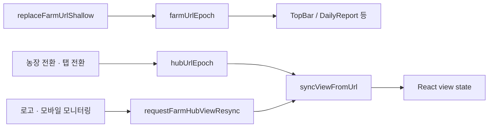

# `/farm` 허브 URL · 셸 계약

허브 셸·라우팅 소유. 구현: `src/lib/farm/farm-view-url.ts`, `farm-page-content.tsx`.  
Cursor 규칙: `.cursor/rules/farm-shell-routing.mdc`.

디자인(모션)·ARIA(프로토콜)는 이 스키마를 **소비만** 하고 키 의미를 바꾸지 않는다.

---

## 쿼리 키

| 키 | 값 | 기본 | 설명 |
|----|-----|------|------|
| `lsind` / `item` | 농장 키 | (권한·서버) | 활성 농장. soft home에서 **유지** |
| `view` | `list` \| `chart` \| `aria` \| (`jarvis`→aria) | **없음 = 그리드(map)** | 상단 탭 |
| `trendPeriod` | `7d` \| `30d` | **없음 = 24h** | 그리드·목록·차트 공유 기간. `24h`는 URL 생략 |
| `sp` | 축사유형 코드 | — | 그리드 드릴 (SP 그래프) |
| `mapLevel` | `stalls` | 없음=sp | 그리드 드릴 단계 |
| `stall` | 축사번호 | — | 그리드 컨트롤러 포커스 |
| `listMode` | `controller` \| `graph` \| `settings` | `controller`(생략) | 목록 탭 모드. 레거시 `channel`은 **읽기만** `graph`로 매핑·정규화 |
| `listLayout` | `group` | 없음=`flat` | 목록 레이아웃 |
| `ctrl` | 컨트롤러 키 | — | 목록 포커스 |
| `alarm` | 알람 id | — | 딥링크 |
| `chartSp` | 축사유형 코드 | — | 차트 집계 (유형). 맵 `sp`와 분리 |
| `chartStall` | 축사번호 | — | 차트 집계 (축사). `chartSp` 필요 |
| `chartCtrl` | 컨트롤러 키 (URI-encoded) | — | 차트 집계 (컨트롤러). `chartSp`+`chartStall` 필요 |

레거시 `tab=ops|…` 는 미들웨어·페이지에서 `/farm`으로 정리. 신규 코드는 `tab` 쓰지 않음.

레거시 `listMode=channel`: `parseListViewMode` → `graph`. 목록 탭 진입 시 `normalizeLegacyListModeParam`으로 URL을 `graph`로 고쳐 씀 (쓰기·타입에 `channel` 없음).

---

## 탭 (`view`)

```
resolveFarmHubView(raw)
  list  → list
  chart → chart
  aria | jarvis → aria
  else  → map   // view 없음·알 수 없음
```

| 전환 헬퍼 | 부수 효과 |
|-----------|-----------|
| `applyMapGridParams` | `view`·`listMode`·drill 제거 |
| `applyListViewParams` | `view=list`, `stall`·`mapLevel` 제거 (`sp` 유지 가능) |
| `applyChartViewParams` | `view=chart`, `listMode`·`stall`·`mapLevel` 제거 (`chart*` 유지) |
| `applyAriaViewParams` | `view=aria`, 동일하게 목록/드릴·`chart*` 정리 |
| `applyHubScopedViewParams(view)` | 위 + 레거시 `tab` 삭제 |
| `pinFarmHubViewParam(view)` | **탭만** 고정. drill·`chart*` 유지 (기간 변경용) |

### 차트 집계 딥링크

- 헬퍼: `resolveFarmChartScope` / `applyFarmChartScopeParams` / `clearFarmChartScopeParams` (`farm-chart-scope.ts`)
- 범위 변경: shallow + `pinFarmHubViewParam(chart)` — **hub epoch 올리지 않음**
- soft home·맵/목록/ARIA 전환·농장 전환 시 `chart*` 제거
- 예: `/farm?lsind=…&item=…&view=chart&trendPeriod=7d&chartSp=SP03&chartStall=1`

---

## Soft home

농장·기간만 남기고 탭/드릴/목록모드를 벗긴 **그리드 홈**.

- 헬퍼: `buildFarmMonitoringHomeParams` / `buildFarmMonitoringHomePath` / `isFarmMonitoringSoftHome`
- 진입점:
  - PC: 좌측 상단 로고 (`AppHeaderBrand`)
  - 모바일 compact: 하단 «모니터링» (`MobileBottomNav`)
- 유지: `lsind`, `item`, `trendPeriod`(7d|30d)
- 제거: `view`, drill, `listMode`, `ctrl`, `alarm`, `chart*`
- 이미 soft home이면 no-op

농장 전환 시: `clearHubFarmDrillParams` + 새 `lsind`/`item` (기간은 유지하는 편이 일반적).

---

## Shallow URL vs Next `useSearchParams`

탭·드릴·기간은 주로 `window.history.replaceState` (`replaceFarmUrlShallow`).

| API | 용도 |
|-----|------|
| `currentFarmSearchParams()` | `/farm`에서 **읽을 때** 기준 (window) |
| `replaceFarmUrlShallow(params)` | 쓰기 + `farmUrlEpoch` bump |
| `useSearchParams()` | SSR·첫 페인트·비 shallow 경로. `/farm` 재작성 소스로 쓰지 말 것 |

---

## Epoch · view sync

의도적 **이중(+resync)** 구조. 합치지 말 것.



| 채널 | bump 시점 | 구독 |
|------|-----------|------|
| `farmUrlEpoch` | 모든 shallow / popstate | `subscribeFarmUrlEpoch` |
| `hubUrlEpoch` | 농장·탭 전환 (`onHubUrlChange` / notify) | `FarmPageContent` effect |
| `requestFarmHubViewResync` | Provider **밖** soft home | `subscribeFarmHubViewResync` |

**금지:** 기간(`trendPeriod`)만 바꿀 때 `onHubUrlChange` / `requestFarmHubViewResync`  
→ URL에 `pinFarmHubViewParam` + `replaceFarmUrlShallow` + `urlTick`만.

단일 UI 진입점: `FarmPageContent`의 `syncViewFromUrl`  
(hydrate / hubUrlEpoch / resync / 비허브 searchParams).

---

## 탭 keep-alive (패널 마운트)

그리드(`map`)는 **항상** 마운트. 목록·차트·ARIA는 첫 방문 후 DOM에 남겨 재진입을 빠르게 하고, 이탈 후 TTL이 지나면 언마운트한다.

| 패널 | TTL | 비고 |
|------|-----|------|
| list | 5분 | BarnTable·enrich |
| chart | 3분 | `chart*` URL로 범위 복구 |
| aria | 2분 | 로컬 오브/마이크 UI 리셋 |

구현: `src/lib/farm/farm-hub-keepalive.ts` · `use-farm-hub-view-shell.ts` · `FarmPageContent`의 패널 렌더.

- 슬라이드 중(`viewSlide`) 해당 패널 언마운트 금지
- 농장 키 변경 시 비활성 패널 keep-alive **즉시 flush**
- `visibilitychange` → visible 시 TTL 재계산 (백그라운드 만료분 즉시 해제)
- 재진입 시 다시 마운트 (차트 범위는 URL, 목록 스크롤 등은 리셋될 수 있음)
- **P1 live pause:** DOM keep-alive와 별도 — 비활성 패널은 LIVE/enrich/폴링 중지 (`isFarmHubPanelLiveActive`). 캐시 유지 → 재진입 즉시 복구. 목록 enrich는 `view=list`일 때만 ([`HUB_STABILITY_P0.md`](./HUB_STABILITY_P0.md))

---

## 변경 시 주의 (단일 에이전트)

| 변경 | 참고 문서 |
|------|-----------|
| 쿼리 키·의미·soft home·epoch | 본 문서 (정본) |
| 탭 슬라이드·패널 모션 | `UI_MOTION.md` · `motionClass`만 소비 |
| `view=aria` NLP·음성 | `aria-protocol.md` |

---

## 관련 문서

- 사용설명서 IA: [user-manual/10-메뉴구조도.md](./user-manual/10-메뉴구조도.md)
- ARIA: [aria-protocol.md](./aria-protocol.md) (**정본**) · [voice-report-poc.md](./voice-report-poc.md) (**보조**)
- 문서 진입점: [README.md](./README.md)
- Preview 게이트 절차: [VERCEL_PREVIEW_GATE.md](./VERCEL_PREVIEW_GATE.md)
- 허브 안정화 P0: [HUB_STABILITY_P0.md](./HUB_STABILITY_P0.md) (`npm run verify:hub` · `npm run smoke:hub-url`)
- 로그인 후 브라우저 스모크: `npm run smoke:hub-url` (dev 또는 Vercel)
  - 로컬: 기본 `http://localhost:3000`
  - 배포본: `UI_VERIFY_BASE=https://<preview-or-prod>.vercel.app npm run smoke:hub-url`
  - 전제: 배포 env의 Supabase와 로컬 `.env.local`이 **동일 프로젝트** (테스트 계정)