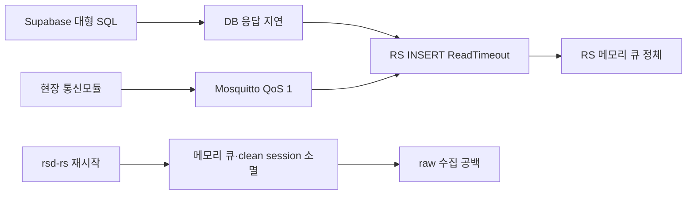

# 2026-09-17 RS 수집 공백과 재발 방지

> 상태: 서비스 복구 · 유실 구간 복구 불가 · 재발 방지 작업 대기
> 대상: EC2 `rsd-rs` → Supabase `iot_room_state_raw`

## 1. 현상과 영향

2026-09-17 Supabase에 큰 SQL 작업이 실행된 뒤 RS의 Supabase HTTPS INSERT가
`ReadTimeout`으로 정체됐다. `rsd-rs`는 systemd에서 `active (running)`이었지만
새 raw 행을 저장하지 못했다.

- 마지막 정상 저장: **17:14 KST** (`08:14 UTC`)
- 저장 재개: **18:49 KST** (`09:49 UTC`)
- DB 수집 공백: 약 **95분**
- 영향: 해당 구간 LIVE·시계열 raw 누락
- 비영향: Mosquitto 수신과 `rsd-c` 명령 에이전트

대형 SQL과 장애의 시간적 선후관계는 확인됐지만, Supabase 로그로 직접적인
자원 고갈 원인까지 확정한 것은 아니다. 직접 확인된 RS 오류는 로그인 실패가
아니라 Supabase HTTPS 응답 `ReadTimeout`이다.

## 2. 장애 흐름



`sudo systemctl restart rsd-rs` 후 MQTT 재구독과 DB 저장이 정상화됐다.
복구 직후 저장된 행은 백로그 burst가 아니라 기존 약 5분 주기의 신규
`history=false` 데이터였다.

## 3. 기존 데이터가 복구되지 않은 이유

- RS MQTT 연결 로그가 `c1`(clean session)이어서 재접속 시 브로커 세션 큐가 폐기됐다.
- RS에는 DB 저장 전 payload를 보존하는 디스크 Outbox가 없다.
- RS 재시작으로 프로세스 메모리 큐가 사라졌다.
- 해당 EC2 EBS 볼륨의 장애 시점 스냅샷이 없다.
- 2026-01-08 AMI는 장애 이전 데이터 복구에 사용할 수 없다.
- 현장 통신모듈은 이 구간의 전송 이력을 재생할 버퍼를 보유하지 않는다.

## 4. 재발 방지 작업

### P0 — RS durable Outbox

- [ ] `SIJackLee/rsd`의 현재 `RS.py` MQTT callback·DB flush 구조 확인
- [ ] MQTT callback에서 SQLite WAL Outbox에 먼저 commit
- [ ] Outbox와 Supabase 전송 worker 분리
- [ ] DB 실패 시 exponential backoff와 circuit breaker 적용
- [ ] RS 재시작 후 미전송 행을 오래된 순서로 자동 전송
- [ ] Outbox를 72시간 및 2~5GB 중 먼저 도달한 상한으로 제한
- [ ] 디스크 여유 20% 이하, Outbox oldest age·row count 경보
- [ ] Supabase 성공이 불명확한 timeout 재시도에 대비한 idempotency 설계

목표 흐름:

```text
MQTT → RS 수신 → SQLite Outbox commit → MQTT ACK
                                  ↓
                         DB worker → Supabase
```

### P1 — MQTT·DB 방어선

- [ ] RS 고정 `client_id`와 persistent session 적용 검토
- [ ] Mosquitto `persistence true`·queued message 상한·디스크 경보 검증
- [ ] raw `ingest_key` unique 제약 필요성 검토
- [ ] 운영 MCP/SQL 역할에 `statement_timeout`·`lock_timeout` 적용 검토
- [ ] 대형 SQL은 실행 전 `EXPLAIN`, 범위·예상 비용·운영 영향 확인
- [ ] 무거운 분석 쿼리는 read replica 또는 별도 분석 경로로 분리 검토

DB migration, Mosquitto 설정, EC2 systemd 변경과 운영 재시작은 각각 영향도를
확인하고 별도 승인 후 적용한다.

## 5. 완료 조건

1. Supabase 연결을 30분 차단한 동안 MQTT payload가 Outbox에 보존된다.
2. DB 장애 중 `rsd-rs`를 재시작해도 Outbox 행이 유지된다.
3. DB 복구 후 모든 행이 자동 저장되며 누락과 중복이 없다.
4. Outbox 상한과 디스크 경보가 동작한다.
5. `raw_last_received_at`과 Outbox oldest age가 운영 화면 또는 알림에 노출된다.

## 6. 롤백

- 기존 `RS.py`와 systemd unit을 보존하고 문제 발생 시 이전 버전으로 복원한다.
- 롤백 시에도 SQLite Outbox 파일은 삭제하지 않는다.
- DB schema 변경이 포함되면 forward migration 방식으로 별도 롤백 계획을 작성한다.
