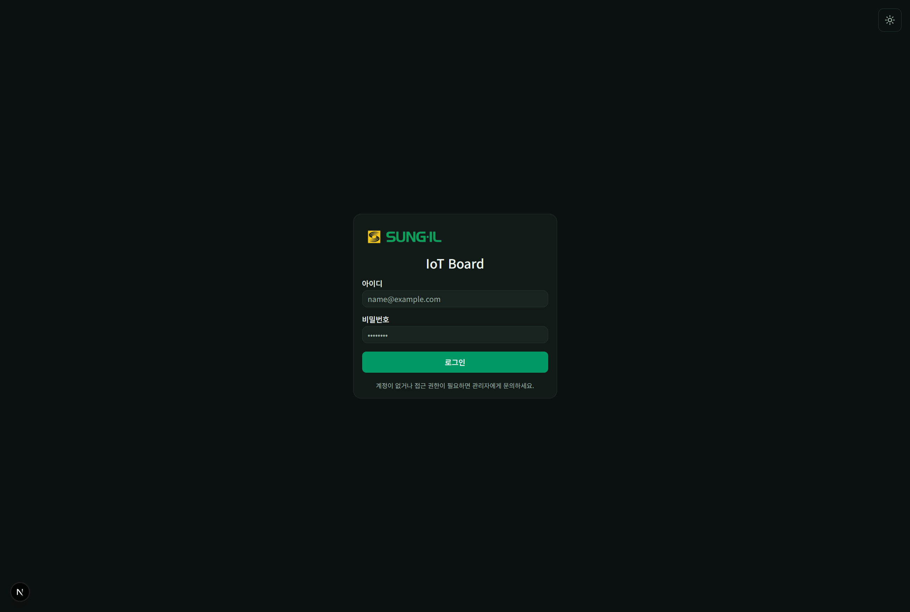

# 0. 시작하기

로그인부터 공통 헤더까지, 대시보드에 처음 들어올 때 보는 화면입니다. 메뉴 전체 구조는 [10-메뉴구조도.md](./10-메뉴구조도.md)를 보세요.

## 로그인

### 이 화면에서 할 수 있는 것

- **아이디 / 비밀번호**: 관리자에게 받은 계정으로 로그인합니다.
- **로그인**: 성공하면 모니터링(`/farm`)으로 이동합니다. 권한이 아직 없으면 대기 화면(`/pending`)으로 안내될 수 있습니다.
- **테마 토글**(우측 상단): 라이트/다크 모드를 바꿉니다.
- **문의 안내**: 계정이 없거나 접근이 막혀 있으면 관리자에게 요청합니다.

> 테스트·데모 계정 예시는 내부 출고 체크리스트를 참고하세요. 실운영 비밀번호는 문서에 적지 않습니다.

## 공통 헤더 (로그인 후)

모니터링·운영 화면 상단에 공통으로 표시됩니다. 상세는 [05-헤더와-알람.md](./05-헤더와-알람.md)를 보세요.

### 이 영역에서 할 수 있는 것

- **로고 / 모니터링 홈**: 농장 모니터링으로 돌아갑니다.
- **농장 선택**(관리자·다농장): 모니터링할 농장을 고릅니다.
- **새로고침**: 화면 데이터를 다시 불러옵니다.
- **레이아웃 토글**: PC ↔ 모바일 미리보기 레이아웃을 수동 전환합니다.
- **테마 토글**: 라이트/다크.
- **연결 상태**: 컨트롤러 온라인/오프라인 요약.
- **알람 벨**: 센서·통신 알림 목록.
- **계정 메뉴**: 역할 표시, 기능 안내 다시 보기, 농장 주소 등.
- **로그아웃**: 세션을 종료하고 로그인 화면으로 이동합니다.
- **운영**(관리자만): `/admin/ops` 운영 화면으로 이동합니다.

## 레거시 경로

예전 `/settings`, `/alarms`, `/controllers`는 **모니터링(`/farm`)으로 통합**되어 별도 화면이 없습니다.
