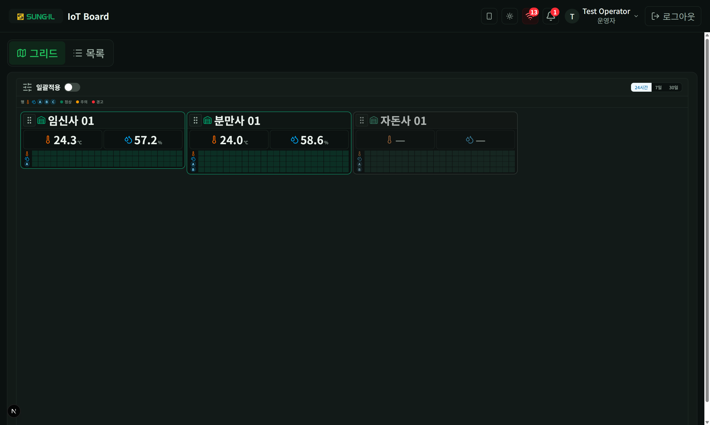
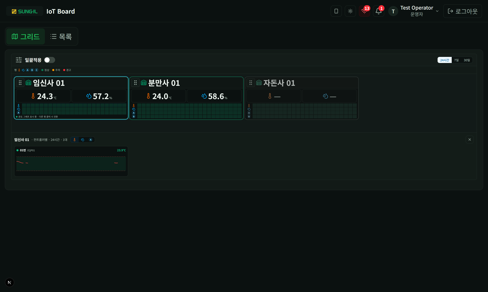

# 1. 모니터링 — 그리드

축사 배치와 이상 징후를 한눈에 보는 보기입니다. 상단에서 **그리드** 탭을 선택합니다.

## 그리드 개요

### 이 화면에서 할 수 있는 것

- **그리드 · 목록 전환**: 그리드는 배치·히트맵, 목록은 컨트롤러별 상세·설정입니다.
- **일괄적용**(명령 권한 있을 때): 토글을 켜면 축사 선택 모드로 바뀝니다. → [03-일괄적용.md](./03-일괄적용.md)
- **범례**: 온도·습도·채널과 정상(초록)·주의(주황)·경고(빨강) 색 의미.
- **기간 선택 (24시간 / 7일 / 30일)**: 모든 축사 카드의 히트맵·그래프 기간이 함께 바뀝니다.
- **축사 카드**: 현재 온도·습도와 상태(테두리·아이콘). 왼쪽 위 손잡이(⠿)로 카드 위치를 옮기면 배치가 저장됩니다.
- **심각도 히트맵**: 세로 = 온도·습도·A·B·C, 가로 = 시간. 색이 진한 구간을 클릭하면 상세가 열립니다.

## 확대 상세 — 컨트롤러별 그래프

### 이 화면에서 할 수 있는 것

- **지표 선택 (온도 / 습도 / 채널)**: 히트맵에서 고른 지표의 컨트롤러별 작은 그래프가 아래(또는 패널)에 펼쳐집니다.
- **점선(알람 상·하한)**: 선이 점선을 벗어나면 주의·경고 색으로 표시됩니다.
- **닫기**: 확대 상세를 접고 그리드만 봅니다.

> **뷰어**: 조회만 가능합니다. 일괄적용·설정 적용은 없습니다. → [09-역할별-차이.md](./09-역할별-차이.md)
