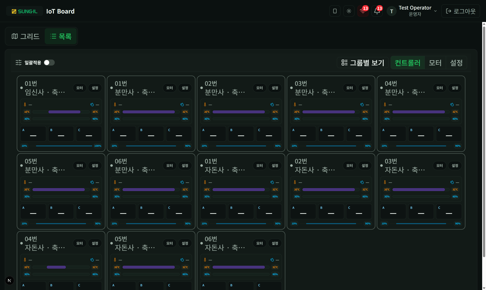

# 2. 모니터링 — 목록

컨트롤러별 게이지·그래프·설정을 보는 보기입니다. 상단에서 **목록** 탭을 선택합니다.

## 목록 개요

### 이 화면에서 할 수 있는 것

- **일괄적용**: 여러 컨트롤러에 같은 설정을 넣을 때 켭니다. → [03-일괄적용.md](./03-일괄적용.md)
- **그룹별 보기**: 축사 유형·그룹 단위로 묶어서 표시합니다.
- **컨트롤러 / 그래프 / 설정** 모드
  - **컨트롤러**: 온도·습도 게이지와 채널 값 중심.
  - **그래프**: 모든 카드의 추이 그래프를 한눈에 스캔합니다. 카드 본문(게이지·채널)은 기본으로 접혀 있고, 이상 징후가 보이면 펼쳐 설정을 조정합니다.
  - **설정**: 카드 안에 알람·설정온도·편차 요약과 적용 UI. → [04-컨트롤러-설정.md](./04-컨트롤러-설정.md)
- **컨트롤러 카드**: 게이지 바에서 현재값·허용범위·설정값을 함께 읽습니다.
- **카드 버튼 (펼침 / 설정 등)**: 그래프 모드에서는 화살표로 본문을 펼치고, 설정 버튼으로 조정합니다. PC에서는 카드 아래 패널이 펼쳐지고, 모바일에서는 sheet로 열립니다.

> 게이지 읽는 법·버튼 역할은 계정 메뉴의 **기능 안내 다시 보기** 투어에도 동일하게 안내됩니다.
