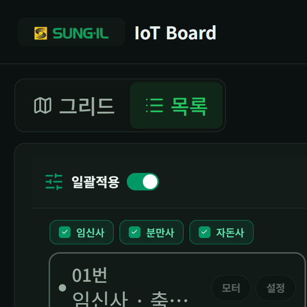
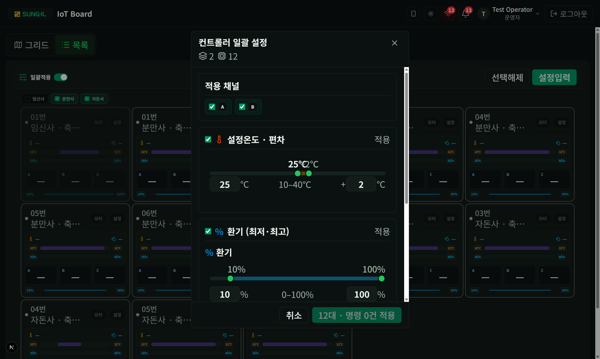

# 3. 일괄적용

명령 권한(`canCommand`)이 있는 계정만 사용할 수 있습니다. 여러 축사·컨트롤러에 설정온도·알람 등을 한 번에 보냅니다.

## 선택 모드

### 이 화면에서 할 수 있는 것

- **일괄적용 토글**: 켜면 카드가 선택 모드로 바뀝니다. 끄면 일반 모니터링으로 돌아갑니다.
- **축사 / 유형 선택**: 적용할 임신사·분만사·자돈사 등을 체크합니다.
- **선택해제**: 선택을 모두 지웁니다.
- **설정입력**: 선택 후 일괄 설정 패널(PC 모달 / 모바일 bottom sheet)을 엽니다.

## 설정 입력 · 적용

### 이 화면에서 할 수 있는 것

- **적용 채널 (A / B / C)**: 채널이 있는 컨트롤러에는 선택한 채널에만 명령이 나갑니다. 건수에 반영됩니다.
- **설정온도 · 편차**: 설정온도·온도 편차·환기(최저·최고)를 묶어서 켜고 값을 맞춥니다.
- **알람**: 온도·습도 상·하한 임계값을 묶어서 적용합니다.
- **접기/펼치기**: 섹션 헤더를 눌러 입력 영역을 접거나 펼칩니다.
- **취소 / 적용**: 적용 시 「N대 · 명령 M건」처럼 대상·건수가 표시됩니다.

> **뷰어·명령 권한 없음**: 일괄적용 토글 자체가 보이지 않습니다.  
> 모바일에서는 같은 내용이 하단 sheet로 열립니다. → [08-모바일.md](./08-모바일.md)
