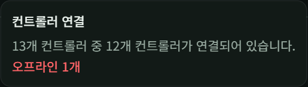
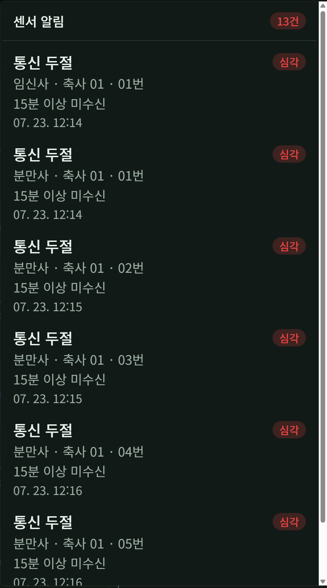
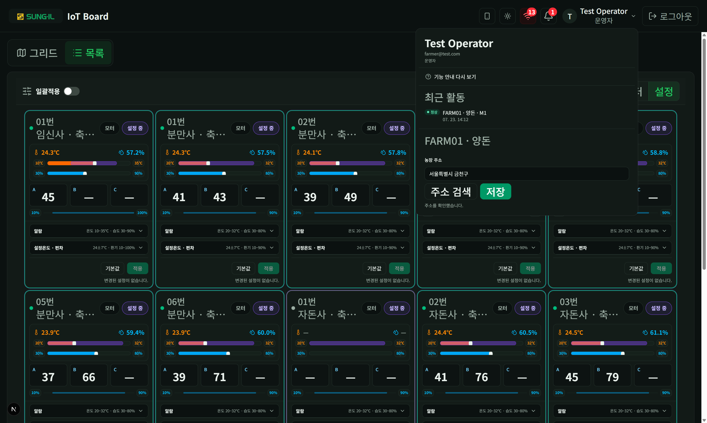

# 5. 헤더와 알람

오른쪽 상단 아이콘으로 연결·알림·계정·테마를 다룹니다.

## 연결 상태

### 이 화면에서 할 수 있는 것

- **연결 아이콘**: 등록·오프라인 컨트롤러 수를 배지로 보여 줍니다.
- **요약 팝오버**: 「N개 중 M개 연결 · 오프라인 K개」처럼 상태를 확인합니다.
- **오프라인**: 해당 컨트롤러 카드 값이 비거나 명령이 실패할 수 있습니다.

## 센서 알림

### 이 화면에서 할 수 있는 것

- **알람 벨**: 미확인·활성 알림 건수를 배지로 표시합니다.
- **알림 목록**: 통신 두절·심각도·위치(축사·번호)·사유·시각을 확인합니다.
- **항목 선택**: 관련 위치로 이동하거나 상세를 이어 볼 수 있습니다(UI에 따라).

> 예전 독립 `/alarms` 화면은 없으며, 헤더 벨과 모니터링에서 통합 확인합니다.

## 계정 메뉴

### 이 화면에서 할 수 있는 것

- **이름 · 이메일 · 역할**: 현재 로그인 계정과 관리자/운영자/뷰어를 확인합니다.
- **기능 안내 다시 보기**: 인앱 투어를 처음부터 다시 실행합니다.
- **최근 활동**: 최근 명령·상태 요약(표시되는 경우).
- **농장 주소**: 주소 검색·저장(운영자 등 권한이 있는 경우).
- **로그아웃**: 헤더의 로그아웃 버튼으로도 동일하게 종료합니다.
