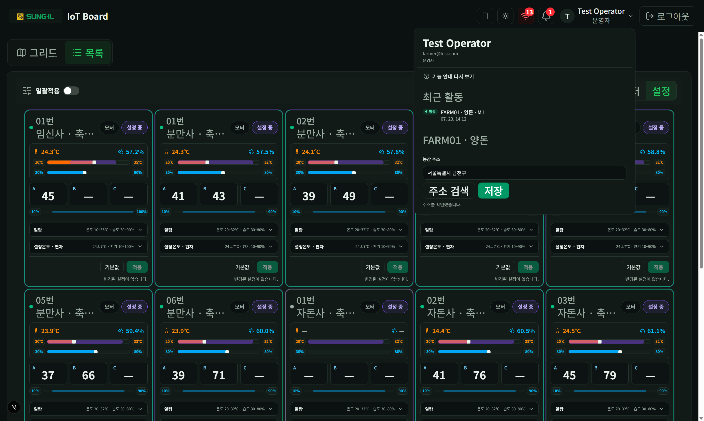

# 5. 헤더와 알람

오른쪽 상단 **도구 아이콘**과 **계정**으로 알림·기능·스타일을 다룹니다.

## 헤더 도구

아이콘이 헤더에 **상시** 보입니다. 알림·오프라인이 있으면 이상상황 배지가 표시됩니다.

순서(왼쪽 → 오른쪽, 계정 직전): **이상상황 · 운영(관리자) · 오늘의 리포트 · 라이트/다크 · PC/모바일(넓은 화면)**.

- **이상상황**: **모듈 에러코드** + **통신 두절** 건수 배지. 누르면 목록이 펼쳐집니다. (대시보드가 온·습 임계를 다시 계산해 이상상황으로 올리지 않습니다.)
- **확인**: 모듈 경보 행의 **확인**을 누르면 해당 경보가 활성 목록에서 빠집니다. (통신 두절 행에는 확인이 없습니다. 현장 조치·모듈 재전송 여부와는 별개입니다.)
- **운영**(관리자): 운영 ↔ 모니터링 전환.
- **오늘의 리포트**: 활성 농장 기준 PDF 다운로드. 표지는 진초록 레터헤드입니다. 구성은 **농장 주간(7일)** → **축사유형마다 1장** → **마지막에 권장구간 이탈**입니다. 그래프는 온도·습도·채널을 각각 한 행으로 그립니다. 표지 상·하한은 **이 농장에 설정한 알람**이고, 축사유형·이탈 페이지는 **생육 권장**입니다. 그래프의 최저·최고도 함께 표시합니다. 이상상황은 **모듈 에러·통신 두절**과 동일하며, 온·습 권장구간 이탈은 배지에 넣지 않고 마지막 페이지에서 봅니다. 추이 해상도는 화면 차트와 같습니다(24시간=15분, 7일·30일=1시간). 확대 브러시는 넣지 않습니다.
- **라이트 / 다크**: 화면 밝기 전환(이 기기에 저장).
- **PC / 모바일 레이아웃**: 넓은 화면에서만 미리보기 수동 전환(자동 감지 해제). 좁은 화면·실기기에서는 숨깁니다.

> 예전 독립 `/alarms` 화면은 없으며, 헤더 도구와 모니터링에서 통합 확인합니다.  
> 차트·목록에 보이는 온·습 상·하한은 **참조 가이드(임계)** 이며, 이상상황 배지와는 별개입니다.  
> **기기 알림:** 문자·전화가 아니라, 대시보드를 **앱으로 설치**한 뒤 **푸시 알림**으로 받을 예정입니다 (구현 후속).

## 계정 메뉴

### 이 화면에서 할 수 있는 것

- **이름 · 이메일 · 역할**: 현재 로그인 계정과 관리자/운영자/뷰어를 확인합니다.
- **전국 관제 요약**: 농장을 고르지 않은 관리자 화면에서는 아이콘+숫자로 전체·정상·경보·오프라인·위치만을 봅니다.
- **기능 안내**: 헤더 물음표. 농장 모니터링에서 누르면 **현재 탭**(필드·차트) 안내가 다시 실행됩니다.
- **최근 활동**: 최근 명령·상태 요약(표시되는 경우).
- **농장 주소**: 주소 검색·저장(운영자 등 권한이 있는 경우).
- **로그아웃**: 시트 오른쪽 위. 시트를 닫으려면 계정 뱃지·바깥·Esc를 씁니다.
