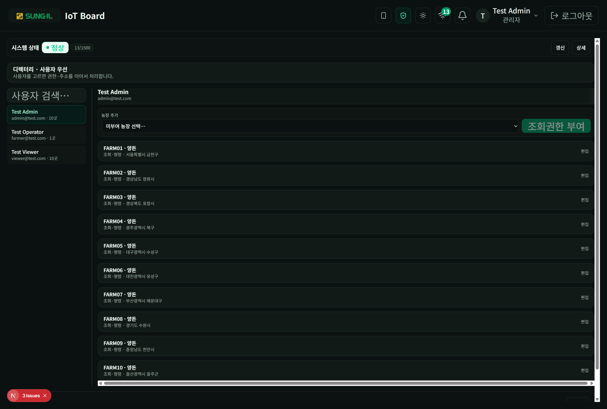

# 6. 운영 (관리자 전용)

경로: `/admin/ops`. 헤더의 **운영** 링크로 들어갑니다. 운영자·뷰어는 접근이 막히거나 모니터링으로 돌아갑니다.

## 디렉터리 · 시스템 상태

### 이 화면에서 할 수 있는 것

- **시스템 상태**: 전체 정상 여부와 용량·건수 요약. **갱신**으로 스캔·사용자·명령 스냅샷을 다시 불러옵니다.
- **상세**: 환경 컨트롤러·통신 모듈·수집 서버 등 하위 상태를 펼칩니다.
- **디렉터리 · 사용자 우선**: 왼쪽에서 사용자를 고르고, 오른쪽에서 농장 권한을 다룹니다.
- **사용자 검색**: 이름·이메일로 목록을 좁힙니다.
- **농장 추가 / 조회권한 부여**: 아직 없는 농장에 조회(및 필요 시 명령) 권한을 부여합니다.
- **부여된 농장 목록**: 농장 코드·업종·조회·명령·주소. **편집**으로 세부 권한을 조정합니다.
- **운영 종료 — 모니터링으로**: 운영 화면을 닫고 `/farm`으로 돌아갑니다.

> 명령 이력·스캔 상세는 시스템 상태·갱신 영역과 연계됩니다. 실운영에서 민감 정보는 스크린샷에 넣지 마세요.
