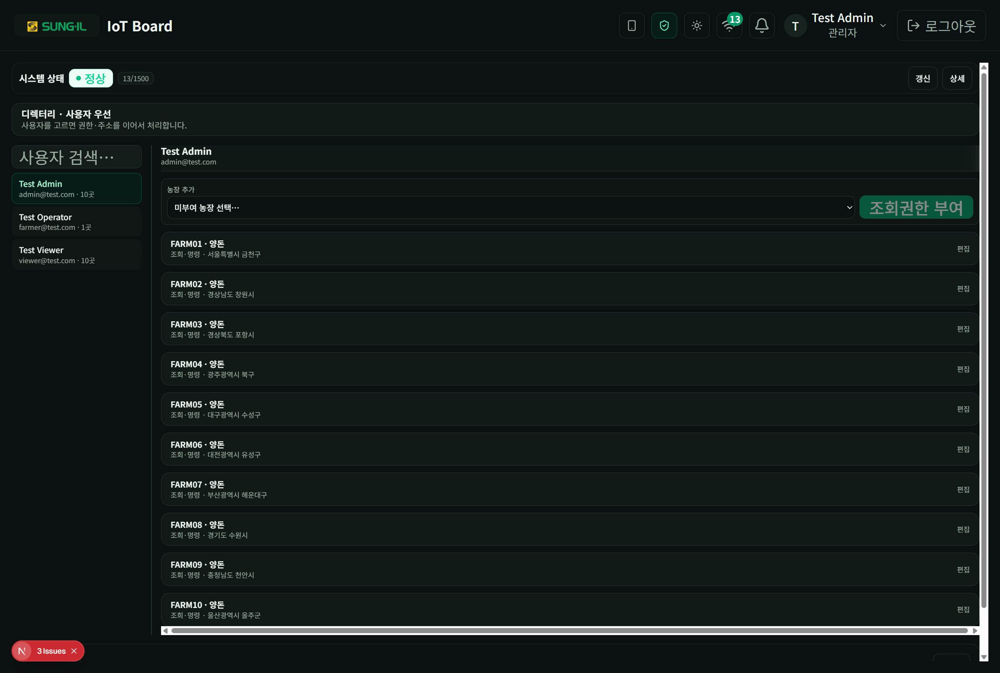

# 6. 운영 (관리자 전용)

경로: `/admin/ops`. 헤더의 **운영** 링크로 들어갑니다. 운영자·뷰어는 접근이 막히거나 모니터링으로 돌아갑니다.

## 디렉터리 · 시스템 상태

### 이 화면에서 할 수 있는 것

- **시스템 상태**: 전체 정상 여부와 용량·건수 요약. **갱신**으로 스캔·사용자·명령 스냅샷을 다시 불러옵니다.
- **상세**: 환경 컨트롤러·통신 모듈·수집 서버 등 하위 상태를 펼칩니다. 데이터 경로는 아이콘+짧은 이름(농장·MQTT·수집·명령·Edge·DB·화면·연계)으로 보고, 긴 이름은 호버·상세에 있습니다. 노드를 누르면 PC는 **페이지 오른쪽 패널**(DAG는 전체 너비), 모바일은 아래 시트로 상세가 열립니다. 이상은 **ERROR TYPE** / **RECOMMEND** 두 줄만 보여 줍니다. 타입은 Receive down · Partial outage · Stale · Display / storage · Command입니다.
- **농장 · 모듈**: 한 줄에 상태·대수·수신율·경과를 보고, 이상 행은 같은 **ERROR TYPE / RECOMMEND**를 붙입니다.
- **디렉터리 · 사용자 우선**: 왼쪽에서 사용자를 고르고, 오른쪽에서 농장 권한을 다룹니다.
- **사용자 검색**: 이름·이메일로 목록을 좁힙니다.
- **농장 추가 / 조회권한 부여**: 아직 없는 농장에 조회(및 필요 시 명령) 권한을 부여합니다.
- **부여된 농장 목록**: 농장 코드·업종·조회·명령·주소. **편집**으로 세부 권한을 조정합니다.
- **운영 종료 — 모니터링으로**: 운영 화면을 닫고 `/farm`으로 돌아갑니다.

> 명령 이력·스캔 상세는 시스템 상태·갱신 영역과 연계됩니다. 실운영에서 민감 정보는 스크린샷에 넣지 마세요.
