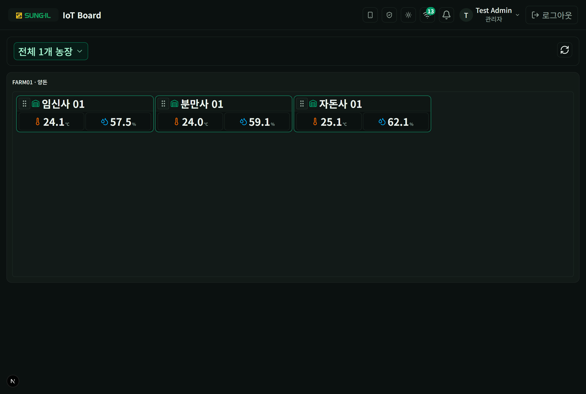
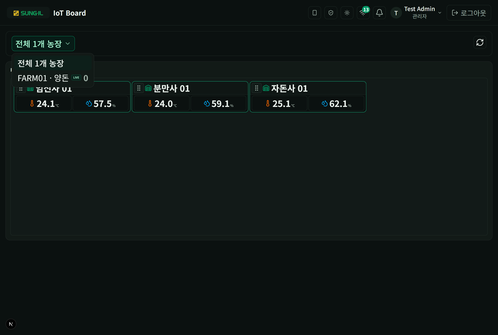

# 7. 전국 허브 (관리자)

관리자로 로그인하면 `/farm`에서 농장 단위로 LIVE 현황을 보고, **농장 선택**으로 전환합니다.

## 허브 · LIVE 그리드

### 이 화면에서 할 수 있는 것

- **농장 블록 (예: FARM01 · 양돈)**: 해당 농장의 축사 카드(온도·습도)를 한 화면에 모아 봅니다.
- **축사 카드**: 운영자와 동일하게 현재값·상태를 확인합니다. 카드 손잡이로 배치를 옮길 수 있습니다.
- **새로고침**: LIVE 현황을 다시 불러옵니다.
- **운영**: 헤더에서 운영(`/admin/ops`)으로 이동합니다.

## 농장 선택

### 이 화면에서 할 수 있는 것

- **전체 N개 농장**: 허브(전체) 보기로 돌아갑니다.
- **개별 농장 (LIVE 뱃지)**: 한 농장 모니터링으로 들어갑니다. LIVE는 실시간 데이터 수신 여부를 나타냅니다.
- **위치만** 농장(해당 시): 위치만 등록된 농장은 뱃지·안내로 구분됩니다.

> 운영자·뷰어는 보통 배정된 농장만 보입니다. 관리자 전용 허브·운영 메뉴는 [09-역할별-차이.md](./09-역할별-차이.md)를 참고하세요.
