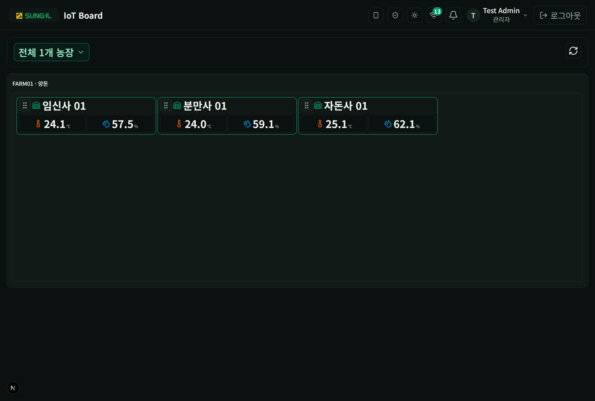
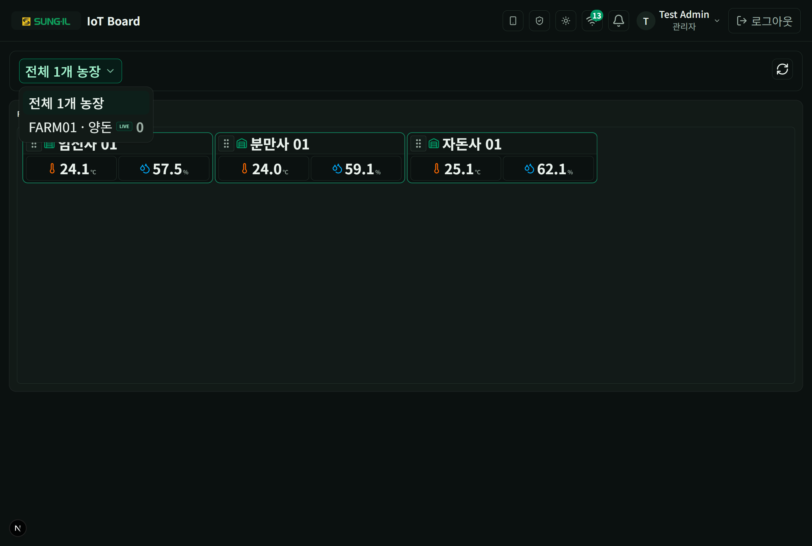

# 7. 전국 허브 (관리자)

관리자로 로그인하면 `/farm`(농장 미선택)에서 **지도 + 농장 현황 관제**를 봅니다. 농장을 고르면 운영자와 같은 현장 모니터링으로 들어갑니다.

## 허브 · 지도 관제

> 스크린샷은 이전 축사 그리드 허브일 수 있습니다. 현재 기본 화면은 전국 지도와 농장 목록입니다.

### 이 화면에서 할 수 있는 것

- **전국 지도**: Leaflet + OSM 한국 타일(한글 지명). 남한만 표시합니다. 좌표가 있는 농장을 핀으로 봅니다. 색은 상태입니다. 카카오 지도는 쓰지 않습니다.
  - 초록: 정상(LIVE)
  - 빨강: 경보
  - 회색: 오프라인
  - 하늘색: 위치만(LIVE 없음)
- **상단 칩**: 농장 수와 상태(정상·경보·오프라인·위치만)를 아이콘+숫자로 봅니다. 칩을 누르면 목록과 핀이 그 상태만 남고, 같은 칩을 다시 누르면 해제됩니다.
- **농장 목록**: 배정된 농장은 좌표가 없어도 목록에 나옵니다. 이름 한 줄에 온도·습도·제어기·수신 아이콘을 붙입니다. 좌표가 없는 농장은 목록 하단 핀 아이콘 숫자로만 표시됩니다.
- **핀 호버**: 이름·상태와 함께 온도·습도·제어기를 목록과 같은 아이콘으로 봅니다. 핀은 좌표가 있는 농장만 찍힙니다.
- **핀 또는 목록 선택**: 해당 농장의 현장 모니터링(`/farm?lsind=&item=`)으로 이동합니다.
- **운영**: 헤더에서 운영(`/admin/ops`)으로 이동합니다. 운영 화면에는 지도를 두지 않습니다.

## 농장 선택

### 이 화면에서 할 수 있는 것

- **전체 N개 농장**: 허브(지도 관제)로 돌아갑니다.
- **개별 농장 (LIVE 뱃지)**: 한 농장 모니터링으로 들어갑니다. LIVE는 실시간 데이터 수신 여부를 나타냅니다.
- **위치만** 농장: 위치만 등록된 농장은 뱃지·목록에서 구분됩니다.

> 운영자·뷰어는 보통 배정된 농장만 보입니다. 관리자 전용 허브·운영 메뉴는 [09-역할별-차이.md](./09-역할별-차이.md)를 참고하세요.
