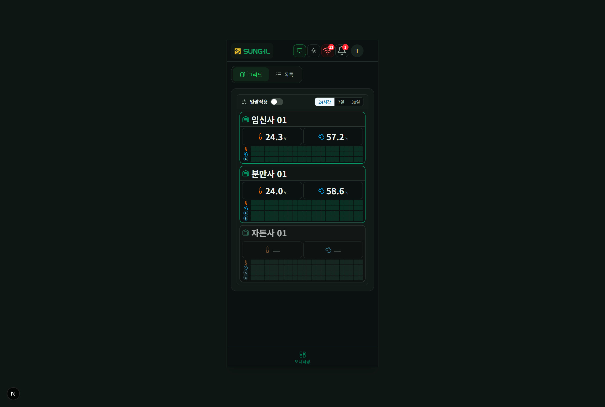
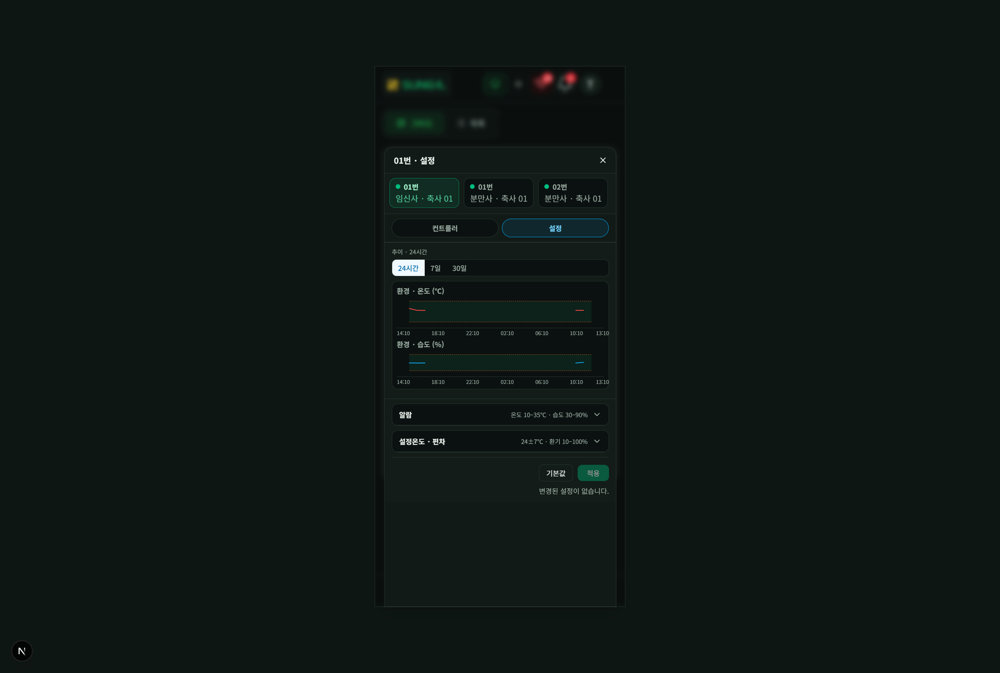

# 8. 모바일 핵심 차이

PC와 기능은 같고, 배치만 다릅니다. 헤더의 **레이아웃 토글**로 모바일 미리보기를 켜거나, 실제 좁은 화면에서 동일 UI가 적용됩니다.

## 홈 · 하단 내비

### 이 화면에서 할 수 있는 것

- **하단 내비 (모니터링)**: 주 화면으로 돌아가는 고정 메뉴입니다.
- **그리드 · 목록**: PC와 같은 보기 전환.
- **일괄적용 · 기간**: 상단 툴바에 유지됩니다.
- **헤더 아이콘**: 연결·알람·계정은 아이콘 위주로 압축됩니다(이름·로그아웃 문구는 줄어들 수 있음).

## 컨트롤러 설정 sheet

### 이 화면에서 할 수 있는 것

- **하단(또는 전면) sheet**: PC의 인라인 패널 대신 sheet로 설정·그래프가 열립니다.
- **컨트롤러 / 설정** 탭: 추이 그래프와 설정 입력을 전환합니다.
- **알람 · 설정온도 · 편차 접기**: PC 목록 설정과 같은 두 묶음입니다.
- **기본값 / 적용**: 명령 권한이 있을 때만 적용이 가능합니다.
- **닫기 (X)**: sheet를 닫고 목록·그리드로 돌아갑니다.

## 일괄적용 bottom sheet

모바일에서 일괄적용 → 축사 선택 → **설정입력**을 누르면 PC 모달 대신 **하단 sheet**가 열립니다.

### 이 화면에서 할 수 있는 것

- **적용 채널 A / B**: PC와 동일.
- **설정온도 · 편차 / 알람** 접기 묶음: 한 손 조작에 맞게 세로로 쌓입니다.
- **N대 · 명령 M건 적용**: 대상·채널을 반영한 건수 표시.
- **취소 / 닫기**: sheet만 닫고 선택 모드는 유지할 수 있습니다.

> PC 일괄적용 UI 설명은 [03-일괄적용.md](./03-일괄적용.md)를 참고하세요.
