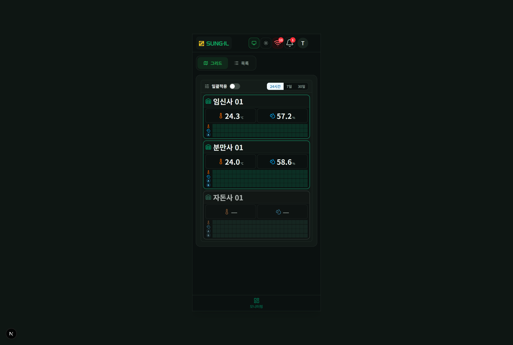
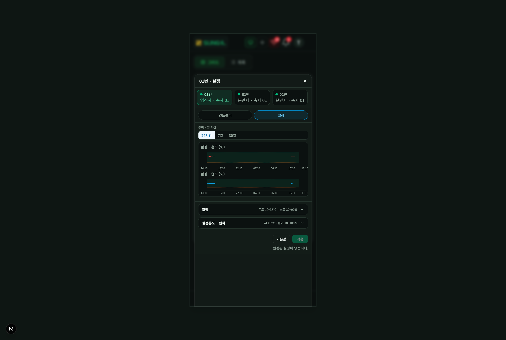

# 8. 모바일 핵심 차이

PC와 기능은 같고, 배치만 다릅니다. 헤더의 **레이아웃 토글**로 모바일 미리보기를 켜거나, 실제 좁은 화면에서 동일 UI가 적용됩니다.

## 홈 · 하단 내비

### 이 화면에서 할 수 있는 것

- **하단 내비 (모니터링)**: 주 화면으로 돌아가는 고정 메뉴입니다.
- **필드 · 차트 · 모델**: PC와 같은 보기 전환. 모델은 위성에서 부지를 고른 뒤 1m 필드에 축사를 놓습니다. **배치**의 방·복도 맞추기와 **연결**의 축사·컨트롤러 도구는 하단 시트(핸들로 접기/펼치기)입니다. Production에서는 관리자만 모델 탭이 보입니다.
- **일괄적용 · 기간**: 상단 툴바에 유지됩니다.
- **헤더 아이콘**: 연결·알람·계정은 아이콘 위주로 압축됩니다(이름·로그아웃 문구는 줄어들 수 있음).

### 손동작 (탭 · 스와이프 · 드래그)

PC의 클릭·휠과 달리, 모바일은 **한 손가락 탭 / 더블탭 / 세로·가로 슬라이드**로 조작합니다.

- **필드**: 카드를 **탭**하면 컨트롤러 시트가 열립니다. 목록은 **세로로 밀어** 스크롤합니다.
- **차트**: 기간 브러시는 **가로로 밀어** 구간을 고릅니다. 플롯을 **탭**하면 점이 핀되고, 빈곳을 **더블탭**하면 설정모드로 들어갑니다. 알람 숫자는 **세로 드래그** 또는 **더블탭**으로 맞춥니다.
- **모델**: 하단 시트 핸들을 **탭**하거나 **아래로 스와이프**하면 접히고, 접힌 핸들을 **위로 스와이프**하면 펼칩니다. **배치**에서 각도 숫자는 **밀어** 돌리며, 탭만으로는 한 칸씩 돌아가지 않습니다. **연결**에서 두 손가락으로 **핀치**해 격자를 확대합니다. 동·칸 가장자리 핸들은 **밀어** 열·칸 수를 맞춥니다.

## 컨트롤러 설정 sheet

### 이 화면에서 할 수 있는 것

- **하단(또는 전면) sheet**: PC의 인라인 패널 대신 sheet로 설정·그래프가 열립니다. 시트 안 그래프는 현장과 같이 **선만** 그리고, 선을 누르면 핀·카드가 붙습니다.
- **축사·컨트롤러 표시**: PC는 아이콘 우하단에 번호가 겹칩니다. 모바일은 **아이콘과 번호를 나란히**, 아이콘 24px·숫자 16px로 둡니다. 시트 제목·상단 피커·현황 카드가 같은 방식입니다.
- **컨트롤러 / 설정** 탭: 추이 그래프와 설정 입력을 전환합니다.
- **알람 · 설정온도 · 편차 접기**: PC 목록 설정과 같은 두 묶음입니다.
- **기본값 / 적용**: 명령 권한이 있을 때만 적용이 가능합니다.
- **차트에서 추이 보기**: 차트 탭으로 먼저 이동한 뒤, 시트가 접혀 하단 핸들만 남습니다. 핸들을 누르면 시트가 다시 펼쳐집니다.

## 일괄적용 bottom sheet

모바일에서 일괄적용 → 축사 선택 → **설정입력**을 누르면 PC 모달 대신 **하단 sheet**가 열립니다.

### 이 화면에서 할 수 있는 것

- **적용 채널 A / B**: PC와 동일.
- **설정온도 · 편차 / 알람** 접기 묶음: 한 손 조작에 맞게 세로로 쌓입니다.
- **N대 · 명령 M건 적용**: 대상·채널을 반영한 건수 표시.
- **취소 / 닫기**: sheet만 닫고 선택 모드는 유지할 수 있습니다.

> PC 일괄적용 UI 설명은 [03-일괄적용.md](./03-일괄적용.md)를 참고하세요.
