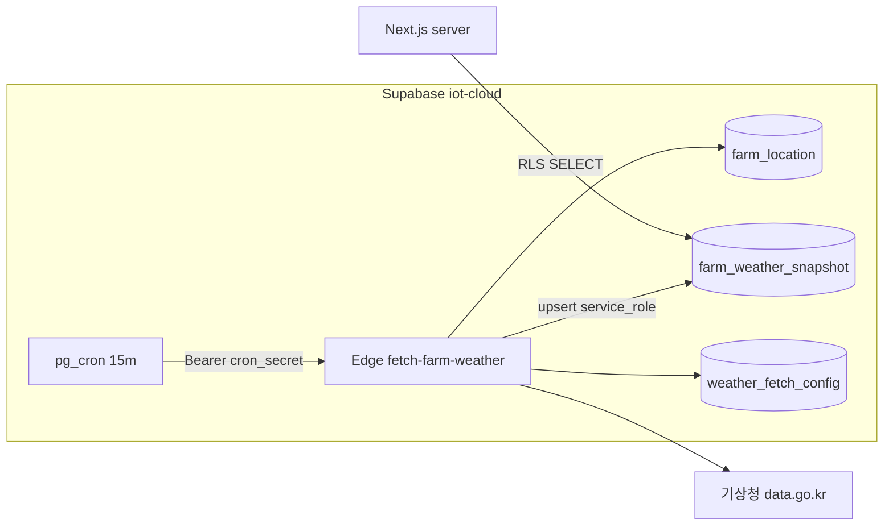

# Phase A — KMA 기상 스냅샷 (상세 계획)

> **상위:** [`weather-ctrl-recommendation-p1.md`](./weather-ctrl-recommendation-p1.md) §9 Phase A  
> **상태:** migration·Edge·enabled **적용 완료** · KMA 단기예보 **연동 확인** (2026-08-11)  
> **PoC 농장:** FARM01/P00 (`lsind_regist_no=FARM01`, `item_code=P00`)  
> **범위:** KMA 수집 + DB 캐시 + cron · **규칙·말풍선·명령 없음**

---

## 1. 목적 · 산출물

| 목표 | 산출 |
|------|------|
| FARM01 저장 좌표로 **외기 온·습도** 주기 수집 | `farm_weather_snapshot` 최신 1행/farm |
| 기상청 **공공데이터 API** 안정 호출 | `lib/weather/kma-*` + Edge `fetch-farm-weather` |
| 15분 주기 갱신 | pg_cron → Edge (기존 decode-batch 패턴) |
| Phase B 규칙 엔진 입력 | `getFarmWeatherSnapshot(farmKey)` server read |

**Done (Phase A):**

- [x] FARM01 `farm_location.lat/lng` 기준 KMA 격자 변환 단위 테스트 PASS
- [ ] Edge 1회 호출 → snapshot `fetch_ok=true`, `temp_c`·`humidity_pct` 채움 (**원격 deploy·enabled 후**)
- [x] 15분 cron migration SQL 준비 (`fetch-farm-weather-15m`, **enabled=false 초기**)
- [x] snapshot age > 20분이면 `stale` 판정 (`weather-stale.ts`)
- [x] KMA 장애 시 **이전 snapshot 유지** (Edge partial update)

### 구현 파일 (2026-08-11)

| 경로 | 역할 |
|------|------|
| `src/lib/weather/kma-*.ts` | 격자·baseTime·KMA client + tests |
| `src/lib/weather/weather-stale.ts` | stale 판정 |
| `src/lib/data/farm-weather.ts` | server read |
| `scripts/smoke-weather-kma.ts` | 실 API smoke |
| `supabase/migrations/20260811120000_farm_weather_snapshot.sql` | 테이블·cron |
| `supabase/functions/fetch-farm-weather/` | Edge 수집 |

### A5 운영 연결 (승인 후 순서)

1. 공공데이터포털 **단기예보 조회** API 키 → Supabase Secret `KMA_DATA_API_KEY`
2. `supabase db push` 또는 MCP `apply_migration` — `20260811120000_farm_weather_snapshot.sql`
3. `supabase functions deploy fetch-farm-weather`
4. curl (Bearer `iot_decode_config.cron_secret`) 1회 → `farm_weather_snapshot` 확인
5. `UPDATE weather_fetch_config SET enabled = true WHERE id = 1;`
6. 15–30분 후 cron 자동 갱신 확인

```bash
# 로컬 smoke (키는 .env.local)
npx tsx scripts/smoke-weather-kma.ts --lat=37.5665 --lng=126.978
```

---

## 2. 아키텍처



### 2.1 수집 경로 선택 (채택)

| 후보 | 채택 | 이유 |
|------|------|------|
| **Edge + pg_cron** | **✅** | `decode-batch`·`push-dispatch`·(구) `fetch-weather-warn`과 동일 |
| Vercel Cron + Route Handler | ❌ | API 키·스케줄이 배포와 분리 어려움 |
| Next만 (on-demand) | ❌ | 15분 proactive에 부적합 |

### 2.2 인증

- Edge: `Authorization: Bearer {iot_decode_config.cron_secret}` (기존 재사용)
- KMA: 쿼리 `serviceKey=` — **Supabase Secret** `KMA_DATA_API_KEY` (Edge 전용)
- DB 쓰기: Edge 내부 `SUPABASE_SERVICE_ROLE_KEY` (Supabase 기본 주입)

---

## 3. KMA API (PoC 최소 세트)

**포털 서비스명:** 기상청_단기예보 ((구)동네예보) 조회서비스  
**Base URL:** `https://apis.data.go.kr/1360000/VilageFcstInfoService_2.0`  
**응답:** `_type=json` (XML 파서 불필요)

| API | operation | 용도 | 주요 category |
|-----|-----------|------|----------------|
| 초단기실황 | `getUltraSrtNcst` | **현재** 외기 | `T1H` 기온°C, `REH` 습도%, `WSD` 풍속m/s, `RN1` 강수mm |
| 초단기예보 | `getUltraSrtFcst` | **~6h** 추이 | `T1H`, `REH` (fcstTime별) |

**Phase A에서 보류 (Phase B 직전 추가 가능):**

- `getVilageFcst` — 3h 단위 **~3일** (규칙 `wx_rise_vent` 「3시간 후 31°C」 문구용)
- `getPwnStatus` — 기상특보 (구 `weather_warn_cache` 와 별도)

### 3.1 격자 변환

- 입력: `farm_location.lat`, `lng` (WGS84)
- 출력: `nx`, `ny` (기상청 DFS 격자)
- 구현: `src/lib/weather/kma-grid.ts` — LAMBERT conformal conic (기상청 공식)
- 테스트: 서울시청 `(37.5665, 126.9780) → (60, 127)` 등 고정 벡터 3건

### 3.2 base_date / base_time

KMA는 **발표 시각**에 따라 유효한 `base_date`·`base_time`이 다름.

| API | 발표 주기 (KST) | 헬퍼 |
|-----|-----------------|------|
| getUltraSrtNcst | 매시 **40분** 이후 직전 정시 | `resolveUltraNcstBase(nowKst)` |
| getUltraSrtFcst | 02:30, 05:30, … 23:30 | `resolveUltraFcstBase(nowKst)` |

- `src/lib/weather/kma-base-time.ts` — KST 기준, API 호출 10분 전이면 **이전 슬롯** fallback
- 실패 코드 `NO_DATA` → 한 슬롯 이전 재시도 1회

### 3.3 호출 예 (개념)

```
GET .../getUltraSrtNcst
  ?serviceKey=...
  &numOfRows=1000&pageNo=1&dataType=JSON
  &base_date=20260811&base_time=1400
  &nx=60&ny=127
```

파서: `response.body.items.item[]` → `{ category, obsrValue | fcstValue, fcstDate?, fcstTime? }`

---

## 4. DB 스키마 (migration 초안)

**파일 (예):** `supabase/migrations/20260811120000_farm_weather_snapshot.sql`  
**적용:** 사용자 승인 후 `supabase db push` / MCP `apply_migration`

### 4.1 `farm_weather_snapshot`

농장당 **최신 1행** upsert (PoC 캐시).

| 컬럼 | 타입 | 설명 |
|------|------|------|
| `lsind_regist_no`, `item_code` | text | PK, `farm_location` FK 논리 참조 |
| `observed_at` | timestamptz | Edge fetch 완료 시각 |
| `grid_nx`, `grid_ny` | int | KMA 격자 |
| `lat`, `lng` | double | fetch 시점 좌표 (location 변경 추적) |
| `kma_ncst_base_date`, `kma_ncst_base_time` | text | 실황 base |
| `kma_fcst_base_date`, `kma_fcst_base_time` | text | 예보 base |
| `temp_c` | numeric(4,1) | 실황 T1H |
| `humidity_pct` | numeric(4,1) | 실황 REH |
| `wind_ms` | numeric(4,1) | WSD |
| `precip_mm` | numeric(6,2) | RN1 |
| `forecast_points` | jsonb | `[{ "at": "ISO", "tempC", "humidityPct" }, …]` 최대 6~12점 |
| `fetch_ok` | boolean | 파싱·HTTP 성공 |
| `result_code`, `result_msg` | text | KMA resultCode / err |
| `raw_ncst`, `raw_fcst` | jsonb | 디버그 (90d 후 NULL화는 v2) |
| `updated_at` | timestamptz | default now() |

**인덱스:** PK만 (farm 1행). Phase B에서 `observed_at` stale 조회는 PK scan.

### 4.2 `weather_fetch_config` (singleton)

| 컬럼 | 타입 | 기본 |
|------|------|------|
| `id` | int | 1 (CHECK id=1) |
| `enabled` | boolean | **false** (승인 후 true) |
| `farm_keys` | text[] | `{FARM01/P00}` |
| `interval_minutes` | int | 15 |

Edge는 `enabled=false`면 **200 + skipped** (cron은 유지·no-op).

### 4.3 RLS

| 역할 | farm_weather_snapshot |
|------|------------------------|
| `authenticated` | SELECT — `user_can_read_farm(uid, lsind, item)` |
| `service_role` | ALL (Edge upsert) |
| weather_fetch_config | SELECT admin only 또는 service_role only |

`GRANT SELECT ON farm_weather_snapshot TO authenticated`

### 4.4 pg_cron

```sql
-- jobname: fetch-farm-weather-15m
-- schedule: */15 * * * *
-- body: net.http_post → .../functions/v1/fetch-farm-weather
-- Authorization: Bearer + iot_decode_config.cron_secret
```

- migration에 **idempotent** 등록 (`cron.unschedule` 후 schedule)
- **초기 `weather_fetch_config.enabled = false`** → 키·Edge 배포 후 수동 `UPDATE enabled=true`

---

## 5. 코드 구조

### 5.1 신규 파일

```
dashboard/web/
├── src/lib/weather/
│   ├── kma-types.ts           # KmaReading, KmaForecastPoint
│   ├── kma-grid.ts            # latLngToGrid(nx, ny)
│   ├── kma-grid.test.ts
│   ├── kma-base-time.ts       # resolveUltraNcstBase, resolveUltraFcstBase
│   ├── kma-base-time.test.ts
│   ├── kma-client.ts          # fetchUltraNcst, fetchUltraFcst, mergeReading
│   └── kma-client.test.ts     # fixture JSON
├── src/lib/data/
│   └── farm-weather.ts        # getFarmWeatherSnapshot, isWeatherStale
├── supabase/functions/
│   └── fetch-farm-weather/
│       └── index.ts           # cron entry, loop allowlist farms
└── scripts/
    └── smoke-weather-kma.ts   # CLI: --lat --lng [--key env]
```

### 5.2 Edge `fetch-farm-weather` 흐름

1. Bearer `cron_secret` 검증 (`decode-batch`와 동일)
2. `weather_fetch_config` — `enabled` 확인
3. `farm_keys` 파싱 → `lsind` + `item_code` split
4. 각 farm:
   - `farm_location` SELECT lat/lng — 없으면 skip + log
   - `latLngToGrid` → KMA 2회 호출 (ncst + fcst)
   - merge → `farm_weather_snapshot` upsert
5. JSON `{ ok, farms: [{ farmKey, fetchOk, tempC }] }`

**에러 정책:**

- farm 1곳 실패 → 다른 farm 계속 (PoC는 1곳)
- KMA HTTP 5xx → `fetch_ok=false`, **기존 행의 temp 컬럼은 UPDATE에서 제외** (COALESCE 패턴 또는 partial update)

### 5.3 Server read (Phase B 선행 API 없음)

```typescript
// farm-weather.ts (server-only)
getFarmWeatherSnapshot(farmKey): FarmWeatherSnapshot | null
isWeatherStale(snapshot, maxAgeMin = 20): boolean
```

- Phase A에서 **admin debug 페이지/API는 만들지 않음** (선택: `/api/admin/weather-snapshot` smoke — 승인 시)

---

## 6. 환경변수 · Secrets

| 이름 | 위치 | 비고 |
|------|------|------|
| `KMA_DATA_API_KEY` | Supabase Edge Secrets | 공공데이터포털 **일반 인증키** (Decoding URL) |
| `SUPABASE_SERVICE_ROLE_KEY` | Edge (기본) | upsert |
| `cron_secret` | `iot_decode_config` | 기존 |
| `WEATHER_CTRL_REC_V1` | `.env.example` 이름만 | Phase C~D UI·규칙 gate (**Phase A는 미사용**) |

`.env.example` 추가 (값 없음):

```
# (선택) Phase A — Edge fetch-farm-weather. Supabase Secrets에만 실값.
# KMA_DATA_API_KEY=
```

로컬 smoke: `KMA_DATA_API_KEY` in `.env.local` (스크립트만, 커밋 금지)

---

## 7. FARM01 사전 조건

| # | 확인 | 조치 |
|---|------|------|
| 1 | `farm_location` 행 존재 | Profile Top Sheet 주소 저장 또는 admin seed |
| 2 | `geocode_source` | `geocode_api` 권장 (`region_lookup`는 시군구 중심 — PoC 가능하나 정확도 낮음) |
| 3 | lat/lng 범위 | CHECK 33–39, 124–132 이미 DB 제약 |
| 4 | `KAKAO_REST_API_KEY` | 주소 재저장 시 geocode (기존) |

**검증 SQL (승인 후 읽기 전용):**

```sql
SELECT lsind_regist_no, item_code, lat, lng, geocode_source, address_text
FROM farm_location
WHERE lsind_regist_no = 'FARM01' AND item_code = 'P00';
```

---

## 8. 구현 단계 (작업 순서)

### A1 · KMA 유틸 (로컬 only, DB 없음)

| 작업 | 검증 |
|------|------|
| `kma-grid.ts` + test | 고정 좌표 3건 |
| `kma-base-time.ts` + test | KST 경계 mock clock |
| `kma-client.ts` + fixture test | 샘플 JSON parse |
| `scripts/smoke-weather-kma.ts` | 실키로 ncst+fcst 1회 출력 |

**예상:** 0.5–1일

### A2 · migration 초안 (미적용)

| 작업 | 검증 |
|------|------|
| `farm_weather_snapshot` + RLS | SQL review |
| `weather_fetch_config` seed | enabled=false |
| pg_cron job SQL | idempotent |

**승인 요청 패키지:** 전체 SQL + 영향(신규 테이블 2, cron job 1, DROP 없음)

**예상:** 0.5일

### A3 · Edge function

| 작업 | 검증 |
|------|------|
| `fetch-farm-weather/index.ts` | `supabase functions serve` + curl |
| Deno에서 `kma-client` | 동일 로직 **복제 vs 공유** — PoC는 Edge 파일 내 inline 또는 `supabase/functions/_shared/weather/` |

> **주의:** Next `src/lib/weather`는 Node; Edge는 Deno. Phase A는 **로직 duplicate 최소** (grid+client를 Edge `_shared`에 두고, Next는 re-export 또는 tsx smoke만 `_shared` 미러) — 또는 smoke는 Edge invoke만.

**예상:** 1일

### A4 · Server read helper

| 작업 | 검증 |
|------|------|
| `farm-weather.ts` | dev에서 service role 또는 seeded row mock |
| `isWeatherStale` | unit test |

**예상:** 0.25일

### A5 · 운영 연결 (**승인 후**)

| 순서 | 작업 |
|------|------|
| 1 | 공공데이터포털 API 키 발급·Supabase Secret 등록 |
| 2 | migration apply |
| 3 | Edge deploy `fetch-farm-weather` |
| 4 | curl 1회 → snapshot 확인 |
| 5 | `UPDATE weather_fetch_config SET enabled=true` |
| 6 | 15–30분 후 cron 자동 갱신 확인 |

**예상:** 0.5일 (키·승인 대기 제외)

### A6 · 문서 · 게이트

| 작업 |
|------|
| 본 문서 상태 → «적용 완료» 갱신 |
| `weather-ctrl-recommendation-p1.md` §8 KMA 링크 보강 |
| `npm run build` / 관련 test PASS |

---

## 9. 테스트 계획

| 레벨 | 명령·방법 | PASS 기준 |
|------|-----------|-----------|
| Unit | `npx tsx src/lib/weather/kma-grid.test.ts` 등 | grid·baseTime·parse |
| Smoke | `npx tsx scripts/smoke-weather-kma.ts --lat=... --lng=...` | temp·humidity 숫자 출력 |
| Edge local | curl Bearer cron_secret | JSON ok |
| DB | SELECT snapshot FARM01 | fetch_ok, observed_at 최근 |
| Stale | observed_at 수동 -25min | `isWeatherStale === true` |
| Failure | 잘못된 serviceKey | fetch_ok=false, 이전 temp 유지 |

**회귀:** `npm run verify:design` · `npx tsc --noEmit` — weather 코드는 UI 미변경

---

## 10. 한도 · 리스크

| 항목 | 내용 | 완화 |
|------|------|------|
| API 일 호출 한도 | 포털 tier ~1000/day | farm 1 × 96/day ≪ 한도 |
| 발표 시각 공백 | 정시+40분 전 ncst 빈 응답 | baseTime fallback |
| 좌표 부정확 | region_lookup centroid | FARM01 geocode_api 재저장 |
| Edge/Node 코드 중복 | Deno vs Node | `_shared` 또는 Phase A는 Edge-only fetch |
| cron_secret 유출 | DB RLS | 기존 decode와 동일 위험 프로파일 |
| **구 weather_warn** | dropped 2026-08-03 | **재사용·혼동 금지**, 신규 테이블명 |

---

## 11. 롤백

1. `UPDATE weather_fetch_config SET enabled=false`
2. `SELECT cron.unschedule(jobid) FROM cron.job WHERE jobname='fetch-farm-weather-15m'`
3. Edge function 배포 해제 (선택)
4. migration revert: `DROP TABLE farm_weather_snapshot, weather_fetch_config` (**승인 후**)

데이터만 제거해도 대시보드 UI 영향 **없음** (Phase A는 read helper만 추가).

---

## 12. Phase A vs B 경계

| Phase A (본 문서) | Phase B 이후 |
|-------------------|----------------|
| `farm_weather_snapshot` | `weather_control_recommendation` |
| KMA fetch | `lib/weather-control/rules` |
| `getFarmWeatherSnapshot` | LIVE + weather merge |
| cron 15m | pending 30m TTL |
| — | DELIN 말풍선 · approve API |

Phase B 시작 조건: FARM01 snapshot **24h 중 fetch_ok 비율 ≥ 90%** (운영 관측 1일).

---

## 13. 승인 시 요청 체크리스트

구현·migration 적용 전 사용자 확인:

- [ ] 공공데이터 API 키 발급 완료 (또는 발급 위임)
- [ ] migration SQL 검토·`apply` 승인
- [ ] Supabase Secret `KMA_DATA_API_KEY` 등록 승인
- [ ] Edge `fetch-farm-weather` deploy 승인
- [ ] FARM01 `farm_location` 좌표 실측 확인
- [ ] cron `enabled=true` 전환 시점
