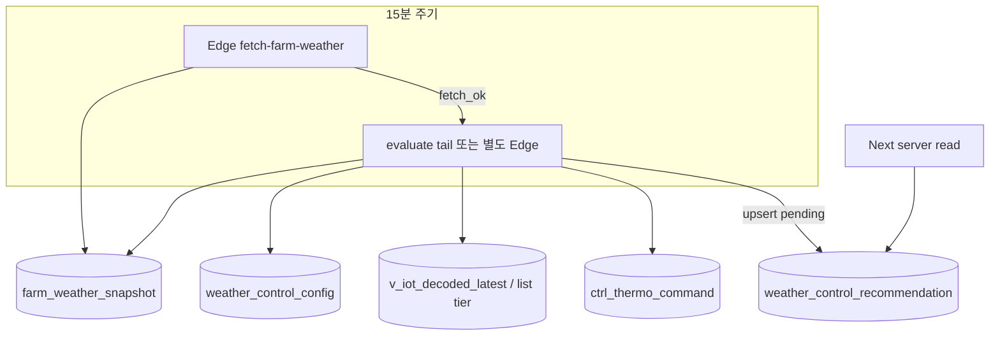

# Phase B — 규칙 엔진 + 권장 draft (상세 계획)

> **상위:** [`weather-ctrl-recommendation-p1.md`](./weather-ctrl-recommendation-p1.md) §9 Phase B  
> **선행:** [`weather-ctrl-phase-a.md`](./weather-ctrl-phase-a.md) ✅ (KMA snapshot·cron)  
> **상태:** **구현·원격 적용 완료** (2026-08-11) — migration·Edge evaluate hook·config enabled  
> **PoC:** FARM01/P00 · **controller** 1건 · pending **30분** · **UI·승인 명령 없음** (Phase C/D)

---

## 1. 목적 · Phase B 경계

| Phase B **포함** | Phase B **미포함** |
|------------------|-------------------|
| `weather_control_recommendation` migration | DELIN 말풍선 UI (Phase C) |
| 규칙 엔진 3종 (코드 고정) | `approve` API · `sendThermoCommandAction` (Phase D) |
| KMA + LIVE merge → **draft pending** | OpenAI / `runAriaProtocol` |
| 만료·무시·중복 방지 CRUD | `WEATHER_CTRL_REC_V1` UI gate (Phase E) |
| admin/smoke read API (선택) | 기상특보 API 연동 (v1.1 옵션) |

**Done (Phase B):**

- [x] FARM01 online controller 대상 규칙 평가 파이프라인 (Edge fetch 성공 직후 evaluate)
- [x] `expires_at` = created + **30분** · pg_cron `expire-weather-rec-5m`
- [x] 동일 farm+controller **pending 1건** (upsert 갱신)
- [x] snapshot stale (>20분) 또는 `fetch_ok=false` → **pending 생성 안 함**
- [x] 규칙 단위 테스트 + `scripts/smoke-weather-control-eval.ts` PASS
- [x] Phase C read helper — `getPendingWeatherRecommendation` + `GET /api/weather-control/pending`

> **참고:** 현재 FARM01 외기 27.6°C·습도 59% 등 **규칙 미충족** 시 pending 행 없음이 정상 (`evaluate: no_match`).

### 구현 파일 (2026-08-11)

| 경로 | 역할 |
|------|------|
| `src/lib/weather-control/*` | 규칙·propose·evaluate·store + tests |
| `src/lib/data/weather-recommendation.ts` | server read (Phase C) |
| `src/app/api/weather-control/pending/route.ts` | admin/농장 read API |
| `scripts/smoke-weather-control-eval.ts` | dry-eval + `--invoke` Edge smoke |
| `supabase/migrations/20260812120000_weather_control_recommendation.sql` | 테이블·expire cron |
| `supabase/functions/fetch-farm-weather/evaluate-runner.ts` | Edge evaluate tail |

```bash
# dry-eval + DB 상태 (service role)
npx tsx scripts/smoke-weather-control-eval.ts --farm=FARM01/P00

# Edge fetch + evaluate 1회
npx tsx scripts/smoke-weather-control-eval.ts --farm=FARM01/P00 --invoke
```

---

## 2. 아키텍처



### 2.1 평가 트리거 (채택)

| 후보 | 채택 | 이유 |
|------|------|------|
| **fetch-farm-weather 성공 직후 evaluate** | **✅ PoC** | cron 1회 · snapshot·규칙 시각 정합 |
| 별도 Edge + pg_cron +2분 | △ v1.1 | LIVE lag 분리 필요 시 |
| 허브 진입 on-demand only | ❌ | proactive 말풍선에 부적합 |

PoC: `fetch-farm-weather/index.ts` 마지막에 `evaluateWeatherControl(farmKey)` 호출 (KMA upsert **성공 farm만**).

### 2.2 코드 배치

| 경로 | 역할 |
|------|------|
| `src/lib/weather-control/types.ts` | RuleId, inputs, draft, caps |
| `src/lib/weather-control/rules.ts` | 3규칙 pure functions |
| `src/lib/weather-control/propose.ts` | current→proposed Δ + hard cap |
| `src/lib/weather-control/evaluate.ts` | merge inputs, pick controller, run rules |
| `src/lib/weather-control/recommendation-store.ts` | pending upsert / expire / dismiss (server) |
| `src/lib/weather-control/*.test.ts` | 단위 테스트 |
| `supabase/functions/fetch-farm-weather/evaluate.ts` | Deno thin wrapper (로직 mirror 또는 `_shared`) |
| `scripts/smoke-weather-control-eval.ts` | FARM01 dry-run / DB write smoke |

---

## 3. 입력 데이터 (merge)

### 3.1 외기 — `farm_weather_snapshot`

| 필드 | 규칙 사용 |
|------|-----------|
| `temp_c`, `humidity_pct` | 실황 비교 |
| `forecast_points[]` | 3h 추이 (`wx_rise_vent`, `wx_drop_heat`) |
| `observed_at`, `fetch_ok` | stale gate |
| `forecast_points[].at` | ISO+09:00 — now~+3h 필터 |

Gate: `fetch_ok=true` AND `!isWeatherStale(observed_at, 20)`.

### 3.2 내부 — LIVE

| 소스 | 필드 |
|------|------|
| `getLiveReadings({ farmKey, slim: true })` | `controllerKey`, `moduleUid`, `tempC`, `humidityPct`, `status`, `thermo` |
| `buildThermoSettingsMap(getThermoCommands(...))` | effective **current** setpoint / vent (pending>sent>live) |

**Controller 선택 (PoC):**

1. `farmKey = FARM01/P00`
2. `status !== 'offline'`
3. `thermo` 또는 settings map에 **min/max vent** 존재
4. **온도 알람 우선** — `tempC`가 setpoint+deviation에 가장 근접(여유 적음)
5. 동률 → `compareControllerKeys` 첫 번째

`weather_control_config.target_controller_key` (optional) — 지정 시 그 controller만.

### 3.3 현재 설정 (current)

`ControllerThermoSettings` from `resolveThermoSettings`:

- `setpointTemp`, `tempDeviation`, `minVentPct`, `maxVentPct`
- `source` — pending command 있으면 **새 pending 생성 skip** (명령 충돌 방지)

---

## 4. 규칙 엔진 v1 (수치 확정)

공통 **hard cap** (propose 단계):

| 항목 | min | max |
|------|-----|-----|
| setpoint | 18°C | 32°C |
| minVent | 20% | 90% |
| maxVent | 20% | 90% |
| minVent ≤ maxVent | 필수 | |

### 4.1 `wx_rise_vent` — 외기 상승 → 환기 상향

**발화 조건 (AND):**

| # | 조건 |
|---|------|
| 1 | `forecastMax3h - externalTemp >= 3` **OR** `forecastMax3h - externalTemp >= 4` (4°C 상승) |
| 2 | `internalTemp >= externalTemp - 2` (내부 여유 ≤2°C) |
| 3 | `current.maxVentPct < 90` (올릴 여지) |

**proposed:** `minVent +5`, `maxVent +10` (cap 적용). setpoint **유지**.

**reason_facts 예:** `{ "externalNow": 27.6, "forecastMax3h": 31, "internalTemp": 27.2, "deltaVentMin": 5, "deltaVentMax": 10 }`

### 4.2 `wx_drop_heat` — 외기 하강 → 목표온도 하향

**발화 조건 (AND):**

| # | 조건 |
|---|------|
| 1 | `forecastMin3h <= externalTemp - 3` |
| 2 | `current.setpointTemp > 18` |

**proposed:** `setpoint - 1°C`. vent **유지**.

### 4.3 `wx_humid_vent` — 고습 → 최고환기 상향

**발화 조건 (OR):**

| # | 조건 |
|---|------|
| 1 | `externalHumidity >= 70` |
| 2 | `internalHumidity >= 75` |

**proposed:** `maxVent +10` (cap 90). min/setpoint **유지**.

### 4.4 우선순위 (복수 발화)

동시 만족 시 **1건만** pending:

```
wx_humid_vent  >  wx_rise_vent  >  wx_drop_heat
```

(습도·폭염성 상승이 난방 하향보다 우선)

### 4.5 no-op 조건

- proposed == current (cap 후 동일)
- controller offline
- thermo settings 없음
- existing pending command on controller
- 30분 내 **동일 rule_id + 동일 proposed** 이미 dismissed → skip (스팸 방지, optional v1)

---

## 5. DB 스키마 (migration 초안)

**파일 (예):** `supabase/migrations/20260812120000_weather_control_recommendation.sql`

### 5.1 `weather_control_recommendation`

| 컬럼 | 타입 | 설명 |
|------|------|------|
| `id` | uuid PK | |
| `lsind_regist_no`, `item_code` | text | farm |
| `module_uid` | int | 명령 target |
| `controller_key` | text | `SP01:01:06` 형 |
| `stall_ty_code`, `stall_no`, `eqpmn_no` | text | `sendThermoCommandAction`용 |
| `status` | text | `pending\|approved\|dismissed\|expired` |
| `rule_id` | text | `wx_rise_vent` 등 |
| `current_*` | numeric/int | setpoint, deviation, min/max vent |
| `proposed_*` | numeric/int | 동일 |
| `internal_temp_c`, `internal_humidity_pct` | numeric | 평가 시점 |
| `external_temp_c`, `external_humidity_pct` | numeric | snapshot |
| `reason_ko` | text | 짧은 근거 (UNPACK 전) |
| `reason_facts` | jsonb | 템플릿 슬롯 |
| `weather_observed_at` | timestamptz | |
| `live_received_at` | timestamptz | |
| `expires_at` | timestamptz | created + 30m |
| `created_at`, `updated_at` | timestamptz | |
| `dismissed_at`, `approved_at` | timestamptz | Phase D |
| `approved_by` | uuid | Phase D |
| `command_id` | uuid FK | → `ctrl_thermo_command` Phase D |

**제약·인덱스:**

```sql
-- farm당 active pending 1건 (partial unique)
CREATE UNIQUE INDEX uq_weather_rec_pending_controller
  ON weather_control_recommendation (lsind_regist_no, item_code, controller_key)
  WHERE status = 'pending';

CREATE INDEX idx_weather_rec_farm_status_expires
  ON weather_control_recommendation (lsind_regist_no, item_code, status, expires_at DESC);
```

### 5.2 `weather_control_config` (singleton)

| 컬럼 | 기본 | 설명 |
|------|------|------|
| `enabled` | false | Phase B smoke 후 true |
| `farm_keys` | `{FARM01/P00}` | |
| `target_controller_key` | null | null=자동 선택 |
| `pending_ttl_minutes` | 30 | |
| `eval_after_weather_fetch` | true | |

### 5.3 RLS

| 테이블 | authenticated | service_role |
|--------|---------------|--------------|
| recommendation | SELECT `user_can_read_farm` | INSERT/UPDATE (Edge) |
| config | SELECT admin | ALL |

### 5.4 만료 cron

```sql
-- jobname: expire-weather-rec-5m
-- */5 * * * *
UPDATE weather_control_recommendation
SET status = 'expired', updated_at = now()
WHERE status = 'pending' AND expires_at < now();
```

(SQL 함수 `expire_weather_control_recommendations()` + cron — idempotent)

---

## 6. evaluate 알고리즘 (의사코드)

```
function evaluateFarm(farmKey):
  if !config.enabled: return skipped
  weather = getFarmWeatherSnapshot(farmKey)
  if !weather || !weather.fetchOk || isStale(weather, 20): return skipped

  readings = getLiveReadings({ farmKey, slim: true })
  commands = getThermoCommands(farmKey, limit=50)
  settingsMap = buildThermoSettingsMap(commands)

  controller = pickController(readings, settingsMap, config.targetControllerKey)
  if !controller: return skipped

  current = resolveThermoSettings(settingsMap, ...)
  if current.source == 'pending': return skipped

  ctx = buildRuleContext(weather, controller, current)
  rule = firstMatchingRule(ctx)  // priority order
  if !rule: expireOrClearStalePending(controller); return no_match

  proposed = applyProposal(current, rule)
  if proposed == current: return no_op

  upsertPending({
    ...ids,
    rule_id: rule.id,
    current_*, proposed_*,
    reason_ko: rule.reasonKo(ctx),
    reason_facts: rule.facts(ctx),
    expires_at: now + 30m,
  })
  // 기존 pending 다른 rule → REPLACE (upsert on partial unique)
```

---

## 7. API / read surface (Phase B 최소)

Phase C/D 전 **검수용** only:

| Route | Method | 용도 |
|-------|--------|------|
| `/api/admin/weather-control/pending` | GET | admin · farmKey query · pending 1건 JSON |
| (internal) `getPendingWeatherRecommendation(farmKey)` | — | server helper Phase C |

**응답 shape (개념):**

```typescript
type WeatherRecommendationView = {
  id: string;
  ruleId: string;
  controllerLabel: string;  // 정식 표시명 only
  current: { setpoint; minVent; maxVent };
  proposed: { setpoint; minVent; maxVent };
  reasonFacts: Record<string, number>;
  expiresAt: string;
  stale: boolean;
};
```

내부 ID/키는 API JSON에 **노출하지 않음** (Phase C 말풍선 동일).

---

## 8. 구현 단계 (B1→B6)

### B1 · types + rules + tests (DB 없음)

| 작업 | 검증 |
|------|------|
| `types.ts`, `rules.ts`, `propose.ts` | fixture ctx 9케이스 |
| cap·priority·no-op | `npm test` |

**예상:** 0.5–1일

### B2 · evaluate + pickController

| 작업 | 검증 |
|------|------|
| `evaluate.ts` — mock weather + readings | dry-run script |
| FARM01 LIVE fixture (recorded JSON) | |

**예상:** 1일

### B3 · migration (승인 후 apply)

| 작업 | 검증 |
|------|------|
| recommendation + config + expire cron | SQL review |
| partial unique pending | conflict test |

**예상:** 0.5일

### B4 · recommendation-store + Edge tail

| 작업 | 검증 |
|------|------|
| `recommendation-store.ts` (service role client for Edge) | |
| `fetch-farm-weather` → evaluate hook | Edge log |
| `weather_control_config.enabled=true` | |

**예상:** 1일

### B5 · smoke + admin read

| 작업 | 검증 |
|------|------|
| `scripts/smoke-weather-control-eval.ts` | pending 1행 |
| optional GET admin route | JSON 200 |

**예상:** 0.5일

### B6 · 문서 · Phase A Done 갱신

| 작업 |
|------|
| 본 문서 상태 → 적용 완료 |
| P1 §10 Phase B 체크 |
| `docs/README.md` 인덱스 |

---

## 9. 테스트 계획

| 레벨 | 내용 | PASS |
|------|------|------|
| Unit | each rule boundary ±0.1 | 3 rules × 4 cases |
| Unit | propose caps 18–32, vent 20–90 | |
| Unit | priority humid > rise > drop | |
| Integration | smoke against FARM01 prod snapshot+LIVE | pending row |
| Negative | stale weather → no row | |
| Negative | offline controller → no row | |
| Negative | pending thermo command → skip | |

```bash
npx tsx scripts/smoke-weather-control-eval.ts --farm=FARM01/P00 [--dry-run]
```

---

## 10. Phase C/D handoff

Phase B 완료 시 Phase C가 소비하는 계약:

| 항목 | Phase B 산출 |
|------|--------------|
| Read | `getPendingWeatherRecommendation(farmKey)` |
| UNPACK 입력 | `reason_facts` + `current_*` + `proposed_*` |
| 만료 | `expires_at` / status `expired` |
| 무시 | `dismissRecommendation(id)` stub (Phase C UI) |
| 승인 | **Phase D** — `approveRecommendation(id)` + LIVE revalidate |

---

## 11. 리스크 · v1.1 옵션

| 리스크 | 완화 |
|--------|------|
| LIVE·KMA 15분 skew | evaluate를 fetch 직후 실행 |
| region_lookup 좌표 부정확 | geocode_api 재저장 (운영) |
| 규칙 오발화 | PoC FARM01 only · config.enabled gate |
| pending 스팸 | partial unique + 30m TTL |
| Edge/Node duplicate | evaluate 로직 `src/lib` 정본 + Edge mirror |

**v1.1 (Phase B 이후):**

- `WthrWrnInfoService` 폭염주의보 → `wx_warn_heat` 보조 규칙
- `target_controller_key` admin UI
- 별도 evaluate cron (+2min)

---

## 12. 승인 체크리스트 (구현 전)

- [ ] 규칙 임계값 (§4) 합의
- [ ] controller **자동 선택** vs FARM01 특정 controller 지정
- [ ] migration apply 승인
- [ ] `weather_control_config.enabled=true` 시점
- [ ] Phase B smoke 후 Phase C 착수

---

## 13. Phase B vs C 경계 요약

```
Phase A ── farm_weather_snapshot (외기)
Phase B ── weather_control_recommendation (pending draft)
Phase C ── DELIN 말풍선 + UNPACK 텍스트
Phase D ── approve + sendThermoCommandAction
Phase E ── WEATHER_CTRL_REC_V1 flag · ship gate
```
