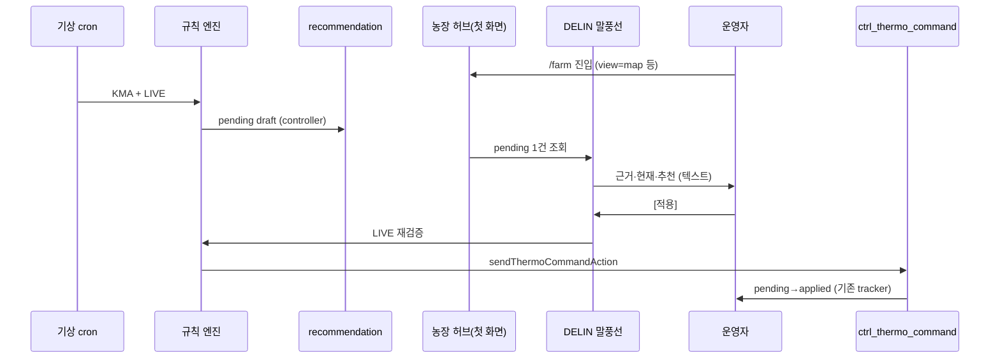

# 기상·환경 CTRL 권장 → 승인 적용 (P1)

> **상태:** 결정 확정 · 구현 전  
> **PoC:** FARM01 · controller 단위 · 기상청 공공데이터 · 규칙 엔진(非 OpenAI)  
> **UX:** 농장 허브 **첫 화면** · TopBar **DELIN 탭** 근처 **말풍선** · 승인 시에만 명령  
> **관련:** [`aria-protocol.md`](./aria-protocol.md) · [`CTRL_THERMO_COMMAND_PHASE_B.md`](./CTRL_THERMO_COMMAND_PHASE_B.md) · [`farm-hub-url.md`](./farm-hub-url.md)

---

## 1. 확정된 결정

| ID | 항목 | 확정 |
|----|------|------|
| 1 | PoC 범위 | FARM01 + **승인 → 명령 적용** end-to-end |
| 2 | 외부 기상 | **기상청 공공데이터 API** (`farm_location` lat/lng → 격자/예보) |
| 3 | 제어 단위 | **controller** (`controller_key` / `module_uid` + `ctrl_idx`) |
| 4 | UX 진입 | **대시보드 첫 화면(현장/허브)** · TopBar **DELIN 탭** 앵커 **말풍선** · 텍스트 proactive |
| 5 | 승인 직전 | **LIVE 재검증** (내부·외기 스냅샷 stale 시 거부/재계산) |
| 6 | UI 범위 | **별도 추천 카드/폼 없음** — 말풍선 본문 + **적용/무시**만 |
| 7 | 문장 생성 | **내부 규칙 엔진 + UNPACK 템플릿** (OpenAI / `runAriaProtocol` 미사용) |
| 8 | pending 만료 | **30분** |

---

## 2. 사용자 여정



1. 농장 허브 **첫 화면** 로드 (DELIN 탭 선택 **불필요**).
2. pending 권장이 있으면 TopBar **보기 토글의 DELIN 탭** (`data-tour-id="view-toggle"` 내 DELIN `role=tab"`) 근처에 **말풍선** 표시.
3. 말풍선 본문: **근거 → 현재 설정 → 추천 설정** (합니다체, 정식 명칭만).
4. **[적용]** · **[무시]** — 별도 설정 UI 없음.
5. 적용 시 LIVE 재검증 통과 후 기존 thermo 명령 INSERT → ACK 추적.

---

## 3. OpenAI / ARIA 프로토콜과의 관계

| 구분 | 기존 DELIN (OpenAI) | 본 기능 (P1) |
|------|---------------------|--------------|
| 트리거 | 사용자 질문 | cron + 허브 진입 |
| 판단 | `runAriaProtocol` | **`lib/weather-control/rules`** |
| 문장 | AI 코드 → UNPACK | **템플릿 UNPACK only** |
| 명령 | CTRL **금지** | **사용자 [적용] 클릭 시만** 기존 server action |

- 말풍선 문장은 **FACT(수치) + REC 템플릿** — 환각·「적용했습니다」 금지 (ACK 전).
- 새 REC 코드 예: `WEATHER_RISE_VENT`, `WEATHER_DROP_HEAT`, `WEATHER_HUMID_VENT` (감사용).

---

## 4. 데이터

### 4.1 입력

| 소스 | 필드 | 비고 |
|------|------|------|
| `farm_location` | lat, lng, address_text | FARM01 저장 주소 |
| KMA 공공데이터 | 기온·습도·풍속·강수·(특보) | API 키 env, 격자 변환 |
| `v_iot_decoded_latest` | temp, humidity, controller | controller scoped |
| `ctrl_thermo` LIVE | setpoint, min/max vent | **현재 설정** |
| `farm_weather_snapshot` | (신규) | 15분 캐시 |

### 4.2 출력 (draft)

| 필드 | 설명 |
|------|------|
| `controller_key` | 대상 컨트롤러 |
| `current_*` / `proposed_*` | setpoint, min_vent, max_vent |
| `rule_id` | 규칙 식별 |
| `reason_ko` | UNPACK용 근거 슬롯 |
| `expires_at` | 생성 + **30분** |

### 4.3 신규 테이블 (migration — **적용은 승인 후**)

- `farm_weather_snapshot` — farm + observed_at + 외기 필드
- `weather_control_recommendation` — pending | approved | dismissed | expired
- (v2) `weather_control_policy` — JSON 규칙

---

## 5. 규칙 엔진 (v1 · 코드 고정 3종)

| rule_id | 조건 (개념) | proposed (Δ cap) |
|---------|-------------|------------------|
| `wx_rise_vent` | 외기 **상승** 예보 + 내부 여유 적음 | min/max vent **+5~10%p** |
| `wx_drop_heat` | 외기 **하강** 예보 | setpoint **−1°C** (floor 18) |
| `wx_humid_vent` | 외기·내부 **고습** | max vent **+10%p** (cap 90) |

공통 hard cap: setpoint 18–32°C, vent 20–90%, **1 controller · 1 pending · 30분**.

---

## 6. UI — DELIN 말풍선

### 6.1 앵커

- **DOM:** TopBar `data-farm-view-toggle-slot="desktop"` 포털된 `data-tour-id="view-toggle"` tablist.
- **DELIN 탭** (`view=aria` 버튼) 기준 `position: absolute` 말풍선 (아래 또는 좌측, viewport clamp).
- **모바일:** 동일 tablist(하단 독 또는 헤더) — `UI_ARIA_PRESENCE` 토큰·motion 재사용.

### 6.2 말풍선 내용 (템플릿 예)

```
앞으로 3시간 외기가 26°C에서 31°C로 오를 예정입니다.
{축사명} {N}번 컨트롤러 기준 내부 27.2°C입니다.

현재 — 목표 24°C · 최저환기 30% · 최고환기 60%
권장 — 목표 24°C · 최저환기 40% · 최고환기 70%

외기 상승에 맞춰 환기 하한·상한을 소폭 올이는 것을 권장합니다.

[적용]  [무시]
```

- `aria-live="polite"` · 닫기(X) · 무시 시 dismissed.
- **DELIN 탭으로 이동하지 않아도** 표시 (첫 화면 proactive).

### 6.3 컴포넌트 (예정)

| 파일 | 역할 |
|------|------|
| `delin-weather-nudge-bubble.tsx` | 말풍선 + 적용/무시 |
| `lib/weather-control/unpack-recommendation.ts` | 한국어 템플릿 |
| `app/api/weather-control/recommendation/route.ts` | GET pending |
| `app/api/weather-control/approve/route.ts` | POST 승인 + 재검증 + command |

Feature flag: `WEATHER_CTRL_REC_V1` (`.env.example` 이름만).

---

## 7. 승인 · 명령

1. `canCommand` + farm scope 확인.
2. recommendation `pending` + **未 만료**.
3. **LIVE 재검증:** 내부·외기 snapshot age ≤ 15분, rule still fires (or within tolerance).
4. `sendThermoCommandAction` — `SET_CTRL_THERMO`, `note=weather:{rule_id}:{rec_id}`.
5. recommendation → `approved` + command id 연결.

실패 시 말풍선: 「조건이 바뀌어 권장을 적용할 수 없습니다. 잠시 후 다시 확인해 주세요.」

---

## 8. KMA 연동 (개요)

| 항목 | 내용 |
|------|------|
| Env | `KMA_API_KEY` (공공데이터포털) |
| 좌표 | lat/lng → **격자(nx,ny)** 변환 유틸 |
| API | 단기예보 / 초단기실황 (PoC는 **기온·습도** 우선) |
| 수집 | Edge 또는 pg_cron 15분 (10-2와 동일) |
| 장애 | snapshot stale → **새 pending 생성 중단** |

---

## 9. 구현 순서 (P1)

| Phase | 산출 |
|-------|------|
| **A** | KMA client + snapshot table + FARM01 cron |
| **B** | rules engine + recommendation CRUD |
| **C** | `unpack-recommendation` + 말풍선 UI |
| **D** | approve API + command + tracker 연동 |
| **E** | flag · smoke · `docs` · `.env.example` ✅ |

---

## 10. 검수 (Done 정의)

- [x] FARM01 주소 좌표로 KMA snapshot 적재 (Phase A)
- [x] controller 1건 pending 생성 (30분 TTL) — 규칙 충족 시 (Phase B)
- [x] `/farm` 첫 화면 DELIN 탭 근처 말풍선 표시 (Phase C)
- [x] 텍스트: 근거 + 현재 + 권장 (OpenAI 미호출) (Phase C)
- [x] [적용] → LIVE 재검증 → `ctrl_thermo_command` pending (Phase D)
- [ ] ACK 후 기존 UI에서 applied 확인 (현장 수동)
- [x] [무시] / 만료 시 말풍선 미표시 (Phase C+D)
- [x] Production `WEATHER_CTRL_REC_V1` gate (Phase E — [`weather-ctrl-phase-e.md`](./weather-ctrl-phase-e.md))

---

## 11. 미포함 (v2+)

- OpenAI / 음성 TTS proactive
- 농장 일괄·채널별 SET_CHANNEL
- 슬라이더 수정 UI
- 자동 적용 (cron → command without user)
- DB JSON 정책 편집 UI
