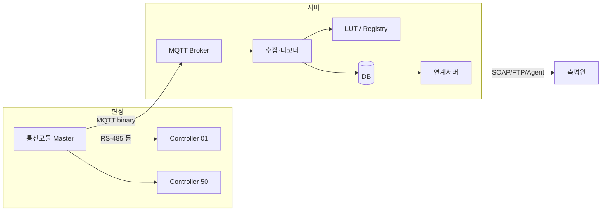
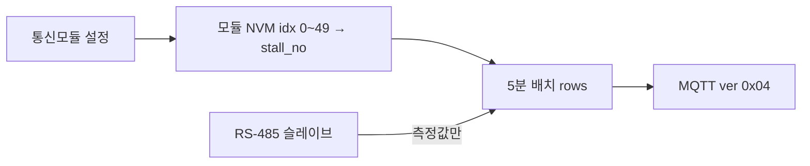

# 데이터폼 정책문서

> **버전:** 1.2  
> **작성일:** 2026-06-08  
> **대상:** STM32F103ZET6 통신모듈 → 수집서버 → (DB 이후) 축평원 연계  
> **현행 프로필:** `P2T2F30` / wire `ver=0x03` / `lut_ver=7` (동작출력값)  
> **예정:** wire `ver=0x04` — row에 **축사번호(`stall_no`)** 포함 (대시보드·LUT 매핑 단순화)  
> **decoded_json:** `ES01`·`ES02`·`EC01`~`EC03` **배열형** (§8.2)  
> **레거시:** wire `ver=0x02` / `lut_ver=6` (fan_bits ON/OFF, 614 B)

---

## 1. 목적

본 문서는 통신모듈이 MQTT로 전송하는 **측정 데이터의 형식·식별·해석 규칙**을 정의한다.

| 구분 | 담당 |
|------|------|
| 펌웨어 | 측정값·팬 상태를 **고정 바이너리**로 전송 |
| 수집서버 | topic·LUT로 **농장·모듈·축사·장비** 해석 |
| 연계서버 | 축평원 「스마트축산 정보연계 인터페이스」 v4.0 필드로 변환 (DB 이후) |

**원칙:** wire payload는 **짧게**, 의미(농장명·축사·장비코드·입기/배기 구분)는 **서버 LUT**가 담당한다.

---

## 2. 시스템 구조



### 2.1 역할

| 요소 | 설명 |
|------|------|
| **통신모듈** | 마스터. 슬레이브 컨트롤러 최대 **50대** 관리 |
| **컨트롤러(ctrl)** | 모듈 내 로컬 번호 **01~50** (`rows[i]` = ctrl `i+1`) |
| **농장(farm)** | 다농장 확장. wire에서는 `farm_uid` (uint16) |
| **모듈(module)** | 농장당 통신모듈 N대. wire에서는 `module_uid` (uint8) |

### 2.2 고정 메타 (서버 LUT·Registry)

| 필드 | 예시 | 비고 |
|------|------|------|
| `lsindRegistNo` | FARM01 | 축사업 등록번호 |
| `itemCode` | P00 | 축종코드 |
| `makrId` | SUNGIL | 제조사 ID |

위 값은 **MQTT body에 포함하지 않는다.** Registry에서 `farm_uid`로 조회한다.

---

## 3. 전송 정책

| 항목 | 값 |
|------|-----|
| 주기 | **5분** 1회 배치 |
| 배치 단위 | **모듈 1대 = MQTT 메시지 1건** |
| 행 수 `n` | 기본 **50** (설치 대수 미만 시 `n < 50` partial 허용) |
| QoS | **0** |
| Phase 3 (레거시) | topic `/KEY12/`, JSON `{"farm","key12","seq","temp","hum","nh3"}` — **신규 설계와 병행 후 단계적 폐기** |

---

## 4. MQTT 라우팅

### 4.1 Topic 규칙

```
sungil/f/{farm_uid}/m/{module_uid}/raw
```

| 예시 | 의미 |
|------|------|
| `sungil/f/1/m/1/raw` | FARM01 (`farm_uid=1`), 모듈 1 |
| `sungil/f/1/m/2/raw` | FARM01, 모듈 2 (ctrl 51~100 등) |
| `sungil/f/2/m/1/raw` | FARM02, 모듈 1 |

- `farm_uid`, `module_uid`는 **숫자 ID** (문자열 농장명·시리얼은 topic/body에 넣지 않음)
- 테넌트 접두 `sungil/` 은 제조사·SaaS 구분용 (변경 시 전체 topic 일괄 변경)

### 4.2 Body

- **Content-Type:** `application/octet-stream` (바이너리)
- 디버그·브릿지용 JSON 래퍼는 **개발/운영 보조**이며 기본 on-wire 포맷이 아님

---

## 5. 프로필 `P2T2F30`

### 5.1 ctrl당 측정 가정

| 구분 | 종류 | code | 최대 개수 | wire |
|------|------|------|-----------|------|
| 센서 | 온도 | ES01 | **2** | `es01[2]` `uint16` ×10 (0.1℃) |
| 센서 | 습도 | ES02 | **2** | `es02[2]` `uint16` ×10 (0.1%) |
| 팬 | 입기 | EC03 | **10** | `ec03_out[10]` `uint8` (동작출력 0~100 %) |
| 팬 | 배기 | EC02 | **10** | `ec02_out[10]` `uint8` |
| 팬 | 송풍 | EC01 | **10** | `ec01_out[10]` `uint8` |
| **합계** | | | 센서 4값 + 팬 30채널 | **행 38 byte** |

- 센서 종류는 **온도·습도만** (NH3·CO2 등은 본 프로필 범위 외, `ver`/`lut_ver` 확장 시 추가)
- 팬 **총 30채널**, 입기/배기/송풍 **각 sn 1~10** (`lut_ver=7` 고정 배분)
- **동작출력값:** 슬레이브·인버터가 보고하는 **실제 출력** (정지=0, 가동=1~100 정수 %). 축평원 `mesureVal01` 등에 **수치 문자열**로 매핑 (`"72"`, `"72.5"` 등은 서버·연계 정책)
- **0.1 % 해상도**가 필요하면 후속 `ver=0x04`에서 `uint16×10` 확장 검토 (50행×30열 시 2 KB 초과)

### 5.2 행(row) 의미

- `rows[i]` (0-based) = 모듈 로컬 **ctrl `i+1`**
- **`ver=0x03`:** `eqpmnNo`, `stallTyCode`, `stallNo`는 body에 없음 → LUT `controllers[]` 인덱스로 매핑
- **`ver=0x04` (예정):** row에 **`stall_no` 포함** → 디코더가 `decoded_json.stallNo` 로 직접 반영. LUT 축사 매핑은 **선택·보조** (Registry·stallTyCode 등)

---

## 6. Wire Format `ver=0x03` (현행)

### 6.1 패킷 구조

| 구간 | 크기 | 설명 |
|------|------|------|
| Header | 12 B | 아래 표 참조 |
| Rows | `n × 38` B | ctrl 스냅샷 |
| CRC16 | 2 B | Header+Rows, **CRC-16/CCITT-FALSE** (poly 0x1021, init 0xFFFF) |

**n=50 일 때 총 1914 byte** (W5500 기본 TX 버퍼 ~2 KB 이내, **1 PUBLISH**)

### 6.2 Header (12 byte, Little-Endian)

| Off | 크기 | 필드 | 설명 |
|-----|------|------|------|
| 0 | 1 | `ver` | `0x03` |
| 1 | 1 | `flags` | bit0=partial(`n<50`), bit1=delta(예약), bit2~7=예약 |
| 2 | 2 | `farm_uid` | uint16 LE |
| 4 | 1 | `module_uid` | uint8 (1~255) |
| 5 | 1 | `lut_ver` | LUT 버전 (**7** = P2T2F30 동작출력 10/10/10) |
| 6 | 4 | `t` | Unix epoch **초**, uint32 LE |
| 10 | 1 | `n` | row 수 (1~50) |
| 11 | 1 | `seq` | 모듈별 배치 시퀀스 0~255 롤링 |

### 6.3 Row (38 byte)

| Off | 크기 | 필드 | 설명 |
|-----|------|------|------|
| 0 | 2 | `es01[0]` | ES01 sn1, ×10 |
| 2 | 2 | `es01[1]` | ES01 sn2, ×10 |
| 4 | 2 | `es02[0]` | ES02 sn1, ×10 |
| 6 | 2 | `es02[1]` | ES02 sn2, ×10 |
| 8 | 10 | `ec03_out[10]` | EC03 sn1~10 동작출력 **0~100** (`uint8`) |
| 18 | 10 | `ec02_out[10]` | EC02 sn1~10 |
| 28 | 10 | `ec01_out[10]` | EC01 sn1~10 |

### 6.4 결측·미설치

| 상황 | wire 값 |
|------|---------|
| 센서 미설치/통신 실패 | `0xFFFF` |
| 팬 정지 | `0` |
| 팬 미설치 (LUT 미사용 sn) | `0xFF` |
| 팬 가동 | `1`~`100` (정수 %) |

### 6.5 EC 채널 배열 매핑 (`lut_ver=7`)

| 배열 | eqpmnCode | sn | role |
|------|-----------|-----|------|
| `ec03_out[i]` | EC03 | i+1 (1~10) | 입기 |
| `ec02_out[i]` | EC02 | i+1 | 배기 |
| `ec01_out[i]` | EC01 | i+1 | 송풍 |

**펌웨어:** RS-485 슬레이브 동작출력(%)을 위 순서로 채운다. 단위 미확정 시 개발 단계는 0~100 정수 % placeholder.  
**서버:** wire 배열을 `decoded_json`의 **동일 code 배열**로 매핑 (§8.2). 인덱스 `i` = **sn `i+1`** (0-based).

### 6.6 레거시 Wire `ver=0x02` (`lut_ver=6`)

| 항목 | 값 |
|------|-----|
| Row | 12 B (`fan_bits` uint32 ON/OFF) |
| n=50 패킷 | 614 B |
| 서버 JSON | `"EC01_5":"1"` (ON=1) |

신규 배포는 **ver=0x03** 우선. 수집서버는 `ver` 미지원 시 거부.

### 6.7 Wire Format `ver=0x04` (예정) — row에 축사번호

**목적:** 통신모듈이 컨트롤러 측정값과 함께 **해당 컨트롤러가 속한 축사(칸) 번호**를 전송. 대시보드·운영에서 idx→stallNo LUT/수동 매핑 없이 축사 단위 표시.

| 구간 | 크기 | 설명 |
|------|------|------|
| Header | 12 B | `ver=0x04` (필드 배치는 §6.2와 동일) |
| Rows | `n × 39` B | ctrl 스냅샷 (**38 + stall_no 1**) |
| CRC16 | 2 B | Header+Rows |

**n=50 일 때 총 1964 byte** (W5500 ~2 KB 이내)

#### Row (39 byte) — `ver=0x03` 대비 변경

| Off | 크기 | 필드 | 설명 |
|-----|------|------|------|
| 0~37 | 38 | (동일) | §6.3 ES01/ES02/EC01~03 |
| 38 | 1 | `stall_no` | `uint8` 축사(칸) 번호 |

| `stall_no` (wire) | 의미 | `decoded_json.stallNo` |
|-------------------|------|-------------------------|
| `0` | 미지정 | `null` |
| `1`~`99` | 칸번호 | `"01"`~`"99"` (2자리 **문자열**, zero-pad) |
| `0xFF` | 미설치/해당 없음 | `null` |

- **`stallTyCode`**, **`eqpmnNo`** 는 v0.04에서도 wire 미포함 가능 → LUT·Registry 보조 (기존 §7).
- 수집서버: `stall_no` → JSON `stallNo` 문자열. **wire 값이 `stallNo` 의 유일한 출처** (LUT `controllers[idx].stallNo` 는 v0.04에서 미사용·보조 메타만).

#### 6.7.1 축사번호 설정 주체 — **통신모듈**

**`stall_no` 는 통신모듈(STM32 마스터)에서만 설정·보관·전송한다.** 슬레이브 컨트롤러·대시보드·서버 DB에서 idx→축사 매핑을 하지 않는다.

| 항목 | 내용 |
|------|------|
| 설정 위치 | 통신모듈 펌웨어 (Flash/EEPROM/NVM 등 **모듈 로컬 저장**) |
| 설정 단위 | **ctrl idx 0~49** (모듈 로컬 번호) 각각 `stall_no` 1바이트 |
| 설정 시점 | 현장 설치·배선 확정 후 (RS-485 주소와 idx 매핑과 별도 또는 연동) |
| 설정 수단 | 통신모듈 **설정 UI** (시리얼/로컬 웹/전용 툴 등, 구현은 펌웨어 과제) |
| 전송 | 5분 배치 MQTT 시 각 `rows[i]` 마지막 바이트에 해당 idx의 `stall_no` 포함 |
| 기본값 | 미설정 idx → wire `0` (미지정) |



- **슬레이브**는 측정값(온습·팬 %)만 제공. **축사번호를 슬레이브가 보고하지 않음.**
- **대시보드**는 `decoded_json.stallNo` 를 **읽기만** 하며, 지도에는 **배치·표시명**만 사용자 설정 (`profiles.ui_config`).

---

## 7. LUT · Registry

### 7.1 Registry (농장·모듈 등록)

```yaml
# registry/v1/farms.yaml (예시)
farms:
  FARM01:
    farm_uid: 1
    lsindRegistNo: FARM01
    itemCode: P00
    makrId: SUNGIL

modules:
  "1:1":
    module_uid: 1
    module_serial: SG-ETH-00041
    lut: FARM01_M01_v6.yaml
  "1:2":
    module_uid: 2
    module_serial: SG-ETH-00042
    lut: FARM01_M02_v6.yaml
```

### 7.2 LUT 파일 (`lut_ver=6`)

```yaml
# lookup/FARM01_M01_v6.yaml
profile: P2T2F30
lut_ver: 6

sensor_columns:
  - { idx: 0, eqpmnCode: ES01, sn: 1, scale: 10 }
  - { idx: 1, eqpmnCode: ES01, sn: 2, scale: 10 }
  - { idx: 2, eqpmnCode: ES02, sn: 1, scale: 10 }
  - { idx: 3, eqpmnCode: ES02, sn: 2, scale: 10 }

fan_map:
  - { bit: 0,  eqpmnCode: EC03, sn: 1 }
  # ... bit1..8 ...
  - { bit: 9,  eqpmnCode: EC03, sn: 10 }
  - { bit: 10, eqpmnCode: EC02, sn: 1 }
  # ... bit11..18 ...
  - { bit: 19, eqpmnCode: EC02, sn: 10 }
  - { bit: 20, eqpmnCode: EC01, sn: 1 }
  # ... bit21..28 ...
  - { bit: 29, eqpmnCode: EC01, sn: 10 }

controllers:
  - { idx: 0,  eqpmnNo: "01", stallTyCode: SP02, stallNo: "01" }
  - { idx: 22, eqpmnNo: "23", stallTyCode: SP05, stallNo: "03" }
  - { idx: 49, eqpmnNo: "50", stallTyCode: SP07, stallNo: "10" }
```

- `controllers[idx]` ↔ `rows[idx]` (0-based)
- **방번호·칸번호·eqpmnEsntlSn** 은 본 transport에 포함하지 않음 (연계서버·DB에서 처리)

### 7.3 LUT 변경 정책

| 변경 내용 | 조치 |
|-----------|------|
| 팬 배분 변경 (10/10/10 → 다른 비율) | `lut_ver` 증가, wire `ver` 유지 가능 |
| 센서 종류 추가 (예: NH3) | `ver=0x03` 등 **행 폭 변경** 필요 |
| ctrl–축사 매핑 변경 | 동일 `lut_ver` 내 YAML 갱신 또는 `lut_ver` bump |

---

## 8. 서버 디코딩 · 내부 레코드

### 8.1 디코드 절차

1. topic에서 `farm_uid`, `module_uid` 추출
2. body CRC 검증
3. Header 파싱 → Registry에서 farm 메타 조회
4. `lut_ver`로 LUT 로드
5. 각 `rows[i]` → **ctrl 1건** `decoded_json` (또는 동등 레코드):
   - `controllers[i]` → `eqpmnNo`, `stallTyCode`, `stallNo`
   - `es01[2]` → `"ES01": […]` (÷10, `0xFFFF` → `null`)
   - `es02[2]` → `"ES02": […]`
   - `ec03_out` / `ec02_out` / `ec01_out` → `"EC03"` / `"EC02"` / `"EC01"` 배열 (`0xFF` → `null`, `0` → `"0"`)
6. `t` → `mesureDt` (KST 등 timezone 정책은 서버 설정)

### 8.2 `decoded_json` 배열 스키마 (v1.2+)

flat 키(`ES01_1`, `EC03_3` …) 대신 **eqpmnCode별 고정 길이 배열**을 사용한다. wire·펌웨어 row와 1:1 대응.

| 키 | 배열 길이 | 인덱스 ↔ sn | 원소 타입 | wire → JSON |
|----|-----------|-------------|-----------|-------------|
| `ES01` | **2** | `[0]`=sn1, `[1]`=sn2 | string \| null | `uint16` ÷10 → `"25.1"`, `0xFFFF` → `null` |
| `ES02` | **2** | 동일 | string \| null | ÷10, `0xFFFF` → `null` |
| `EC03` | **10** | `[i]`=sn `i+1` | string \| null | `0`→`"0"`, `1`~`100`→문자열, `0xFF`→`null` |
| `EC02` | **10** | 동일 | string \| null | 동일 |
| `EC01` | **10** | 동일 | string \| null | 동일 |

- **full 배열** 유지 (sparse object 아님) — sn 위치가 인덱스로 고정
- 값은 **문자열** (DB·연계 일관성). 정수 %는 `"75"` 형태
- 레거시 flat 키(`ES01_1` 등)는 **v1.1 이전** 디코더 산출물; 신규 수집은 배열형만 저장

### 8.3 예시 — ctrl 23 펼침

**입력:** `rows[22]`, `es01=[251,248]`, `es02=[602,595]`, `ec03=[75,0,60,…]`, `ec02=[0,45,…]`, `ec01=[80,0,0,0,55,…]`

| 해석 | 값 |
|------|-----|
| ES01 sn1/2 | 25.1℃ / 24.8℃ |
| ES02 sn1/2 | 60.2% / 59.5% |
| EC03 (입기) | sn1 **75%**, sn3 **60%** |
| EC02 (배기) | sn2 **45%** |
| EC01 (송풍) | sn1 **80%**, sn5 **55%** |

```json
{
  "lsindRegistNo": "FARM01",
  "itemCode": "P00",
  "makrId": "SUNGIL",
  "eqpmnNo": "23",
  "stallTyCode": "SP05",
  "stallNo": "03",
  "mesureDt": "2026-05-29 14:35:00",
  "ES01": ["25.1", "24.8"],
  "ES02": ["60.2", "59.5"],
  "EC03": ["75", "0", "60", "0", "0", "0", "0", "0", "0", "0"],
  "EC02": ["0", "45", "0", "0", "0", "0", "0", "0", "0", "0"],
  "EC01": ["80", "0", "0", "0", "55", "0", "0", "0", "0", "0"]
}
```

### 8.4 축평원 연계

- 공식 연계는 **MQTT가 아닌** Agent/SOAP/FTP (`smart.ekape.or.kr`)
- v4.0 공통 26필드(`mesureVal01`~`15` 등) 매핑은 **DB 적재 이후 연계서버** 책임
- 연계 시 `ES01[i]`·`EC03[i]` 등 배열을 flat `mesureVal01`~ 필드 또는 장비별 레코드로 펼침 (본 transport 형식과 분리)
- 본 문서의 transport는 **현장→자사 서버** 구간만 규정

---

## 9. 하드웨어 제약 (W5500)

| 항목 | 값 | 영향 |
|------|-----|------|
| 기본 TX 버퍼 | ~2 KB | 단일 MQTT PUBLISH 상한 |
| `w5500_socket_send()` | `free_size >= len` 일괄 송신 | 청크 분할 미구현 시 대용량 JSON 불가 |
| P2T2F30 v0x02 50행 | ~614 B | 레거시 |
| P2T2F30 v0x03 50행 | ~1914 B | **1 PUBLISH 안전** (MQTT TX ≥2 KB 권장) |

**행 폭 확장 시:** `uint16×10`×30열 등으로 2 KB 초과 시 → partial 배치, 모듈 분할, TX 버퍼 확대, 청크 송신 중 선택 (별도 구현 과제).

---

## 10. 버전·호환

| 식별자 | 현재 값 | 의미 |
|--------|---------|------|
| `profile` | `P2T2F30` | 온2+습2+팬30(10/10/10) |
| wire `ver` | `0x03` | Header 12B + Row 38B (동작출력) |
| `lut_ver` | `7` | EC 배열 10/10/10, sensor 4열 |
| wire `ver` (레거시) | `0x02` | Row 12B, fan_bits |
| `lut_ver` (레거시) | `6` | fan_map bit |

### 진화 경로 (참고)

| 단계 | 설명 |
|------|------|
| Phase 3 | JSON `/KEY12/` (개발 검증용) |
| P2T2F30 v6 | wire v0x02, fan_bits ON/OFF |
| P2T2F30 v7 | wire v0x03, 동작출력 uint8 % |
| decoded v1.2 | `ES01`/`ES02`/`EC**` **배열형** JSON (**현행**) |
| **ver 0x04** | row에 **`stall_no`** (축사번호), 39 B/행 |
| ver 0.05+ | 센서 종류·0.1% 출력·column mask, delta 등 |

**호환 규칙:** 수집서버는 수신 `ver`·`lut_ver` 미지원 시 **거부·알람** (잘못된 해석 저장 금지).

---

## 11. 예시 패킷 (ctrl 23 행만)

```
Header (예):
  03 00 01 00 01 07 24 9F 67 11 32 11
  ver=3 farm_uid=1 module_uid=1 lut_ver=7 t=1734567300 n=50 seq=17

Row[22] (38 B):
  FB 00 F8 00 5A 02 73 02
  4B 00 3C 00 00 00 00 00 00 00 00
  00 2D 00 00 00 00 00 00 00 00
  50 00 00 00 37 00 00 00 00 00
  ES01: 251,248 | ES02: 602,595
  EC03: 75,0,60,… | EC02: 0,45,… | EC01: 80,0,0,0,55,…
```

---

## 12. 관련 문서

| 문서 | 경로 |
|------|------|
| **해석본 (설명)** | [데이터폼 정책문서 해석본.md](데이터폼%20정책문서%20해석본.md) |
| 워크스페이스 개요 | [README.md](README.md) |
| 개발 워크플로 | [1_참고자료/docs/DEV_WORKFLOW.md](1_참고자료/docs/DEV_WORKFLOW.md) |
| 펌웨어 구조 | [3_펌웨어파일/stm32f103zet6_comm_module/docs/firmware_structure_kr.md](3_펌웨어파일/stm32f103zet6_comm_module/docs/firmware_structure_kr.md) |
| Phase 3 MQTT 검증 | [2_테스팅파일/docs/test_result_mqtt_phase3.md](2_테스팅파일/docs/test_result_mqtt_phase3.md) |
| 축평원 연계 인터페이스 | `2. 「스마트축산 정보연계 인터페이스」 개정(안) 전문.pdf` |

---

## 13. 변경 이력

| 버전 | 일자 | 내용 |
|------|------|------|
| 1.0 | 2026-05-29 | P2T2F30 확정: 온·습 각2, 팬 10/10/10, wire v0x02, lut_ver 6 |
| 1.1 | 2026-06-08 | 팬 ON/OFF → **동작출력값** (`uint8` 0~100 %), wire **v0x03**, lut_ver **7**, 패킷 1914 B |
| 1.2 | 2026-06-08 | `decoded_json` **배열형** (`ES01`/`ES02`/`EC01`~`EC03`), wire·펌웨어 `es01[2]`/`es02[2]` 정렬 |
| 1.3 | 2026-06-09 | **축사번호:** wire `ver=0x04` row `stall_no`. **통신모듈 NVM에서 idx별 설정·전송** (슬레이브·대시보드·서버 매핑 DB 미채택) |
