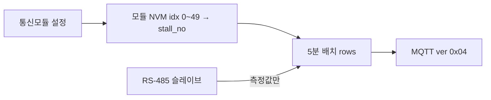

# 데이터폼 정책문서

> **버전:** 1.7  
> **작성일:** 2026-06-16  
> **대상:** STM32F103ZET6 통신모듈 → 수집서버 → (DB 이후) 축평원 연계  
> **현행 (펌웨어·RSD·대시보드·가상모듈):** wire `ver=0x0B` — [명세](../RSD/docs/wire-v00b-spec.md) · [설계 제안](../docs/changes/20260608-wire-v00b-spec.md)  
> **이전:** `ver=0x0A` / `lut_ver=11` — [v00a](../RSD/docs/wire-v00a-spec.md) · `ver=0x08` / `lut_ver=9` — [v008](../docs/changes/20260611-wire-v008-thermo-spec.md) · `ver=0x07` / `lut_ver=8` — [v007](../docs/changes/20260610-wire-v007-spec.md)  
> **레거시:** `P2T2F30` / `ver=0x03`·`0x04` / `lut_ver=7` · `ver=0x02` / `lut_ver=6` (fan_bits, 614 B)  
> **decoded_json:** v0x0B → **`channels[]`** (schema **2.0**, §8.2.4) · v0x0A → `ES01`·`ES02`·`EC01`~`EC03` 배열 (schema **1.8**) · **`controllerKey`** (§8.2.3) · 채널별 **`thermo`** (§8.2.1)

---

## 1. 목적

본 문서는 통신모듈이 MQTT로 전송하는 **측정 데이터의 형식·식별·해석 규칙**을 정의한다.

| 구분 | 담당 |
|------|------|
| 펌웨어 | 측정값·팬 상태를 **고정 바이너리**로 전송 |
| 수집서버 | **MQTT topic**으로 농장 식별, wire로 **축사·장비** 해석 |
| 연계서버 | 축평원 「스마트축산 정보연계 인터페이스」 v4.0 필드로 변환 (DB 이후) |

**원칙:** wire payload는 **짧게**. **농장 식별**(`lsindRegistNo`, `itemCode`)은 **MQTT topic**에, 축사·장비·입기/배기 구분은 wire·디코더가 담당한다.

---

## 2. 시스템 구조


### 2.1 역할

| 요소 | 설명 |
|------|------|
| **통신모듈** | 마스터. 모듈당 최대 **48컨트롤러** 스냅샷 (LIVE multi-chunk, RSD·펌웨어) |
| **컨트롤러(ctrl)** | **업무 키:** `controllerKey` = `{stallTyCode}:{stallNo}:{eqpmnNo}` (예: `SP07:03:02`). wire row byte0 = **`eqpmn_no` 1~10** (축사 내 장비번호). **v0x0B:** ctrl 내부 **채널 슬롯 A/B/C** — 각 슬롯에 온·습·`eqpmnCode`·측정·**thermo** (§6.13). RS-485 `ctrl_idx`는 **통신모듈 내부 전용** — uplink/downlink JSON·DB에 실리지 않음 |
| **농장(farm)** | `lsindRegistNo` + `itemCode` (축평원 v4.0 필수 1~2번) |
| **모듈(module)** | 농장당 통신모듈 1대. DB `module_uid=1` implicit |

### 2.2 농장 식별 (MQTT topic)

| 필드 | 예시 | 비고 |
|------|------|------|
| `lsindRegistNo` | FARM01 | 축산업등록번호 — **topic 2번째 세그먼트** |
| `itemCode` | P00 | 축종코드 — **topic 3번째 세그먼트** |
| `makrId` | SUNGIL | 제조사 ID — 디코더/설정 고정 (`APP_MAKR_ID`) |

위 값은 **wire body에 넣지 않는다.** topic 파싱이 1차 출처이며, `decoded_json`·DB 컬럼에 반영한다.

---

## 3. 전송 정책

| 항목 | 값 |
|------|-----|
| 주기 | **5분** 1회 배치 |
| 배치 단위 | **모듈 1대 = MQTT 메시지 1건** |
| 행 수 `n` | 기본 **48** (모듈 전체). v0x0A LIVE는 **multi-chunk** (예: 39+9). partial 허용 |
| QoS | **1** (`ver=0x05` 이상, RSD·펌웨어 현행). 레거시 Phase 3·`ver=0x03` 등은 **0** 가능 |
| Phase 3 (레거시) | topic `/KEY12/`, JSON `{"farm","key12","seq","temp","hum","nh3"}` — **신규 설계와 병행 후 단계적 폐기** |

---

## 4. MQTT 라우팅

### 4.1 Topic 규칙 (v0x07)

```
sungil/{lsindRegistNo}/{itemCode}/raw
sungil/{lsindRegistNo}/{itemCode}/cmd
sungil/{lsindRegistNo}/{itemCode}/epoch
```

| 예시 | 의미 |
|------|------|
| `sungil/FARM01/P00/raw` | 등록번호 FARM01, 돈육(P00) 업링크 |
| `sungil/FARM01/P00/cmd` | 동일 농장 downlink |
| `sungil/TEST1/P00/raw` | 축평원 테스트 등록번호 |

- RSD subscribe: `sungil/+/+/raw` (**QoS 1**)
- Downlink subscribe (통신모듈·가상 fleet): `sungil/{lsind}/{item}/cmd` (**QoS 1**)
- `farm_uid` 숫자 ID·Registry LUT **폐기** (DB도 `lsind_regist_no` + `item_code`)
- 테넌트 접두 `sungil/` 은 제조사·SaaS 구분용

### 4.2 Body

- **Content-Type:** `application/octet-stream` (바이너리)
- 디버그·브릿지용 JSON 래퍼는 **개발/운영 보조**이며 기본 on-wire 포맷이 아님

---

## 5. 프로필 `P2T2F30`

### 5.1 ctrl당 측정 가정

| 구분 | 종류 | code | 최대 개수 | wire |
|------|------|------|-----------|------|
| 센서 | 온도 | ES01 | **2** | `es01[2]` `uint16` ×10 (0.1℃) |
| 센서 | 습도 | ES02 | **2** | `es02[2]` `uint16` ×10 (0.1%) |
| 팬 | 입기 | EC03 | **10** | `ec03_out[10]` `uint8` (동작출력 0~100 %) |
| 팬 | 배기 | EC02 | **10** | `ec02_out[10]` `uint8` |
| 팬 | 송풍 | EC01 | **10** | `ec01_out[10]` `uint8` |
| **합계** | | | 센서 4값 + 팬 30채널 | **행 38 byte** |

- 센서 종류는 **온도·습도만** (NH3·CO2 등은 본 프로필 범위 외, `ver`/`lut_ver` 확장 시 추가)
- 팬 **총 30채널**, 입기/배기/송풍 **각 sn 1~10** (`lut_ver=7` 고정 배분)
- **동작출력값:** 슬레이브·인버터가 보고하는 **실제 출력** (정지=0, 가동=1~100 정수 %). 축평원 `mesureVal01` 등에 **수치 문자열**로 매핑 (`"72"`, `"72.5"` 등은 서버·연계 정책)
- **0.1 % 해상도**가 필요하면 후속 `ver=0x04`에서 `uint16×10` 확장 검토 (50행×30열 시 2 KB 초과)

### 5.2 행(row) 의미

- `rows[i]` = 컨트롤러 1건 스냅샷
- **`ver=0x0A` (현행):** row byte0 = **`eqpmn_no` (1~10)**, `stall_ty`, `stall_no` → `controllerKey` (§8.2.3). **`idx` 없음**
- **`ver=0x03`:** `eqpmnNo`, `stallTyCode`, `stallNo`는 body에 없음 → LUT `controllers[]` 인덱스로 매핑
- **`ver=0x04`~`0x09` (레거시):** row에 `ctrl_idx` 또는 stall 필드 → decoded에 `idx` 포함 가능

---

## 6. Wire Format (버전별)

> **현행 on-wire:** `ver=0x0B` (§6.13). §6.12(v0x0A)·§6.9~6.11·§6.1~6.8은 **이전·레거시** 참조.

### 6.1 Wire `ver=0x03` (레거시 P2T2F30)

| 구간 | 크기 | 설명 |
|------|------|------|
| Header | 12 B | 아래 표 참조 |
| Rows | `n × 38` B | ctrl 스냅샷 |
| CRC16 | 2 B | Header+Rows, **CRC-16/CCITT-FALSE** (poly 0x1021, init 0xFFFF) |

**n=50 일 때 총 1914 byte** (W5500 기본 TX 버퍼 ~2 KB 이내, **1 PUBLISH**)

### 6.2 Header (12 byte, Little-Endian)

| Off | 크기 | 필드 | 설명 |
|-----|------|------|------|
| 0 | 1 | `ver` | `0x03` |
| 1 | 1 | `flags` | bit0=partial(`n<50`), bit1=delta(예약), bit2~7=예약 |
| 2 | 2 | `farm_uid` | uint16 LE |
| 4 | 1 | `module_uid` | uint8 (1~255) |
| 5 | 1 | `lut_ver` | LUT 버전 (**7** = P2T2F30 동작출력 10/10/10) |
| 6 | 4 | `t` | Unix epoch **초**, uint32 LE |
| 10 | 1 | `n` | row 수 (1~50) |
| 11 | 1 | `seq` | 모듈별 배치 시퀀스 0~255 롤링 |

### 6.3 Row (38 byte)

| Off | 크기 | 필드 | 설명 |
|-----|------|------|------|
| 0 | 2 | `es01[0]` | ES01 sn1, ×10 |
| 2 | 2 | `es01[1]` | ES01 sn2, ×10 |
| 4 | 2 | `es02[0]` | ES02 sn1, ×10 |
| 6 | 2 | `es02[1]` | ES02 sn2, ×10 |
| 8 | 10 | `ec03_out[10]` | EC03 sn1~10 동작출력 **0~100** (`uint8`) |
| 18 | 10 | `ec02_out[10]` | EC02 sn1~10 |
| 28 | 10 | `ec01_out[10]` | EC01 sn1~10 |

### 6.4 결측·미설치

| 상황 | wire 값 |
|------|---------|
| 센서 미설치/통신 실패 | `0xFFFF` |
| 팬 정지 | `0` |
| 팬 미설치 (LUT 미사용 sn) | `0xFF` |
| 팬 가동 | `1`~`100` (정수 %) |

### 6.5 EC 채널 배열 매핑 (`lut_ver=7`)

| 배열 | eqpmnCode | sn | role |
|------|-----------|-----|------|
| `ec03_out[i]` | EC03 | i+1 (1~10) | 입기 |
| `ec02_out[i]` | EC02 | i+1 | 배기 |
| `ec01_out[i]` | EC01 | i+1 | 송풍 |

**펌웨어:** RS-485 슬레이브 동작출력(%)을 위 순서로 채운다. 단위 미확정 시 개발 단계는 0~100 정수 % placeholder.  
**서버:** wire 배열을 `decoded_json`의 **동일 code 배열**로 매핑 (§8.2). 인덱스 `i` = **sn `i+1`** (0-based).

### 6.6 레거시 Wire `ver=0x02` (`lut_ver=6`)

| 항목 | 값 |
|------|-----|
| Row | 12 B (`fan_bits` uint32 ON/OFF) |
| n=50 패킷 | 614 B |
| 서버 JSON | `"EC01_5":"1"` (ON=1) |

신규 배포는 **ver=0x03** 우선. 수집서버는 `ver` 미지원 시 거부.

### 6.7 Wire Format `ver=0x04` (예정) — row에 축사번호

**목적:** 통신모듈이 컨트롤러 측정값과 함께 **해당 컨트롤러가 속한 축사(칸) 번호**를 전송. 대시보드·운영에서 idx→stallNo LUT/수동 매핑 없이 축사 단위 표시.

| 구간 | 크기 | 설명 |
|------|------|------|
| Header | 12 B | `ver=0x04` (필드 배치는 §6.2와 동일) |
| Rows | `n × 39` B | ctrl 스냅샷 (**38 + stall_no 1**) |
| CRC16 | 2 B | Header+Rows |

**n=50 일 때 총 1964 byte** (W5500 ~2 KB 이내)

#### Row (39 byte) — `ver=0x03` 대비 변경

| Off | 크기 | 필드 | 설명 |
|-----|------|------|------|
| 0~37 | 38 | (동일) | §6.3 ES01/ES02/EC01~03 |
| 38 | 1 | `stall_no` | `uint8` 축사(칸) 번호 |

| `stall_no` (wire) | 의미 | `decoded_json.stallNo` |
|-------------------|------|-------------------------|
| `0` | 미지정 | `null` |
| `1`~`99` | 칸번호 | `"01"`~`"99"` (2자리 **문자열**, zero-pad) |
| `0xFF` | 미설치/해당 없음 | `null` |

- **`stallTyCode`**, **`eqpmnNo`** 는 v0.04에서도 wire 미포함 가능 → LUT·Registry 보조 (기존 §7).
- 수집서버: `stall_no` → JSON `stallNo` 문자열. **wire 값이 `stallNo` 의 유일한 출처** (LUT `controllers[idx].stallNo` 는 v0.04에서 미사용·보조 메타만).

#### 6.7.1 축사번호 설정 주체 — **통신모듈**

**`stall_no` 는 통신모듈(STM32 마스터)에서만 설정·보관·전송한다.** 슬레이브 컨트롤러·대시보드·서버 DB에서 idx→축사 매핑을 하지 않는다.

| 항목 | 내용 |
|------|------|
| 설정 위치 | 통신모듈 펌웨어 (Flash/EEPROM/NVM 등 **모듈 로컬 저장**) |
| 설정 단위 | **ctrl idx 0~49** (모듈 로컬 번호) 각각 `stall_no` 1바이트 |
| 설정 시점 | 현장 설치·배선 확정 후 (RS-485 주소와 idx 매핑과 별도 또는 연동) |
| 설정 수단 | 통신모듈 **설정 UI** (시리얼/로컬 웹/전용 툴 등, 구현은 펌웨어 과제) |
| 전송 | 5분 배치 MQTT 시 각 `rows[i]` 마지막 바이트에 해당 idx의 `stall_no` 포함 |
| 기본값 | 미설정 idx → wire `0` (미지정) |



- **슬레이브**는 측정값(온습·팬 %)만 제공. **축사번호를 슬레이브가 보고하지 않음.**
- **대시보드**는 `decoded_json.stallNo` 를 **읽기만** 하며, 지도에는 **배치·표시명**만 사용자 설정 (`profiles.ui_config`).

### 6.8 Wire Format `ver=0x05` (현행)

상세: [docs/changes/20260610-wire-v005-spec.md](../docs/changes/20260610-wire-v005-spec.md)

| 항목 | 값 |
|------|-----|
| Header | **11 B** (`seq` 없음, byte4=reserved `0`) |
| Rows | `n × 40` B (`stall_ty`, `stall_no`, ES, EC01~03) |
| n=50 패킷 | **2013 B** |
| MQTT topic | `sungil/f/{farm_uid}/raw` (QoS **1**) |
| `t` | Unix epoch → `mesureDt` **KST(Asia/Seoul)** |
| `lut_ver` | **8** |

| wire | JSON | 비고 |
|------|------|------|
| `stall_ty` 1~10 | `SP01`~`SP10` | wire 슬롯은 **양돈 SP 체계**. `itemCode` 축종은 topic·§7.4 디코드 LUT로 정합 |
| `stall_no` 1~32 | `"01"`~`"32"` | **유형(`stall_ty`)당 max 32** |

- `module_uid`·`profile`·`batch_seq` 없음. DB `module_uid=1` implicit.
- 레거시 `ver=0x03`/`0x04`/`0x05`는 별도 명세 참조.

### 6.9 Wire Format `ver=0x08` (이전)

v0x07 대비 **row tail 6 B**에 컨트롤러 **온도·환기 설정값(thermo)** uplink 추가.

| 항목 | LIVE (`replay=0`) | REPLAY (`replay=1`) |
|------|-------------------|---------------------|
| MQTT topic | `sungil/{lsindRegistNo}/{itemCode}/raw` (QoS **1**) | 동일 |
| Header | **13 B** — v0x07과 동일 (`farm_uid` 없음) | 동일 |
| Row | **47 B** (v0x06/07 41 B + **thermo 6 B**) | **51 B** (45 B + **thermo 6 B**) |
| `n` max (1 pkt) | **42** (2048 B MQTT 버퍼) | **39** |
| `lut_ver` | **9** | **9** |
| decoded schema | **1.6** | **1.6** |
| DB 키 | `lsind_regist_no`, `item_code` (text) | 동일 |

상세: [wire-v008-thermo-spec.md](../docs/changes/20260611-wire-v008-thermo-spec.md)

#### Row thermo tail (6 B, LE)

LIVE row offset **41**, REPLAY offset **45** (EC03 뒤):

| Off | 크기 | 필드 | 설명 |
|-----|------|------|------|
| +0 | 2 | `setpoint_x10` | uint16 LE, 0.1℃ (예: 250 = 25.0℃) |
| +2 | 2 | `deviation_x10` | uint16 LE, 0.1℃ |
| +4 | 1 | `min_vent_pct` | uint8, 0~100 |
| +5 | 1 | `max_vent_pct` | uint8, 0~100 |

| 상황 | wire 값 |
|------|---------|
| setpoint/deviation 미수신 | `0xFFFF` |
| vent 미수신 | `0xFF` |
| NA가 하나라도 있음 | 디코더는 `thermo` **생략** (null) |

**유효 범위** (downlink `ctrl_thermo_command`와 동일):

- setpoint: 50~400 (5.0~40.0℃)
- deviation: 5~100 (0.5~10.0℃)
- vent: 0~100, `min_vent_pct` ≤ `max_vent_pct`

#### LIVE multi-chunk (v0x08)

**48 ctrl** 전체 + thermo 시 1패킷 초과 → **LIVE도** `partial` / `chunk_seq` / `last_chunk` 사용.

- 예: 48 sparse rows → chunk0: 42 rows, chunk1: 6 rows (`last_chunk`)
- RSD `live_chunk_merge.py`: chunk0 저장 보류 → `last_chunk` 수신 시 controllers 병합 후 decoded 1건 저장

#### 펌웨어 thermo 채움 우선순위

1. RS485 readback — 컨트롤러 실값 (후속)
2. `ctrl_cmd_store` — downlink 적용값
3. NA — 미확인

개발/가상 모드: `virtual_data`가 ctrl별 demo thermo 생성.

#### 호환

- 디코더: v0x02~0x07 기존 유지
- v0x08 미지원 펌웨어 → 대시보드는 `ctrl_thermo_command` 이력 fallback

### 6.10 Wire Format `ver=0x07` (이전)

| 항목 | 값 |
|------|-----|
| MQTT topic | `sungil/{lsindRegistNo}/{itemCode}/raw` (QoS **1**) |
| Header | 13 B — byte2~4 **reserved 0** (`farm_uid` 없음) |
| Row | v0x06과 동일 (LIVE 41 B / REPLAY 45 B) |
| decoded schema | **1.5** |
| DB 키 | `lsind_regist_no`, `item_code` (text) |

상세: [wire-v007-spec.md](../docs/changes/20260610-wire-v007-spec.md)

### 6.11 Wire Format `ver=0x06` (이전)

상세: [20260610-wire-v006-spec.md](../docs/changes/20260610-wire-v006-spec.md)

| 항목 | LIVE (`replay=0`) | REPLAY (`replay=1`) |
|------|-------------------|---------------------|
| Header | **13 B** + `chunk_seq` | 동일 |
| Row | **41 B** (`ctrl_idx`+stall+ES+EC) | **45 B** (+`row_t`) |
| `ctrl_idx` | **0~47** (48대) | 동일 |
| `n` max (1 pkt) | **49** (sparse 허용) | **44** |
| `mesureDt` | Header `t` | **row `row_t`** |

- `flags`: `partial`, `replay`, `last_chunk`
- 평상시: 연결 ctrl만 sparse LIVE 전송
- 복구: REPLAY burst + `chunk_seq` (44건/청크)

### 6.12 Wire Format `ver=0x0A` (이전)

v0x09 대비 **row byte0**이 `ctrl_idx` → **`eqpmn_no` (1~10, 축사 내 장비번호)** 로 변경. decoded·DB·downlink에서 **`controllerKey`** 로 식별.

| 항목 | LIVE (`replay=0`) | REPLAY (`replay=1`) |
|------|-------------------|---------------------|
| MQTT topic | `sungil/{lsindRegistNo}/{itemCode}/raw` (QoS **1**) | 동일 |
| Header | **13 B** — v0x07/v0x08과 동일 | 동일 |
| Row | **51 B** (v0x08 REPLAY와 **동일 레이아웃**, byte0만 `eqpmn_no`) | **51 B** |
| Row byte0 | **`eqpmn_no` 1~10** | **`eqpmn_no` 1~10** |
| `n` max (1 pkt) | **39** | **39** |
| `lut_ver` | **11** | **11** |
| decoded schema | **1.8** | **1.8** |
| 컨트롤러 키 | **`controllerKey`** = `SPxx:stallNo:eqpmnNo` | 동일 |
| DB·downlink | `stall_ty_code`, `stall_no`, `eqpmn_no` | 동일 |

상세: [wire-v00a-spec.md](../RSD/docs/wire-v00a-spec.md)

#### Row LIVE (51 B)

| Off | Len | 필드 | 설명 |
|-----|-----|------|------|
| 0 | 1 | **`eqpmn_no`** | uint8, **1~10** (축사 내 N번째 컨트롤러) |
| 1 | 4 | `row_t` | uint32 LE (LIVE: header `t`와 동일 값) |
| 5 | 1 | `stall_ty` | 1~10 → `SP01`~`SP10` |
| 6 | 1 | `stall_no` | 1~32 → `"01"`~`"32"` |
| 7 | 34 | ES01/02 + EC01~03 | v0x08과 동일 |
| 41 | 6 | thermo | §6.9 thermo tail |

- **`ctrl_idx` / 전역 `eqpmnNo`(idx+1) uplink에 없음**
- 동일 패킷 내 `(stall_ty, stall_no, eqpmn_no)` **유일** (디코더 검증)

#### LIVE multi-chunk

v0x08과 동일. **48 ctrl** 예: chunk0 **39** rows + chunk1 **9** rows (`last_chunk`).

- RSD `live_chunk_merge.py`: v0x0A는 **`controllerKey`** 기준 병합 (레거시는 `idx`)

#### Downlink (MQTT JSON)

Topic: `sungil/{lsindRegistNo}/{itemCode}/cmd`

```json
{
  "action": "SET_CTRL_THERMO",
  "stallTyCode": "SP07",
  "stallNo": "03",
  "eqpmnNo": "02",
  "setpoint_temp": "25",
  "temp_deviation": "2",
  "min_vent_pct": "10",
  "max_vent_pct": "80"
}
```

- **`ctrl_idx` 미사용**. DB `ctrl_thermo_command`·`user_access`(scope `ctrl`)도 동일 3필드
- `ctrl_idx` 컬럼은 **nullable 레거시** (v0x09 이하 호환)

#### 호환

- RSD 디코더: v0x02~0x09 decode 유지 (decoded에 `idx` 포함)
- v0x0A 미지원 수집서버 → **거부·알람** (§10)

### 6.13 Wire Format `ver=0x0B` (현행)

v0x0A 대비 **header `t`·`lut_ver` 폐기**, row **77 B**, 컨트롤러당 **채널 A/B/C** 블록. LIVE burst 병합 키는 **`session_id`**.

| 항목 | LIVE (`history=0`) | 보충 burst (`history=1`) |
|------|-------------------|--------------------------|
| MQTT topic | `sungil/{lsindRegistNo}/{itemCode}/raw` (QoS **1**) | 동일 |
| Header | **12 B** — `session_id`, `chunk_seq`, **header `t` 없음** | 동일 |
| Row | **77 B** — `row_t` + stall + **ch_mask** + 채널 A/B/C×23 B | 동일 (row `row_t`가 과거 시각 가능) |
| Row byte0 | **`eqpmn_no` 1~10** | 동일 |
| `n` max (1 pkt) | **26** (77×26+12+2=2016 B) | **26** |
| `lut_ver` | **없음** (wire·DB nullable) | 없음 |
| decoded schema | **2.0** | **2.0** |
| burst 병합 키 | **`session_id`** + `chunk_seq` | 동일 |
| 컨트롤러 키 | **`controllerKey`** | 동일 |

상세: [wire-v00b-spec.md](../RSD/docs/wire-v00b-spec.md) · [20260608-wire-v00b-spec.md](../docs/changes/20260608-wire-v00b-spec.md)

#### Header (12 B)

| Off | Len | 필드 | 설명 |
|-----|-----|------|------|
| 0 | 1 | `ver` | `0x0B` |
| 1 | 1 | `flags` | bit0 `partial`, bit1 `last_chunk`, bit2 `history`, bit3 `ctrl_time` |
| 2 | 4 | `session_id` | uint32 LE — **한 burst의 모든 chunk 공통** |
| 6 | 1 | `n` | row 수 (1~26) |
| 7 | 2 | `chunk_seq` | uint16 LE |
| 9 | 3 | `reserved` | `0x000000` |

- **폐기:** header `t`, `lut_ver`, v0x0A `replay` 플래그 (→ `history` + row `row_t`)
- DB `iot_room_state_raw/decoded`: **`session_id`** 컬럼 저장; `mesure_dt`는 선택(merged row 대표 시각)

#### Row (77 B) — 채널 A/B/C

| 구간 | 내용 |
|------|------|
| 공통 | `eqpmn_no`, `row_t`, `stall_ty`, `stall_no`, `ch_mask` |
| 슬롯 A (bit0) | 온·습·`eqpmn_code`·`meas_mask`+outputs·**thermo 6 B** |
| 슬롯 B (bit1) | 동일 23 B |
| 슬롯 C (bit2) | 동일 23 B |

| wire 슬롯 | decoded `channel` | 공장 NVM `eqpmn_code` | decoded `eqpmnCode` |
|-----------|-------------------|----------------------|---------------------|
| 1번째 | **A** | `0x03` | EC03 |
| 2번째 | **B** | `0x02` | EC02 |
| 3번째 | **C** | `0x01` | EC01 |

- `ch_mask` bit=0 → 해당 슬롯 **생략** (wire·decoded 모두)
- flat `ES01[]`/`EC03[]` 등 **v0x0B decoded에 사용하지 않음** (schema 2.0)
- 채널 `outputs`: 해당 `eqpmnCode` 하위 측정 sn→% sparse map

#### LIVE multi-chunk

**48 ctrl** 예: chunk0 **26** rows + chunk1 **22** rows (`last_chunk`).

- RSD `live_chunk_merge.py`: **`(topic, session_id, chunk_seq)`** 병합; controller dedupe 키 **`controllerKey|mesureDt`**
- dashboard `iot-live-merge.ts`: 동일 `session_id`·`controllerKey|mesureDt` 규칙

#### Downlink (MQTT JSON)

Topic: `sungil/{lsindRegistNo}/{itemCode}/cmd` (QoS **1**)

**v0x0B 채널 설정 (현행 UI·DB·C.py):**

```json
{
  "action": "SET_CHANNEL_THERMO",
  "stallTyCode": "SP01",
  "stallNo": "01",
  "eqpmnNo": "01",
  "channel": "B",
  "eqpmnCode": "EC02",
  "setpoint_temp": "24",
  "temp_deviation": "1.5",
  "min_vent_pct": "15",
  "max_vent_pct": "90",
  "ttl_sec": 300,
  "cmd_id": "…",
  "module_uid": 1
}
```

| 규칙 | 내용 |
|------|------|
| `channel` | `A` / `B` / `C` — 통신모듈 **슬롯** |
| `eqpmnCode` | `EC01`~`EC99` — **NVM 매핑과 일치** 필수 (불일치 시 통신모듈·가상모듈 **거부**) |
| 레거시 | `SET_CTRL_THERMO` — 채널 필드 없음 → 슬롯 **A** thermo 의미 (가상모듈·호환) |
| 식별 | **`ctrl_idx` 미사용** — `stallTyCode`+`stallNo`+`eqpmnNo` + (채널 시) `channel`+`eqpmn_code` |

#### Downlink 파이프라인 (DB → MQTT → uplink ACK)


| 단계 | 담당 | 비고 |
|------|------|------|
| insert | dashboard `ctrl_thermo_command` | `action`, `channel`, `eqpmn_code`, `status=pending` |
| publish | RSD `C.py` + `wire_command.py` | dedupe: farm+module+stall+eqpmn+**channel+eqpmn_code** |
| subscribe | STM 펌웨어 / **`sim_fleet.py`** | topic `…/cmd` QoS 1 |
| uplink | thermo in `channels[].thermo` | LIVE merge 후 decoded |
| ACK | `command_ack.py` (D.py hook) | 매칭 키 `controllerKey\|channel\|eqpmnCode` |

명령 상태: `pending` → `sent` (C.py) → `applied` (uplink thermo 일치) · `failed` / `cancelled` (TTL·superseded)

#### 가상 통신모듈 (`sim_fleet.py`)

- MQTT **`…/cmd` SUBSCRIBE** — C.py downlink 수신
- `SET_CHANNEL_THERMO` 파싱 → RAM **thermo override** → 다음 `/raw`에 `channels[].thermo` 반영
- 기본 `cmd_trigger_uplink=true`: cmd 적용 후 **즉시 uplink 1회** (R/S/D·`command_ack` E2E 검증용)
- 측정값(온·습·fan%)은 합성 파형 유지 — **thermo 설정 4값만** cmd에 따라 변경

#### 호환

- RSD: v0x02~0x0A decode 유지; v0x0B → schema **2.0**
- v0x0B 미지원 수집서버 → **거부·알람** (§10)
- STM `cmd_json.c` (Phase 5): 현재 `SET_CTRL_THERMO`+`ctrl_idx` — **v0x0B downlink JSON과 별도 갱신 필요** (펌웨어 과제)

---

## 7. LUT · 농장 메타 (v0x07+)

### 7.1 농장 식별 — MQTT topic (Registry LUT 폐기)

v0x07부터 **농장 메타는 topic에서 직접 파싱**한다. 별도 `farm_uid` Registry는 사용하지 않는다.

```text
topic: sungil/FARM01/P00/raw
  → lsindRegistNo=FARM01, itemCode=P00, makrId=SUNGIL(설정)
```

펌웨어 설정 (`app_config.h`):

```c
#define APP_LSIND_REGIST_NO  "FARM01"
#define APP_ITEM_CODE        "P00"
#define APP_MAKR_ID          "SUNGIL"
```

### 7.2 LUT 파일 (`lut_ver=6`) — **레거시 Registry**

> v0x07+ 현행은 **topic + wire `stall_ty`/`stall_no`** 가 1차 출처. 아래 YAML은 `ver=0x02`·`fan_map`·ctrl–축사 **Registry LUT** 레거시 예시.

```yaml
# lookup/FARM01_M01_v6.yaml
profile: P2T2F30
lut_ver: 6

sensor_columns:
  - { idx: 0, eqpmnCode: ES01, sn: 1, scale: 10 }
  - { idx: 1, eqpmnCode: ES01, sn: 2, scale: 10 }
  - { idx: 2, eqpmnCode: ES02, sn: 1, scale: 10 }
  - { idx: 3, eqpmnCode: ES02, sn: 2, scale: 10 }

fan_map:
  - { bit: 0,  eqpmnCode: EC03, sn: 1 }
  # ... bit1..8 ...
  - { bit: 9,  eqpmnCode: EC03, sn: 10 }
  - { bit: 10, eqpmnCode: EC02, sn: 1 }
  # ... bit11..18 ...
  - { bit: 19, eqpmnCode: EC02, sn: 10 }
  - { bit: 20, eqpmnCode: EC01, sn: 1 }
  # ... bit21..28 ...
  - { bit: 29, eqpmnCode: EC01, sn: 10 }

controllers:
  - { idx: 0,  eqpmnNo: "01", stallTyCode: SP02, stallNo: "01" }
  - { idx: 22, eqpmnNo: "23", stallTyCode: SP05, stallNo: "03" }
  - { idx: 47, eqpmnNo: "48", stallTyCode: SP07, stallNo: "10" }
```

- `controllers[idx]` ↔ `rows[idx]` (0-based)
- **방번호·칸번호·eqpmnEsntlSn** 은 본 transport에 포함하지 않음 (연계서버·DB에서 처리)

### 7.3 LUT 변경 정책

| 변경 내용 | 조치 |
|-----------|------|
| 팬 배분 변경 (10/10/10 → 다른 비율) | `lut_ver` 증가, wire `ver` 유지 가능 |
| 센서 종류 추가 (예: NH3) | `ver=0x03` 등 **행 폭 변경** 필요 |
| ctrl–축사 매핑 변경 | 동일 `lut_ver` 내 YAML 갱신 또는 `lut_ver` bump |

### 7.4 축종별 `stallTyCode` LUT (디코드 후처리)

wire·펌웨어는 **양돈 SP01~SP10 슬롯**으로 `stall_ty`를 전송한다. `itemCode`가 양돈(P)이 아닐 때 UI·DB 정합을 위해 **수집서버 디코드 직후** 선택적으로 remap한다.

| 구분 | 내용 |
|------|------|
| wire/raw | `stall_ty` → **SP01~SP10** (변경 없음) |
| `decoded_json` | `APPLY_STALL_LUT=true` 시 SP 슬롯 → 축종 §3.3 코드 |
| 구현 | RSD `farm_item_stall_lut.py`, `decoder_stall_lut.py`, `D.py` hook |
| UI | `stall-type.ts` `isStallTyValidForItemCode()` |

`itemCode` 접두(WDPHTRIB) → 슬롯 LUT (SP01~10 순서 매핑):

| 접두 | 축종 | stallTy 예 |
|------|------|------------|
| P | 양돈 | SP01~SP10 |
| W | 한우 | SW01~SW03 |
| D | 낙농 | SD01~SD03 |
| H | 양계 | SH01~SH08 |
| T | 오리 | ST01~ST02 |
| R | 사슴 | SR01 |
| I | 곤충 | SI01 |
| B | 양봉 | SB01 |

- 슬롯 수가 적은 축종은 **마지막 코드로 clamp** (예: SP05 + R00 → SR01).
- 메타: `stallLutApplied`, `stallLutRemapped`, `stallLutSource` (`D.py`).
- **기본 `APPLY_STALL_LUT=false`** — 운영 FARM01(P00)은 identity. 테스트·다축종 mock 시 EC2에서만 `true`.
- mock 시드: `seed_farm02_50_mock.py`가 동일 LUT를 insert 시 적용.

---

## 8. 서버 디코딩 · 내부 레코드

### 8.1 디코드 절차

1. topic에서 `lsindRegistNo`, `itemCode` 추출 (`module_uid=1` implicit)
2. body CRC 검증
3. Header 파싱 — **`ver=0x0B`:** 12 B (`session_id`, `chunk_seq`, flags). **`ver=0x0A`:** 13 B (`lut_ver`, header `t`)
4. `lut_ver`로 레거시 LUT 로드 (v0x03 ctrl 매핑 등, **v0x0B는 생략**)
5. 각 row → **ctrl 1건** `decoded_json.controllers[]`:
   - **공통:** byte0 `eqpmn_no` → `eqpmnNo`, `stall_ty`/`stall_no` → `stallTyCode`/`stallNo`, **`controllerKey`**
   - **`ver=0x0B`:** `ch_mask` + 채널 블록 → **`channels[]`** (§8.2.4). flat `ES01`/`EC**` **미사용**
   - **`ver=0x0A`:** `es01[2]`/`es02[2]`/`ec**_out` → flat 배열 (§8.2). **`idx` 생략**
   - **`ver=0x09` 이하:** `ctrl_idx` → `idx`, `eqpmnNo` = idx+1 (레거시)
   - thermo: v0x0B는 **`channels[].thermo`**; v0x08~0x0A는 controller 단일 `thermo` (§8.2.1)
6. 시각: **`ver=0x0B`** — row `row_t`만 권위 (`ctrl_time` 플래그 참고). v0x0A — header `t` + row `row_t`
7. **LIVE multi-chunk:** `last_chunk`까지 병합. v0x0B → **`session_id`** 키; v0x0A → **`controllerKey`** (레거시 `idx`)
8. **(선택)** `APPLY_STALL_LUT=true` → `controllers[].stallTyCode` remap (§7.4)

### 8.2 `decoded_json` 스키마

#### 8.2.0 v0x0A flat 배열 (schema **1.8**, §8.2 레거시 표)

v0x0A·이하에서 flat 키(`ES01_1`, `EC03_3` …) 대신 **eqpmnCode별 고정 길이 배열**을 사용한다. wire·펌웨어 row와 1:1 대응.

| 키 | 배열 길이 | 인덱스 ↔ sn | 원소 타입 | wire → JSON |
|----|-----------|-------------|-----------|-------------|
| `ES01` | **2** | `[0]`=sn1, `[1]`=sn2 | string \| null | `uint16` ÷10 → `"25.1"`, `0xFFFF` → `null` |
| `ES02` | **2** | 동일 | string \| null | ÷10, `0xFFFF` → `null` |
| `EC03` | **10** | `[i]`=sn `i+1` | string \| null | `0`→`"0"`, `1`~`100`→문자열, `0xFF`→`null` |
| `EC02` | **10** | 동일 | string \| null | 동일 |
| `EC01` | **10** | 동일 | string \| null | 동일 |

- **full 배열** 유지 (sparse object 아님) — sn 위치가 인덱스로 고정
- 값은 **문자열** (DB·연계 일관성). 정수 %는 `"75"` 형태
- 레거시 flat 키(`ES01_1` 등)는 **v1.1 이전** 디코더 산출물; 신규 수집은 배열형만 저장

### 8.2.1 `thermo` 객체 (schema **1.6+** / **2.0** 채널)

downlink 설정·RS485 readback·가상모듈 override의 **온도·환기 설정 4값**.

| JSON 키 | 타입 | wire → JSON |
|---------|------|-------------|
| `setpointTemp` | string | `setpoint_x10` ÷10 → `"25.0"` |
| `tempDeviation` | string | `deviation_x10` ÷10 → `"2.0"` |
| `minVentPct` | number | `min_vent_pct` (0~100) |
| `maxVentPct` | number | `max_vent_pct` (0~100) |

**위치:**

| wire `ver` | decoded 위치 |
|------------|----------------|
| **0x0B** | `controllers[].channels[].thermo` (슬롯별) |
| **0x08~0x0A** | `controllers[].thermo` (ctrl 1세트) |

```json
{
  "controllerKey": "SP01:01:01",
  "channels": [
    {
      "channel": "A",
      "eqpmnCode": "EC03",
      "tempC": "25.1",
      "humidityPct": "60.0",
      "thermo": {
        "setpointTemp": "25.0",
        "tempDeviation": "2.0",
        "minVentPct": 10,
        "maxVentPct": 80
      }
    },
    {
      "channel": "B",
      "eqpmnCode": "EC02",
      "thermo": {
        "setpointTemp": "24.0",
        "tempDeviation": "1.5",
        "minVentPct": 5,
        "maxVentPct": 90
      }
    }
  ]
}
```

- **대시보드:** LIVE `channels[].thermo` 우선; 명령·sent 상태는 `ctrl_thermo_command` + `mergeThermoSettingsMaps` (§8.2.5)
- **적용 확인:** LIVE `channels[].thermo`가 sent 명령과 일치 → `status=applied` (`command_ack.py`, 키 `controllerKey|channel|eqpmnCode`)

### 8.2.3 `controllerKey` · 식별 (schema **1.8** / **2.0**)

| 필드 | 출처 | 예 |
|------|------|-----|
| `stallTyCode` | wire `stall_ty` | `SP07` |
| `stallNo` | wire `stall_no` | `"03"` |
| `eqpmnNo` | wire row byte0 | `"02"` |
| **`controllerKey`** | 디코더 조합 | **`SP07:03:02`** |

전체 업무 식별:

```text
(lsindRegistNo, itemCode, stallTyCode, stallNo, eqpmnNo)
  ≡ topic farm + controllerKey
```

**v0x0B 채널·명령 식별 (추가):**

```text
controllerKey + channel + eqpmnCode
  예: SP01:01:01 + B + EC02
```

- **대시보드·DB·downlink**는 `controllerKey` (또는 3필드); v0x0B UI는 **채널 탭 A/B/C** + `eqpmn_code`
- **레거시 v0x09 이하:** `idx` + `eqpmnNo`=idx+1, `controllerKey` 없음 → UI `legacy:idx:N` fallback
- **chunk merge:** v0x0B = `session_id` + **`controllerKey|mesureDt`**; v0x0A = `controllerKey` only; 레거시 = `idx`

```json
{
  "schema_version": "2.0",
  "session_id": 42,
  "controllers": [{
    "controllerKey": "SP07:03:02",
    "stallTyCode": "SP07",
    "stallNo": "03",
    "eqpmnNo": "02",
    "mesureDt": "2026-06-15 12:00:00",
    "chMask": "0x07",
    "channels": [
      {
        "channel": "A",
        "eqpmnCode": "EC03",
        "tempC": "25.1",
        "humidityPct": "60.0",
        "outputs": { "1": "72", "2": "0" },
        "thermo": { "setpointTemp": "25.0", "tempDeviation": "2.0", "minVentPct": 10, "maxVentPct": 80 }
      }
    ]
  }]
}
```

### 8.2.4 `channels[]` (schema **2.0**, `ver=0x0B`)

| 필드 | 설명 |
|------|------|
| `channel` | `"A"` / `"B"` / `"C"` — 통신모듈 **슬롯** (wire 블록 순서) |
| `eqpmnCode` | `"EC03"` 등 — wire `eqpmn_code` + NVM |
| `tempC`, `humidityPct` | string \| null — 채널 온·습 1쌍 |
| `outputs` | object — `meas_mask` sparse, sn→% 문자열 |
| `thermo` | §8.2.1 — 채널별 설정 (선택) |

- UI LIVE 모니터·환기 %: 채널 `outputs` + `eqpmnCode` 기준 해석 (`iot-channel.ts`)
- flat `ES01[]`/`EC03[]`와 **자동 호환 변환 없음** — v0x0B 전용 경로

### 8.2.5 `ctrl_thermo_command` · 대시보드 설정 소스

| 컬럼 | v0x0B |
|------|-------|
| `stall_ty_code`, `stall_no`, `eqpmn_no` | 컨트롤러 대상 (필수) |
| `channel`, `eqpmn_code` | 채널 명령 시 필수 (`SET_CHANNEL_THERMO`) |
| `action` | `SET_CHANNEL_THERMO` (채널 UI) / `SET_CTRL_THERMO` (레거시) |
| `status` | `pending` → `sent` → `applied` |
| `payload_json` | C.py가 MQTT에 실제 publish한 JSON |

대시보드 `thermoSettingsKey`: `{farm}:{module}:{controllerKey}` 또는 `{…}:{channel}`.

명령이 LIVE와 일치하지 않으면 sent 명령값을 UI에 표시; 일치 시 LIVE 우선 (`mergeThermoSettingsMaps`).

### 8.2.2 `stallTyCode` remap (schema 1.2+, §7.4)

디코더 1차 출력의 `stallTyCode`는 wire `stall_ty` → **SP01~SP10**. `itemCode` 축종과 불일치할 수 있다.

| 단계 | `stallTyCode` 출처 |
|------|-------------------|
| wire 디코드 직후 | SP 슬롯 (양돈 템플릿) |
| `APPLY_STALL_LUT` 후 | itemCode 접두별 SW/SD/SH/… (§7.4 표) |
| mock 시드 | `apply_stall_lut_to_decoded_json()` + `mockBatch` 태그 |

```json
{
  "itemCode": "R00",
  "controllers": [{ "idx": 0, "stallTyCode": "SR01" }],
  "stallLutApplied": true,
  "stallLutRemapped": 48,
  "stallLutSource": "D.py"
}
```

- **대시보드:** `decoded_json`의 `stallTyCode` 사용 (`stall-type.ts`). wire raw viewer는 SP 유지 가능.
- **한계:** wire↔decoded stallTy **완전 일치**는 펌웨어 축종별 `stall_ty` 전송 또는 wire LUT 후속 과제.

### 8.3 예시 — v0x0B controller `SP01:01:01` (채널 B)

**입력:** §6.13 row — 채널 B `eqpmnCode=EC02`, thermo 24.0℃ / 1.5℃ / 5~90%

```json
{
  "schema_version": "2.0",
  "session_id": 100,
  "controllers": [{
    "controllerKey": "SP01:01:01",
    "stallTyCode": "SP01",
    "stallNo": "01",
    "eqpmnNo": "01",
    "mesureDt": "2026-06-16 12:00:00",
    "chMask": "0x07",
    "channels": [
      {
        "channel": "B",
        "eqpmnCode": "EC02",
        "tempC": "24.0",
        "humidityPct": "57.0",
        "outputs": { "2": "45" },
        "thermo": {
          "setpointTemp": "24.0",
          "tempDeviation": "1.5",
          "minVentPct": 5,
          "maxVentPct": 90
        }
      }
    ]
  }]
}
```

### 8.3.1 예시 — v0x0A controller `SP05:03:02` (flat 배열, 이전)

**입력:** row `eqpmn_no=2`, `stall_ty=5`, `stall_no=3`, ES/EC 값 동 §6.12

| 해석 | 값 |
|------|-----|
| `controllerKey` | **SP05:03:02** |
| ES01 sn1/2 | 25.1℃ / 24.8℃ |
| EC03 (입기) | sn1 **75%**, sn3 **60%** |

```json
{
  "lsindRegistNo": "FARM01",
  "itemCode": "P00",
  "makrId": "SUNGIL",
  "controllerKey": "SP05:03:02",
  "stallTyCode": "SP05",
  "stallNo": "03",
  "eqpmnNo": "02",
  "mesureDt": "2026-06-15 12:00:00",
  "ES01": ["25.1", "24.8"],
  "ES02": ["60.2", "59.5"],
  "EC03": ["75", "0", "60", "0", "0", "0", "0", "0", "0", "0"],
  "EC02": ["0", "45", "0", "0", "0", "0", "0", "0", "0", "0"],
  "EC01": ["80", "0", "0", "0", "55", "0", "0", "0", "0", "0"]
}
```

### 8.4 축평원 연계

- 공식 연계는 **MQTT가 아닌** Agent/SOAP/FTP (`smart.ekape.or.kr`)
- v4.0 공통 26필드(`mesureVal01`~`15` 등) 매핑은 **DB 적재 이후 연계서버** 책임
- 연계 시 `ES01[i]`·`EC03[i]` 등 배열을 flat `mesureVal01`~ 필드 또는 장비별 레코드로 펼침 (본 transport 형식과 분리)
- 본 문서의 transport는 **현장→자사 서버** 구간만 규정

---

## 9. 하드웨어 제약 (W5500)

| 항목 | 값 | 영향 |
|------|-----|------|
| 기본 TX 버퍼 | ~2 KB | 단일 MQTT PUBLISH 상한 |
| `w5500_socket_send()` | `free_size >= len` 일괄 송신 | 청크 분할 미구현 시 대용량 JSON 불가 |
| P2T2F30 v0x02 50행 | ~614 B | 레거시 |
| P2T2F30 v0x03 50행 | ~1914 B | **1 PUBLISH 안전** (MQTT TX ≥2 KB 권장) |

**행 폭 확장 시:** `uint16×10`×30열 등으로 2 KB 초과 시 → partial 배치, 모듈 분할, TX 버퍼 확대, 청크 송신 중 선택 (별도 구현 과제).

---

## 10. 버전·호환

| 식별자 | 현재 값 | 의미 |
|--------|---------|------|
| `profile` | `P2T2F30` | 온·습·팬 측정 (v0x0B는 채널 블록으로 재배치) |
| ctrl 설치 | **48대** | LIVE multi-chunk 합산 |
| wire `ver` | **`0x0B`** | row **77 B**, **`channels[]`**, schema **2.0**, **`session_id`** burst |
| `lut_ver` | **없음** (nullable) | v0x0B wire·DB |
| decoded schema | **2.0** | `channels[]`; flat ES/EC **미사용** |
| wire `ver` (이전) | `0x0A` | row 51 B, schema **1.8**, `lut_ver=11` |
| decoded schema (이전) | **1.8** | `controllerKey`; flat `ES01`/`EC**` |
| wire `ver` (이전) | `0x08` | thermo 6 B, schema 1.6, `idx` 0~47 |
| `lut_ver` (이전) | `9` | v0x08 thermo uplink |
| wire `ver` (이전) | `0x07` | topic 식별, LIVE 41 B / REPLAY 45 B, schema 1.5 |
| `lut_ver` (이전) | `8` | v0x06/07 row 레이아웃 |
| wire `ver` (레거시) | `0x03` | Header 12B + Row 38B (동작출력) |
| `lut_ver` (레거시) | `7` | EC 배열 10/10/10, sensor 4열 |
| wire `ver` (레거시) | `0x02` | Row 12B, fan_bits |
| `lut_ver` (레거시) | `6` | fan_map bit |

### 진화 경로 (참고)

| 단계 | 설명 |
|------|------|
| Phase 3 | JSON `/KEY12/` (개발 검증용) |
| P2T2F30 v6 | wire v0x02, fan_bits ON/OFF |
| P2T2F30 v7 | wire v0x03, 동작출력 uint8 % |
| decoded v1.2 | `ES01`/`ES02`/`EC**` **배열형** JSON |
| **ver 0x0B** | **`session_id`**, **`channels[]`**, schema **2.0**, `SET_CHANNEL_THERMO`, sim_fleet cmd |
| **ver 0x0A** | byte0 **`eqpmn_no`**, **`controllerKey`**, schema **1.8**, downlink stall+eqpmn |
| **ver 0x08** | row **thermo 6 B**, schema **1.6**, LIVE multi-chunk |
| **stallTy LUT** | 디코드 후 SP→축종 §3.3 remap (`APPLY_STALL_LUT`, §7.4) |
| **ctrl 48** | 펌웨어·RSD·mock **48ctrl** (multi-chunk) |
| **MQTT QoS 1** | `ver=0x05+` 업링크·RSD subscribe |
| **ver 0x07** | topic 식별, `farm_uid` 폐기, schema 1.5 |
| **ver 0x04** | row에 **`stall_no`** (축사번호), 39 B/행 |
| ver 0.05+ | 센서 종류·0.1% 출력·column mask, delta 등 |

**호환 규칙:** 수집서버는 수신 `ver`·`lut_ver` 미지원 시 **거부·알람** (잘못된 해석 저장 금지).

---

## 11. 예시 패킷 (ctrl 23 행만)

```
Header (예):
  03 00 01 00 01 07 24 9F 67 11 32 11
  ver=3 farm_uid=1 module_uid=1 lut_ver=7 t=1734567300 n=50 seq=17

Row[22] (38 B):
  FB 00 F8 00 5A 02 73 02
  4B 00 3C 00 00 00 00 00 00 00 00
  00 2D 00 00 00 00 00 00 00 00
  50 00 00 00 37 00 00 00 00 00
  ES01: 251,248 | ES02: 602,595
  EC03: 75,0,60,… | EC02: 0,45,… | EC01: 80,0,0,0,55,…
```

---

## 12. 관련 문서

| 문서 | 경로 |
|------|------|
| **wire v0x0B (현행)** | [RSD/docs/wire-v00b-spec.md](../RSD/docs/wire-v00b-spec.md) |
| **wire v0x0B (설계 제안)** | [docs/changes/20260608-wire-v00b-spec.md](../docs/changes/20260608-wire-v00b-spec.md) |
| **wire v0x0A (이전)** | [RSD/docs/wire-v00a-spec.md](../RSD/docs/wire-v00a-spec.md) |
| **wire v0x08 (thermo)** | [docs/changes/20260611-wire-v008-thermo-spec.md](../docs/changes/20260611-wire-v008-thermo-spec.md) |
| **wire v0x07** | [docs/changes/20260610-wire-v007-spec.md](../docs/changes/20260610-wire-v007-spec.md) |
| **wire v0x06** | [docs/changes/20260610-wire-v006-spec.md](../docs/changes/20260610-wire-v006-spec.md) |
| **wire v0x05** | [docs/changes/20260610-wire-v005-spec.md](../docs/changes/20260610-wire-v005-spec.md) |
| **admin UI·mock·LUT** | [docs/admin-ui-phases.md](../docs/admin-ui-phases.md) |
| **dashboard 실행** | [web/README.md](web/README.md) |
| **RSD 파이프라인** | [../RSD/README.md](../RSD/README.md) |
| **축평원 연계 인터페이스** | `STM_Ethernet/2. 「스마트축산 정보연계 인터페이스」 개정(안) 전문.pdf` (워크스페이스 `STM_Ethernet`) |
| **가상 fleet (cmd·uplink)** | `STM_Ethernet/2_테스팅파일/phase_a_sim/README.md` |
| **명령 폼 (downlink)** | [명령폼 정책문서.md](../docs/명령폼 정책문서.md) |
| **펌웨어 구조 (참고)** | `STM_Ethernet/3_펌웨어파일/stm32f103zet6_comm_module/docs/firmware_structure_kr.md` |

> `데이터폼 정책문서 해석본.md` — 별도 파일 없음 (본 문서 + §6·§8·wire 명세로 통합).

---

## 13. 변경 이력

| 버전 | 일자 | 내용 |
|------|------|------|
| 1.0 | 2026-05-29 | P2T2F30 확정: 온·습 각2, 팬 10/10/10, wire v0x02, lut_ver 6 |
| 1.1 | 2026-06-08 | 팬 ON/OFF → **동작출력값** (`uint8` 0~100 %), wire **v0x03**, lut_ver **7**, 패킷 1914 B |
| 1.2 | 2026-06-08 | `decoded_json` **배열형** (`ES01`/`ES02`/`EC01`~`EC03`), wire·펌웨어 `es01[2]`/`es02[2]` 정렬 |
| 1.3 | 2026-06-09 | **축사번호:** wire `ver=0x04` row `stall_no`. **통신모듈 NVM에서 idx별 설정·전송** (슬레이브·대시보드·서버 매핑 DB 미채택) |
| 1.4 | 2026-06-11 | **wire `ver=0x08` / `lut_ver=9`:** row thermo 6 B (설정온도·편차·min/max 환기), schema **1.6**, LIVE multi-chunk, `decoded_json.thermo` |
| 1.5 | 2026-06-12 | **QoS 1** (`ver=0x05+`) 정정 · **ctrl 48** (idx 0~47) · §7.4·§8.2.2 **축종 stallTy LUT** (`APPLY_STALL_LUT`) · §6 레거시 표기 정리 · §12 링크 갱신 |
| 1.6 | 2026-06-15 | **wire `ver=0x0A` / `lut_ver=11`:** row byte0 **`eqpmn_no`**, **`controllerKey`**, schema **1.8**, downlink `stallTyCode`+`stallNo`+`eqpmnNo`, §6.12 · v0x08→이전 · §8.2.3 |
| 1.7 | 2026-06-16 | **wire `ver=0x0B` (현행):** `session_id`, row **77 B**, **`channels[]`**, schema **2.0**, `SET_CHANNEL_THERMO`, §6.13 · downlink 파이프라인·`command_ack` 채널 매칭 · `sim_fleet` cmd 구독 · v0x0A→§6.12 이전 · §8.2.4~8.2.5 |
