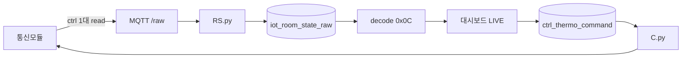

# 데이터폼 최종안 — Wire `ver=0x0C` (row 스트림)

> **상태:** 확정 (최적안)  
> **작성일:** 2026-06-16 (row 센서·runMode 정정: 2026-06-08)  
> **대상:** 통신모듈 → MQTT → RS → DB → 대시보드  
> **wire `ver`:** `0x0C` (12) — **신규 표준**  
> **decoded `schema_version`:** `2.2`  
> **레거시:** `0x0B` decode 호환 유지 (과거·과도기 데이터)

본 문서는 **v0x0C 단일 uplink 포맷**과 RS-DB-C 파이프라인을 정의한다.

---

## 1. 목적·원칙

### 1.1 목적

통신모듈이 컨트롤러 1대를 RS-485로 읽은 **직후** MQTT로 보내는 측정·설정 데이터의 wire·decode·DB·downlink 규칙을 정의한다.

| 구분 | 담당 |
|------|------|
| 통신모듈 | RS-485 read → **즉시** `…/raw` 1건 |
| **RS** | uplink **passthrough** → `iot_room_state_raw` |
| **조회** | `payload_bytea` decode (앱/View) · LIVE 최신 |
| **C** | `…/cmd` · uplink thermo → **`applied`** |
| 대시보드 | decode 조회 · `ctrl_thermo_command` |

### 1.2 설계 원칙

| # | 원칙 |
|---|------|
| P1 | **1 MQTT = 1 컨트롤러 = 1 row** — burst·chunk·`session_id` **없음** |
| P2 | **시각은 `row_t` 하나** — 수집시각·측정시각 **구분하지 않음** |
| P3 | **슬림 header** — `ver` + `flags`(1B)만; `n`·`chunk_seq`·`reserved` **없음** |
| P4 | **온·습도는 row 공통** — 채널 A/B/C **밖**에 온도 4·습도 1 |
| P5 | **`runMode`** — byte7 `ch_mask` 대신 **작동모드 uint8** |
| P6 | **채널 슬롯** — A/B/C 각 **19B** (장비코드·측정·설정만) |
| P7 | **농장 식별은 topic** — `sungil/{lsind}/{item}/raw` |
| P8 | **RS passthrough** — wire 파싱·`wire_ver` 컬럼 기록 **없음** |

---

## 2. 시스템 구조



| 요소 | 설명 |
|------|------|
| 1주기 (48 ctrl) | MQTT **48건** → raw **48 row** |
| 패킷 크기 | **79 B** (`2 + 75 + 2` CRC) |
| LIVE | `controllerKey`별 **최신** `received_at` row |

---

## 3. 식별·키

### 3.1 MQTT topic

```
sungil/{lsindRegistNo}/{itemCode}/raw    ← uplink (바이너리, QoS 1)
sungil/{lsindRegistNo}/{itemCode}/cmd    ← downlink (JSON, QoS 1)
```

### 3.2 컨트롤러·채널

```text
controllerKey = "{stallTyCode}:{stallNo}:{eqpmnNo}"
  예: SP07:03:02

channelKey = "{controllerKey}:{channel}:{eqpmnCode}"
  예: SP01:01:01:B:EC02
```

| 필드 | wire (row) | decoded |
|------|------------|---------|
| 측정시간 | `row_t` | `mesureDt` |
| 축사유형코드 | `stall_ty` | `stallTyCode` |
| 축사번호 | `stall_no` | `stallNo` |
| 장비번호 | `eqpmn_no` | `eqpmnNo` |
| 작동모드 | `run_mode` | `runMode` |
| 온도 4값 | `temp[0..3]` | `tempsC[]` |
| 습도 1값 | `hum` | `humidityPct` |
| A/B/C 라인 | 슬롯 19B × 3 | `channels[]` (팬·설정) |

---

## 4. 전송 정책

| 항목 | 값 |
|------|-----|
| 주기 | **5분** (운영 기본) |
| uplink | **ctrl 1대 수집 → MQTT 1건** |
| Body | `application/octet-stream` |
| QoS | **1** |

**폐기 (신규 송신 안 함):** multi-chunk burst, `session_id` 묶음, `n>1` 패킷.

**보충 전송:** `flags.history=1` — row `row_t`가 과거 시각일 수 있음 (선택).

---

## 5. Wire `ver=0x0C`

### 5.1 패킷 구조 (79 byte)

```
[ver 1B] + [flags 1B] + [Row 75B] + [CRC16 2B]
```

| 항목 | 값 |
|------|-----|
| `ver` | `0x0C` |
| row 수 | **항상 1** (암묵) |
| CRC | CRC-16/CCITT-FALSE, `ver`~row 끝 |

### 5.2 `flags` (1 byte)

| bit | 이름 | 설명 |
|-----|------|------|
| 0 | `history` | 0=현행 폴링, 1=과거·보충 |
| 1~7 | — | **0** (예약) |

### 5.3 Row (75 byte)

#### 공통 헤더 (8 B)

| Off | Len | 필드 |
|-----|-----|------|
| 0 | 4 | `row_t` — **유일한 시각** (uint32 LE, Unix UTC) |
| 4 | 1 | `stall_ty` → `SP01`~`SP10` |
| 5 | 1 | `stall_no` 1~32 |
| 6 | 1 | `eqpmn_no` 1~10 |
| 7 | 1 | **`run_mode`** — 작동모드 (uint8, enum **후속 정의**) |

#### 센서 블록 (10 B) — **채널 바깥**

| Off | Len | 필드 | decoded |
|-----|-----|------|---------|
| 8 | 8 | `temp[0..3]` | `tempsC[0..3]` — uint16 LE ×10 (0.1℃), `0xFFFF`→null |
| 16 | 2 | `hum` | `humidityPct` — uint16 LE ×10 (0.1%), `0xFFFF`→null |

#### 채널 슬롯 A → B → C (각 **19 B**)

| 블록 내 | 필드 | decoded |
|---------|------|---------|
| +0 | `eqpmn_code` | `eqpmnCode` |
| +1,+3 | `meas_mask`, `meas_out[10]` | `outputs` (측정값) |
| +13 | `thermo` 6B | `thermo` (설정값) |

- 슬롯 **전체 `0xFF`×19** = 비활성 채널 (v0x0B `ch_mask` 대체)
- 채널 슬롯에 **온·습도 없음**

| 슬롯 | `channel` | 공장 기본 `eqpmn_code` |
|------|-----------|------------------------|
| 1번째 | A | EC03 (`0x03`) |
| 2번째 | B | EC02 (`0x02`) |
| 3번째 | C | EC01 (`0x01`) |

---

## 6. Downlink (변경 없음)

Topic: `sungil/{lsind}/{item}/cmd` · JSON · `SET_CHANNEL_THERMO`

| status | 담당 |
|--------|------|
| `pending` | 대시보드 |
| `sent` | C.py |
| `applied` | RS raw 후 `command_ack` |

ACK: 별도 topic 없음 — cmd 반영 후 **다음 `/raw`** thermo 일치.

---

## 7. Decode (`schema_version` **2.2**)

### 7.1 패킷 메타

```json
{
  "schema_version": "2.2",
  "wireVer": 12,
  "mode": "live",
  "history": false,
  "controllers": [ "…" ]
}
```

| v0x0B 대비 제거 | 이유 |
|-----------------|------|
| `session_id` | row 스트림 |
| `partial`, `last_chunk`, `chunk_seq` | chunk 없음 |
| `ctrl_time`, `timeSource` | 시각 단일 (`row_t`) |
| `chMask` | **`runMode`로 대체** |
| `channels[].tempC/humidityPct` | **row `tempsC`/`humidityPct`** |

### 7.2 Controller

```json
{
  "controllerKey": "SP10:01:02",
  "stallTyCode": "SP10",
  "stallNo": "01",
  "eqpmnNo": "02",
  "mesureDt": "2026-06-16 14:54:51",
  "runMode": 1,
  "tempsC": ["28.0", "24.8", "26.5", null],
  "humidityPct": "62.1",
  "channels": [
    {
      "channel": "A",
      "eqpmnCode": "EC03",
      "outputs": { "1": "90" },
      "thermo": {
        "setpointTemp": "25",
        "tempDeviation": "2",
        "minVentPct": 10,
        "maxVentPct": 80
      }
    }
  ]
}
```

| 사용자 용어 | decoded |
|-------------|---------|
| 측정시간 | `mesureDt` ← `row_t` |
| 축사유형·번호·장비번호 | `stallTyCode`, `stallNo`, `eqpmnNo` |
| 온도 4값 | `tempsC[0..3]` |
| 습도 | `humidityPct` |
| 작동모드 | `runMode` |
| A/B/C 설정값 | `channels[].thermo` |
| A/B/C 측정값 | `channels[].outputs` |

---

## 8. DB (RS-DB-C)

### 8.1 `iot_room_state_raw`

```json
{
  "topic": "sungil/FARM01/P00/raw",
  "payload_json": {
    "format": "binary",
    "encoding": "base64",
    "data": "<79B packet base64>",
    "byte_len": 79
  },
  "payload_bytea": "\\x0c00…",
  "received_at": "…"
}
```

### 8.2 View

| View | 역할 |
|------|------|
| `v_iot_raw_live` | `get_byte(payload,0) IN (11,12)` 필터 |
| LIVE 최신 | 앱에서 `controllerKey`별 pick |

---

## 9. 서버 파이프라인

```
MQTT /raw → RS.py → iot_room_state_raw
조회 시   → decode 0x0C (또는 레거시 0x0B)
```

| 프로세스 | v0x0C 영향 |
|----------|------------|
| RS.py | **없음** |
| C.py / command_ack | **없음** (thermo 동일) |
| wire_decode | `decode_row_v0c` |
| dashboard | `wire-decode-v0c.ts` |

---

## 10. E2E 예시

**① MQTT** — `sungil/FARM01/P00/raw`, **79 B**, `ver=0x0C`, `flags=0`

**② raw** — `byte_len=79`, `get_byte(payload,0)=12`

**③ decode** — `tempsC[0]=28.0`, `runMode=1`, B채널 `thermo.setpointTemp=24.0`

---

## 11. 레거시 `0x0B`

| 항목 | 처리 |
|------|------|
| 과거 raw (`ver=0x0B`) | decode **유지** (`chMask`, 채널별 온습) |
| sim 기본 | **`wire_ver: 0x0C`** |

---

## 12. v0x0B → v0x0C 요약

| | v0x0B (레거시) | **v0x0C (현행)** |
|--|----------------|------------------|
| Header | 12B | **2B** |
| 패킷 (n=1) | 91B | **79B** |
| Row | 77B | **75B** |
| 온·습도 | 채널 슬롯 내 | **row 공통 4+1** |
| byte7 | `ch_mask` | **`run_mode`** |
| 채널 슬롯 | 23B | **19B** |

---

*본 문서가 wire uplink의 최종 기준이다. CRC·바이트 검증: `RSD/tests/test_wire_decode_v0c.py`.*
