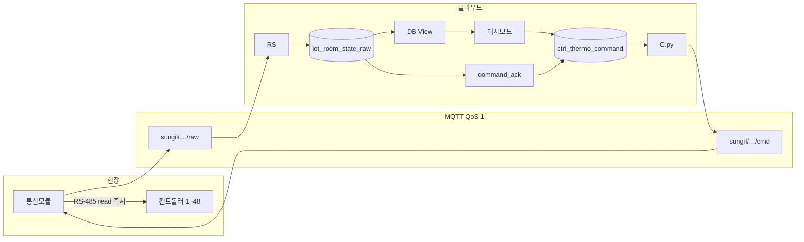
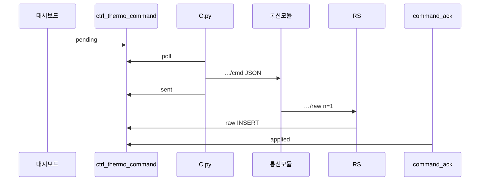

# 데이터폼 최종안 — Wire `ver=0x0B`

> **상태:** 확정 (최적안)  
> **작성일:** 2026-06-16  
> **대상:** STM32F103ZET6 통신모듈 → MQTT → 수집서버(RSD) → DB → 대시보드 → (이후) 축평원 연계  
> **wire `ver`:** `0x0B` (11)  
> **decoded `schema_version`:** `2.0`

본 문서는 **v0x0B 단일 포맷**만 정의한다. 구현·검증·운영의 기준 문서로 사용한다.

---

## 1. 목적·원칙

### 1.1 목적

통신모듈이 MQTT로 전송하는 **측정·설정 데이터**의 형식, 식별, 해석, downlink, DB 저장 규칙을 한곳에 정의한다.

| 구분 | 담당 |
|------|------|
| 통신모듈 | RS-485 **순차 read → 즉시** `…/raw` uplink · `…/cmd` 수신·적용 |
| **RS** | uplink **passthrough** → `iot_room_state_raw` |
| **DB View** | raw 정제 → LIVE·조회 |
| **C** | DB 명령 → `…/cmd` · uplink thermo → **`applied`** |
| 대시보드 | View 조회 · `ctrl_thermo_command` 저장 |
| 연계서버 | DB/View 이후 축평원 v4.0 (transport 범위 외) |

### 1.2 설계 원칙

| # | 원칙 |
|---|------|
| P1 | **권위 있는 시각 = row `row_t`만** — header 배치 시각 없음 |
| P2 | **`lut_ver` 없음** — 레이아웃·디코드는 `ver=0x0B`로 통합 |
| P3 | **컨트롤러 = 채널 슬롯 A/B/C** — 슬롯마다 온·습·장비코드·측정·설정 |
| P4 | **장비코드는 통신모듈 NVM** — wire·서버는 슬롯 순서만 고정 |
| P5 | **농장 식별은 MQTT topic** — payload에 `lsind`/`item` 넣지 않음 |
| P6 | **RS-485 `ctrl_idx`는 모듈 내부 전용** — JSON·DB·downlink에 없음 |
| P7 | **uplink 1건 = ctrl 1건** — RS passthrough raw row · View로 LIVE 최신 |

---

## 2. 시스템 구조



| 요소 | 설명 |
|------|------|
| **통신모듈** | ctrl **순차 수집**, 1대 읽을 때마다 `…/raw` **1건** (`n=1`) |
| **컨트롤러** | `controllerKey` = `{stallTyCode}:{stallNo}:{eqpmnNo}` |
| **채널** | 슬롯 **A / B / C** — 온·습·측정·thermo |
| **RS** | uplink passthrough → **`iot_room_state_raw`** |
| **View** | raw → controller·LIVE 최신 **조회 정제** |
| **C** | `ctrl_thermo_command` → `…/cmd` · **`applied`** 판정 |

---

## 3. 식별·키

### 3.1 MQTT topic (농장·품목)

```
sungil/{lsindRegistNo}/{itemCode}/raw    ← uplink (바이너리)
sungil/{lsindRegistNo}/{itemCode}/cmd    ← downlink (JSON)
sungil/{lsindRegistNo}/{itemCode}/epoch  ← 시각 동기 (선택)
```

| 예시 | 의미 |
|------|------|
| `sungil/FARM01/P00/raw` | FARM01, 품목 P00 uplink |
| `sungil/FARM01/P00/cmd` | 동일 농장 downlink |

- RSD subscribe: `sungil/+/+/raw`
- 통신모듈·가상 fleet subscribe: `sungil/{farm}/{item}/cmd`
- `makrId` (예: `SUNGIL`) — 디코더·설정 고정, wire body 없음

### 3.2 컨트롤러·채널 키

```text
controllerKey = "{stallTyCode}:{stallNo}:{eqpmnNo}"
  예: SP07:03:02

channelKey = "{controllerKey}:{channel}:{eqpmnCode}"
  예: SP01:01:01:B:EC02
```

| 필드 | wire 출처 | 예 |
|------|-----------|-----|
| `stallTyCode` | `stall_ty` 1~10 | `SP01` |
| `stallNo` | `stall_no` 1~32 | `"01"` |
| `eqpmnNo` | row `eqpmn_no` 1~10 | `"01"` |
| `channel` | 슬롯 A/B/C | `"B"` |
| `eqpmnCode` | 채널 블록 `eqpmn_code` | `EC02` |

전체 스코프:

```text
(lsindRegistNo, itemCode, module_uid, controllerKey [, channel, eqpmnCode])
```

---

## 4. 전송 정책

| 항목 | 값 |
|------|-----|
| 주기 | **5분** 1회 (운영 기본) |
| uplink | **ctrl 1대 수집 → MQTT 1건** (`n=1`, row 77 B) |
| 1주기 | 최대 **48** MQTT / **48** raw row |
| QoS | **1** (raw·cmd) |
| Body (raw) | `application/octet-stream` |
| Body (cmd) | UTF-8 JSON |

### 4.1 LIVE burst · multi-chunk

- 한 burst = 동일 **`session_id`** 를 가진 chunk 0…N
- 패킷당 row 최대 **26** (77×26+12+2 = 2016 B)
- **48 ctrl** 예: chunk0 **26** rows + chunk1 **22** rows (`last_chunk=1`)
- flags `partial=1` (중간 chunk), `last_chunk=1` (burst 종료)

### 4.2 보충 burst (`history=1`)

- 과거·미수집 구간 보충
- row `row_t`가 **과거 시각**일 수 있음
- 동일 `session_id`·chunk 규칙 적용

### 4.3 병합 키 (서버·UI)

| 단계 | 키 |
|------|-----|
| chunk 묶음 | `(topic, session_id, chunk_seq)` |
| controller dedupe (merge 후) | **`controllerKey|mesureDt`** |

---

## 5. Wire Format `ver=0x0B`

### 5.1 패킷 구조

```
[Header 12 B] + [Row × n] + [CRC16 2 B]
```

| 항목 | 값 |
|------|-----|
| `ver` | `0x0B` |
| `n` max | **26** / 패킷 |
| CRC | CRC-16/CCITT-FALSE (poly 0x1021, init 0xFFFF), Header+Rows |

### 5.2 Header (12 byte, LE)

| Off | Len | 필드 | 설명 |
|-----|-----|------|------|
| 0 | 1 | `ver` | `0x0B` |
| 1 | 1 | `flags` | 비트표 아래 |
| 2 | 4 | `session_id` | uint32 — **burst 내 모든 chunk 공통** |
| 6 | 1 | `n` | row 수 (1~26) |
| 7 | 2 | `chunk_seq` | uint16 — 0부터 증가 |
| 9 | 3 | `reserved` | `0x000000` |

#### `flags`

| bit | 이름 | 설명 |
|-----|------|------|
| 0 | `partial` | 다음 chunk 존재 |
| 1 | `last_chunk` | burst 마지막 chunk |
| 2 | `history` | 0=현행 폴링, 1=과거·보충 burst |
| 3 | `ctrl_time` | 1=row `row_t`가 컨트롤러 시각, 0=모듈 수집 시각 |
| 4~7 | — | 0 |

- **`session_id`:** burst 시작 시 모듈 카운터 +1; chunk0~N 동일 값
- header **`t` 없음**, **`lut_ver` 없음**

### 5.3 Row (77 byte)

**1 row = 컨트롤러 1대 × `row_t` 1건 × 채널 A/B/C 블록**

#### 공통 헤더 (8 B)

| Off | Len | 필드 | 설명 |
|-----|-----|------|------|
| 0 | 4 | **`row_t`** | uint32 LE — **이 row의 시각** (Unix UTC) |
| 4 | 1 | `stall_ty` | 1~10 → `SP01`~`SP10` |
| 5 | 1 | `stall_no` | 1~32 |
| 6 | 1 | **`eqpmn_no`** | 1~10 (축사 내 컨트롤러 번호) |
| 7 | 1 | **`ch_mask`** | bit0=A, bit1=B, bit2=C |

#### 채널 블록 (23 B × 3, 슬롯 순서 A → B → C)

| Row Off | 슬롯 |
|---------|------|
| 8 | A |
| 31 | B |
| 54 | C |

**블록 내부 (23 B):**

| Off | Len | 필드 | 설명 |
|-----|-----|------|------|
| +0 | 2 | `temp_x10` | uint16 LE, 0.1℃ (`0xFFFF`=NA) |
| +2 | 2 | `hum_x10` | uint16 LE, 0.1% (`0xFFFF`=NA) |
| +4 | 1 | **`eqpmn_code`** | 장비코드 byte (§5.4) |
| +5 | 2 | `meas_mask` | bit0~9: sn1~10 존재 |
| +7 | 10 | `meas_out[10]` | sn 동작출력 0~100% (`0xFF`=결측) |
| +17 | 6 | **`thermo`** | §5.5 |

- `ch_mask` bit=0 → 해당 슬롯 **생략** (wire 23B 무시·`0xFF` 권장)

### 5.4 `eqpmn_code` (장비코드)

| wire | `eqpmnCode` | 용도 |
|------|-------------|------|
| `0x01` | EC01 | 송풍 등 |
| `0x02` | EC02 | 배기 |
| `0x03` | EC03 | 입기 |
| `0x00` | — | 활성 채널 사용 금지 |
| `0xFF` | — | 비활성 슬롯 placeholder |

### 5.5 Thermo (채널당 6 B)

| Off | Len | 필드 | 유효 범위 |
|-----|-----|------|-----------|
| +0 | 2 | `setpoint_x10` | 50~400 (5.0~40.0℃) |
| +2 | 2 | `deviation_x10` | 5~100 (0.5~10.0℃) |
| +4 | 1 | `min_vent_pct` | 0~100 |
| +5 | 1 | `max_vent_pct` | 0~100, ≥ min |

- NA: setpoint/deviation `0xFFFF`, vent `0xFF` → thermo NA 시 decoded **`thermo` 생략**
- downlink·DB·UI와 **동일 범위**

### 5.6 측정값 (`meas_*`)

- `meas_mask` bit=1인 sn만 `meas_out` 해석
- mask=0 슬롯 무시; mask=1 & `0xFF` → 결측 (null)
- decoded: `outputs` sparse object — `"1": "72"` (sn → % 문자열)

### 5.7 채널 슬롯 ↔ NVM

| wire 슬롯 | decoded `channel` | `ch_mask` | 공장 기본 `eqpmn_code` |
|-----------|-------------------|-----------|------------------------|
| 1번째 23B | **A** | bit0 | `0x03` (EC03) |
| 2번째 23B | **B** | bit1 | `0x02` (EC02) |
| 3번째 23B | **C** | bit2 | `0x01` (EC01) |

| 구분 | 담당 |
|------|------|
| 슬롯 이름·wire 순서 | **고정** (A→B→C) |
| 슬롯별 `eqpmn_code` | **통신모듈 NVM** (현장 설정) |
| uplink `eqpmn_code` | RS485 read 후 NVM 값을 row에 기록 |
| downlink 검증 | `channel` + `eqpmnCode`가 NVM과 **일치**해야 적용 |

---

## 6. Downlink (MQTT JSON)

### 6.1 Topic·QoS

```
Topic: sungil/{lsindRegistNo}/{itemCode}/cmd
QoS: 1
```

### 6.2 `SET_CHANNEL_THERMO` (채널 설정)

```json
{
  "cmd_id": "uuid",
  "action": "SET_CHANNEL_THERMO",
  "lsindRegistNo": "FARM01",
  "itemCode": "P00",
  "module_uid": 1,
  "stallTyCode": "SP01",
  "stallNo": "01",
  "eqpmnNo": "01",
  "channel": "B",
  "eqpmnCode": "EC02",
  "setpoint_temp": "24",
  "temp_deviation": "1.5",
  "min_vent_pct": "15",
  "max_vent_pct": "90",
  "ttl_sec": 300,
  "issued_at": "2026-06-16T12:00:00+00:00"
}
```

| 필드 | 규칙 |
|------|------|
| `stallTyCode` | `SP01`~`SP10` |
| `stallNo` | `01`~`32` |
| `eqpmnNo` | `01`~`10` (zero-pad 2자리) |
| `channel` | `A` / `B` / `C` |
| `eqpmnCode` | `EC01`~`EC99` — **NVM 매핑과 일치** |
| thermo 4값 | string 또는 number; §5.5 범위 |
| `ctrl_idx` | **사용하지 않음** |

`SET_CTRL_THERMO` (채널 필드 없음) — 슬롯 **A** thermo 의미 (호환·가상모듈).

### 6.3 명령 파이프라인



| 단계 | 처리 | `status` |
|------|------|----------|
| UI insert | `ctrl_thermo_command` | `pending` |
| C.py publish | `wire_command.py` → MQTT | `sent` |
| uplink | cmd 적용 후 `/raw` thermo 반영 | (raw row) |
| command_ack | thermo 4값 vs sent | `applied` |
| TTL / dedupe / 오류 | C.py | `cancelled` / `failed` |

**ACK 매칭 키:** `controllerKey|channel|eqpmnCode`

---

## 7. `decoded_json` (schema **2.0**)

### 7.1 burst·패킷 메타

```json
{
  "schema_version": "2.0",
  "session_id": 42,
  "mode": "live",
  "partial": false,
  "last_chunk": true,
  "history": false,
  "ctrl_time": true,
  "controllers": [ … ]
}
```

| 필드 | 설명 |
|------|------|
| `session_id` | wire header와 동일 |
| `mode` | `live` / `replay` (history·운영 정책에 따름) |
| `mesureDt` | row `row_t` → KST 등 서버 timezone |

### 7.2 Controller 레코드

```json
{
  "controllerKey": "SP01:01:01",
  "stallTyCode": "SP01",
  "stallNo": "01",
  "eqpmnNo": "01",
  "mesureDt": "2026-06-16 12:00:00",
  "chMask": "0x07",
  "channels": [
    {
      "channel": "A",
      "eqpmnCode": "EC03",
      "tempC": "25.1",
      "humidityPct": "60.0",
      "outputs": { "1": "72", "2": "0" },
      "thermo": {
        "setpointTemp": "25.0",
        "tempDeviation": "2.0",
        "minVentPct": 10,
        "maxVentPct": 80
      }
    },
    {
      "channel": "B",
      "eqpmnCode": "EC02",
      "tempC": "24.0",
      "humidityPct": "57.0",
      "outputs": { "2": "45" },
      "thermo": {
        "setpointTemp": "24.0",
        "tempDeviation": "1.5",
        "minVentPct": 5,
        "maxVentPct": 90
      }
    }
  ]
}
```

### 7.3 `channels[]` 필드

| 필드 | 타입 | 설명 |
|------|------|------|
| `channel` | string | `"A"` / `"B"` / `"C"` |
| `eqpmnCode` | string | `EC01`~`EC99` |
| `tempC` | string \| null | ÷10, `"25.1"` |
| `humidityPct` | string \| null | ÷10 |
| `outputs` | object | sn → % 문자열 (sparse) |
| `thermo` | object \| omit | §7.4 |

- flat `ES01[]` / `EC03[]` 등 **schema 2.0에서 사용하지 않음**

### 7.4 `thermo` 객체

| 키 | 타입 | wire |
|----|------|------|
| `setpointTemp` | string | `setpoint_x10` ÷10 |
| `tempDeviation` | string | `deviation_x10` ÷10 |
| `minVentPct` | number | `min_vent_pct` |
| `maxVentPct` | number | `max_vent_pct` |

위치: **`channels[].thermo`** (채널별).

### 7.5 디코드·조회 (View)

1. topic → `lsindRegistNo`, `itemCode`
2. `payload_bytea` CRC·header·row 파싱 (SQL 함수)
3. row 77B → `controllerKey` + `channels[]`
4. `row_t` → `mesureDt`
5. View `v_iot_live_latest`: **`controllerKey`별 최신** raw/decoded row
6. (선택) stallTy LUT — View 또는 연계 레이어

> **D.py 실시간 프로세스는 사용하지 않음.** 규칙은 `wire_decode.py`와 동일, 실행은 View.

---

## 8. DB

### 8.1 `iot_room_state_raw` (RS passthrough)

| 컬럼 | RS 저장 |
|------|---------|
| `topic`, `received_at`, `saved_at` | MQTT 메타 |
| `payload_bytea`, `payload_json` | **바이너리 그대로** |
| `lsind_regist_no`, `item_code`, `module_uid` | topic에서만 |
| `wire_ver`, `session_id`, … | **null** (RS 미기록) |

**1주기 48 ctrl → raw 48 row.**

### 8.2 DB View (정제·조회)

| View | 역할 |
|------|------|
| `v_iot_controller_row` | raw 1건 → controller 1행 (`channels[]`) |
| `v_iot_live_latest` | 모듈별 `controllerKey` 최신 LIVE |

`iot_room_state_decoded` **쓰기는 하지 않음** (레거시 데이터·호환 조회만).

### 8.3 `ctrl_thermo_command`

| 컬럼 | 설명 |
|------|------|
| `lsind_regist_no`, `item_code`, `module_uid` | 농장·모듈 |
| `stall_ty_code`, `stall_no`, `eqpmn_no` | 컨트롤러 대상 |
| `channel`, `eqpmn_code` | 채널 명령 (`SET_CHANNEL_THERMO`) |
| `action` | `SET_CHANNEL_THERMO` / `SET_CTRL_THERMO` |
| `setpoint_temp`, `temp_deviation`, `min_vent_pct`, `max_vent_pct` | 설정 4값 |
| `status` | `pending` → `sent` → `applied` |
| `payload_json` | C.py 실제 MQTT body |
| `ctrl_idx` | nullable (내부 호환만, downlink 미사용) |

---

## 9. 대시보드

### 9.1 LIVE 표시

- 컨트롤러 패널: 채널 탭 **A / B / C** (`eqpmnCode` 표시)
- LIVE: View `v_iot_live_latest` → `channels[]`
- 설정 표시: `mergeThermoSettingsMaps` — LIVE thermo 우선, sent/applied 명령 보조

### 9.2 thermo 설정 키

```text
{farmId}:{moduleUid}:{controllerKey}           ← 레거시 단일
{farmId}:{moduleUid}:{controllerKey}:{channel} ← 채널별
```

### 9.3 명령 UI

- 채널 선택 후 저장 → `SET_CHANNEL_THERMO` + `channel` + `eqpmn_code`
- 상태: 전송 대기 → 전송 완료 → 적용 완료 (`command_ack`)

---

## 10. 서버 파이프라인

```
MQTT /raw  → RS  → iot_room_state_raw (passthrough)
raw        → DB View (정제·LIVE 최신)
RS raw 후  → command_ack (sent → applied)
pending    → C.py → MQTT /cmd
```

| 프로세스 | 역할 |
|----------|------|
| **RS** | MQTT subscribe → raw INSERT (wire 미파싱) |
| **View** | payload decode · `controllerKey`별 LIVE |
| **C.py** | pending → `…/cmd` → `sent` |
| **command_ack** | raw/View thermo vs sent → `applied` |

과도기: `R.py`+`S.py` passthrough = RS와 동등. **`D.py`는 사용하지 않음.**

구현: `RS.py`(목표), `wire_command.py`, `C.py`, `command_ack.py`, View migration

---

## 10.1 예시 데이터 (E2E)

정책문서 §4.3.4와 동일 시나리오: **FARM01 · SP01:01:03 · 채널 B thermo 설정**

| # | 단계 | 예시 |
|---|------|------|
| 1 | MQTT uplink | `sungil/FARM01/P00/raw`, `n=1`, row `SP01:01:03`, `row_t=20260608140503` |
| 2 | raw row | `id=10042`, `payload_bytea=\x0b00…`, `wire_ver=null` |
| 3 | View row | `controller_key=SP01:01:03`, B채널 `thermo.setpointTemp=24.0` |
| 4 | cmd pending | `SET_CHANNEL_THERMO`, channel `B`, `eqpmn_code=EC02` |
| 5 | cmd sent | C.py → MQTT cmd JSON, `status=sent` |
| 6 | applied | uplink B thermo ≡ sent → `status=applied` |

**raw INSERT (②):**

```json
{
  "id": 10042,
  "topic": "sungil/FARM01/P00/raw",
  "lsind_regist_no": "FARM01",
  "item_code": "P00",
  "module_uid": 1,
  "payload_bytea": "\\x0b00…",
  "received_at": "2026-06-08T05:05:03+00:00"
}
```

**View controller (③):**

```json
{
  "raw_id": 10042,
  "controller_key": "SP01:01:03",
  "mesure_dt": "20260608140503",
  "channels": [
    { "channel": "B", "eqpmnCode": "EC02", "thermo": { "setpointTemp": "24.0", "tempDeviation": "1.5", "minVentPct": 15, "maxVentPct": 90 } }
  ]
}
```

**명령 (④→⑥):** `pending` → C.py MQTT → `sent` → uplink thermo 일치 → `applied`

---

---

## 11. 검증·가상 통신모듈

| 도구 | 역할 |
|------|------|
| `phase_a_sim/sim_fleet.py` | 10농장 × 48ctrl v0x0B uplink |
| `sim_fleet` cmd SUBSCRIBE | C.py downlink 수신 → thermo RAM override |
| `cmd_trigger_uplink` | cmd 적용 후 즉시 `/raw` 1회 (ACK E2E) |

가상모듈은 **thermo 4값만** cmd에 반영; 온·습·fan 측정은 합성 파형 유지.

---

## 12. 하드웨어·운영 제약

| 항목 | 값 |
|------|-----|
| W5500 TX 버퍼 | ~2 KB → 패킷 **26 row** 상한 (레거시 burst). **row 스트림은 n=1** |
| 모듈당 ctrl | **48** — 1주기 **48 MQTT** |
| 미지원 `ver` | 수집서버 **거부·알람** (잘못된 해석 저장 금지) |

---

## 13. 구현 맵 (참고)

| 영역 | 경로 |
|------|------|
| Wire decode 규칙 | `SI1/RSD/wire_decode.py` (View/SQL 이식 기준) |
| Downlink | `SI1/RSD/wire_command.py`, `C.py` |
| ACK | `SI1/RSD/command_ack.py` (RS raw 저장 후) |
| RS (목표) | `SI1/RSD/RS.py` |
| DB View | `SI1/dashboard/web/supabase/migrations/` |
| Dashboard UI | `SI1/dashboard/web/src/components/controllers/` |
| 가상 fleet | `STM_Ethernet/2_테스팅파일/phase_a_sim/` |
| RSD 명세 축약 | `SI1/RSD/docs/wire-v00b-spec.md` |

---

## 14. 축평원 연계 (범위 외 요약)

- 공식 연계: Agent/SOAP/FTP (`smart.ekape.or.kr`)
- v4.0 공통 필드 매핑은 **DB 적재 이후** 연계서버 책임
- schema 2.0 `channels[]` → flat `mesureVal` 펼침은 연계 레이어에서 처리

---

*본 문서는 wire `ver=0x0B` 데이터폼의 최종 정의이다. 상세 바이트 검증·테스트는 RSD `tests/test_wire_decode_v0b.py` 및 `phase_a_sim/test_cmd_downlink.py`를 따른다.*
